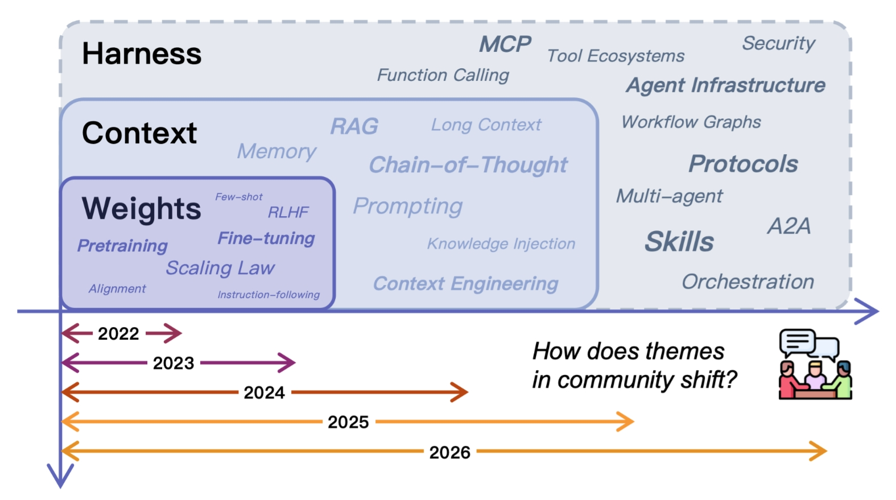
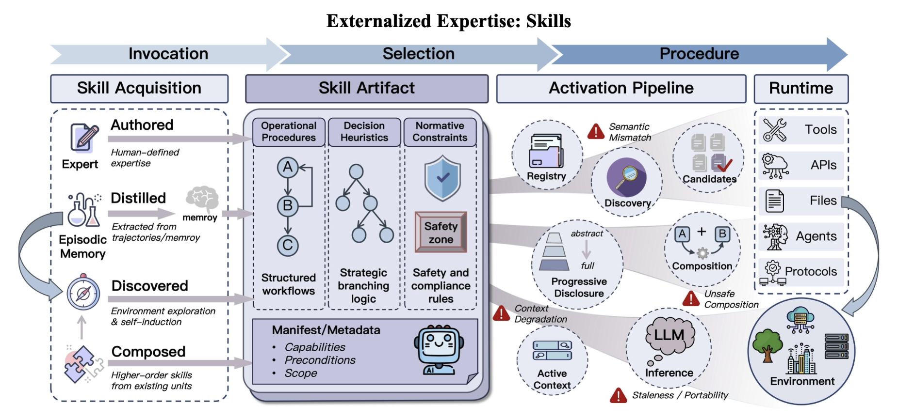
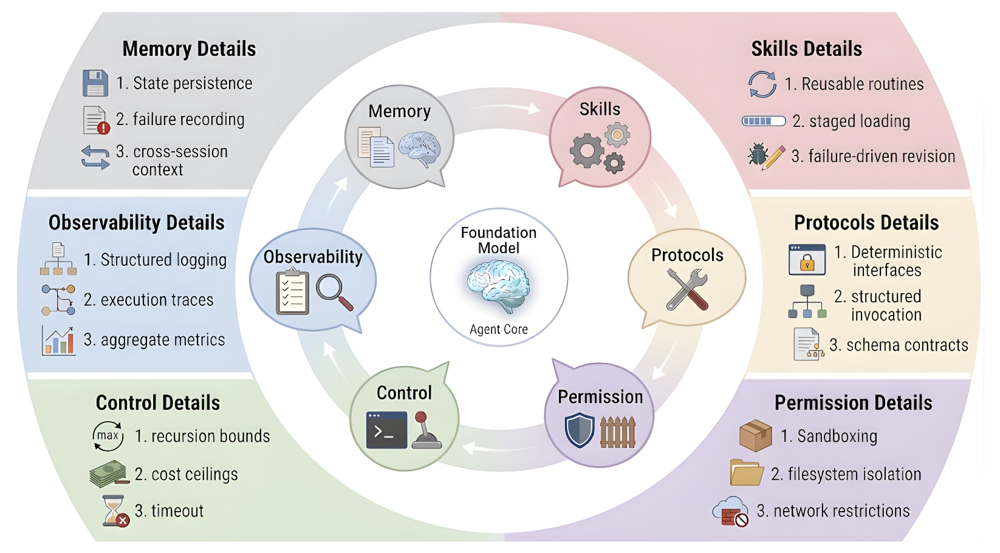

# LLM智能体中的外化：记忆、技能、协议与Harness工程的统一综述

**原文标题：** Externalization in LLM Agents: A Unified Review of Memory, Skills, Protocols and Harness Engineering

**作者：** Chenyu Zhou, Huacan Chai, Wenteng Chen, Zihan Guo, Rong Shan, Yuanyi Song, Tianyi Xu, Yingxuan Yang, Aofan Yu, Weiming Zhang, Congming Zheng, Jiachen Zhu, Zeyu Zheng, Zhuosheng Zhang, Xingyu Lou, Changwang Zhang, Zhihui Fu, Jun Wang, Weiwen Liu, Jianghao Lin, Weinan Zhang

**机构：** 上海交通大学、中山大学、上海创新研究院、卡耐基梅隆大学、OPPO

**原文链接：** https://arxiv.org/abs/2604.08224

---

## 摘要

大型语言模型（LLM）智能体的构建方式正日益从修改模型权重转向重组其运行时环境。早期系统期望模型从内部恢复的能力，如今被外化到记忆存储、可复用技能、交互协议以及使这些模块在实践中可靠运行的周边Harness中。本文从**外化**（externalization）的视角审视这一转变。借鉴认知工件的理念，我们认为智能体基础设施的重要性不仅仅在于它添加了辅助组件，更在于它将困难的认知负担转化为模型能够更可靠地解决的形式。在这一视角下，记忆外化了跨时间的状态，技能外化了程序性专业知识，协议外化了交互结构，而Harness工程则作为统一层将它们协调为受治理的执行过程。我们追溯了从权重到上下文再到Harness的历史演进，分析了记忆、技能和协议作为三种不同但耦合的外化形式，并考察了它们在更大的智能体系统内部如何交互。我们进一步讨论了参数化能力与外化能力之间的权衡，指出了自演化Harness和共享智能体基础设施等新兴方向，并讨论了评估、治理以及模型与外部基础设施长期共同演化方面的开放挑战。最终结果是一个系统级框架，用于解释为何实际的智能体进展越来越不仅依赖于更强的模型，还依赖于更好的外部认知基础设施。

---

## 1 引言

> **图1：外化作为LLM智能体设计的组织原则。** 上方面板：人类认知外化的弧线——从思想经由语言、书写、印刷到数字计算。中间面板：LLM智能体对应的外化弧线——从权重经由三个外化维度——记忆（外化状态）、技能（外化专业知识）和协议（外化交互）——到统一它们的Harness。下方面板：文献全景图，将代表性工作映射到三个能力层——权重、上下文和Harness——展示研究线程如何逐步向外迁移。两条弧线之间的平行编码了一个递归主张：LLM智能体通过沿着驱动人类认知历史的同一表征维度外化认知负担来实现可靠的智能体性。

人类文明的历史也可以被解读为一部认知外化的历史。口语将私人思想转化为可共享的符号形式。书写将知识从脆弱的生物记忆转移到持久的物质记录中。印刷术在社会规模上机械化了知识的复制。数字计算将算术和符号操作从神经劳动转移到可编程机器上。在这些转变中，关键的变化不是人类没有工件就变得不那么有能力了。相反，工件通过将选定的负担向外转移并释放有限的内部资源用于规划、抽象和创造性来重组认知系统（Norman, 1993）。同样的向外委托模式现在正在机器智能前沿——大型语言模型智能体的设计中重现。

这一视角在**认知工件**（cognitive artifacts）的概念中有着自然的理论锚点（Norman, 1991, 1993）。核心洞见是：外部辅助工具不仅仅是放大一种不变的内部能力；它们往往**转变了任务本身**。购物清单并不扩展生物记忆容量，它将一个困难的回忆问题变成了一个识别问题。地图并不简单地使导航"更强"，它将隐藏的空间关系转化为可见的结构。因此，工件的力量在于**表征转换**：它重构了问题，使得智能体能够用其已有的能力更可靠地解决它（Norman, 1991）。

我们认为，同样的逻辑现在主宰着基于LLM的智能体中最重要的设计选择。我们的核心论点是：**外化——将认知负担从模型内部计算逐步转移到持久的、可检查的和可复用的外部结构中——是统一记忆、技能、协议和Harness工程近期进展的转变逻辑**。这不仅仅是关于工程便利性的主张，更是关于可靠智能体能力来源的主张：不是来自不断更大的模型本身，而是来自对任务需求的系统性重构，使内部能力和外部基础设施共同覆盖所需的全部能力范围（Norman, 1991; Sumers et al., 2024）。

一个没有外化的LLM仍然面临三种反复出现的不匹配，它们直接对应三个Harness维度：

- 其上下文窗口是有限的，会话记忆弱或不存在，造成**连续性问题**——记忆外化解决这一问题
- 长的多步骤程序往往被重新推导而非一致执行，造成**方差问题**——技能外化解决这一问题
- 与外部工具、服务和协作者的交互在仅依赖自由形式提示时仍然脆弱，造成**协调问题**——协议外化解决这一问题

一个具体的例子有助于固定直觉。考虑一个软件工程智能体被要求在大型代码库中实现一个功能、运行测试并打开拉取请求。没有外化时，模型必须在脆弱的提示中保持代码库结构、项目约定、工作流状态和工具交互。有了外化，持久项目记忆提供上下文，可复用技能文档编码约定和工作流，协议化的工具接口强制正确的模式，Harness排序步骤、验证输出并管理失败。基础模型可能保持不变；改变的是它被要求解决的任务的**表征**。

##### 记忆系统外化跨时间的状态

记忆系统不是依赖上下文窗口作为历史的唯一载体，而是允许积累的知识——用户偏好、先前轨迹、已解决的歧义、领域事实——在任何单个会话之外持久存在，并在相关时选择性地检索。核心转换是从**回忆到识别**：智能体不再需要从潜在权重中重新生成过去的知识；它从持久的、可搜索的存储中检索知识（Lewis et al., 2020; Park et al., 2023; Packer et al., 2023; Chhikara et al., 2025; Xu et al., 2025b）。

##### 技能系统外化程序性专业知识

技能系统不是依赖模型的权重在每次调用时重新生成特定任务的技能，而是将程序、最佳实践和操作指南打包成可复用的工件。核心转换是从**生成到组合**：智能体从预先验证的组件中组装行为，而不是每一步都即兴发挥（OpenAI, 2023a; Schick et al., 2023; Wang et al., 2023a; Anthropic, 2025, 2026; Jiang et al., 2026b）。

##### 协议外化交互结构

协议不是依赖与工具、服务和其他智能体之间临时的提示级协调，而是定义了用于发现、调用、委托和权限管理的显式机器可读合约。核心转换是从**临时到结构化**：含糊的、脆弱的通信变成了可互操作的、可治理的交换（Anthropic, 2024; Google Cloud, 2025a; Ehtesham et al., 2025c）。

**Harness**是承载所有三个维度的工程层，提供编排逻辑、约束、可观测性和反馈循环，使外化的认知在实践中保持一致。它不是与记忆、技能和协议并列的第四种外化。它是这些外化形式在其中运作和交互的**运行时环境**。

本文的其余部分组织如下：第2节追溯从权重到上下文再到Harness的历史路径。第3至5节分析记忆、技能和协议作为三种不同但互补的外化形式。第6节将Harness工程呈现为外化智能体设计的整合学科，第7节考察模块之间的主要交叉交互。第8节讨论向更具适应性和自演化形式的外化方向发展的未来方向，第9节以对智能体研究的更广泛影响作为结论。

---

## 2 背景：从权重到上下文再到Harness

> **图2：跨三个能力层的社区主题演变。** 堆叠的层——权重、上下文和Harness——展示了LLM智能体社区的重心如何随时间向外转移，从参数化知识和提示工程转向Harness级基础设施，如工具生态系统、协议、技能和多智能体编排。

LLM智能体的近期历史可以理解为一种从模型本身逐步向外的运动。能力首先被视为权重的属性，然后被视为提示和上下文窗口的属性，现在越来越被视为模型所运行的更广泛基础设施的属性。这些阶段是分层而非相互排斥的——即使在最重基础设施的系统中，权重仍然重要——但每个阶段都改变了开发者放置系统可变智能的位置，以及他们投入大部分工程努力的位置。

### 2.1 权重中的能力

**权重层**对应现代LLM部署的最早期阶段，其中能力几乎完全等同于模型参数。大规模语料库上的预训练将广泛的统计规律、世界知识和潜在推理习惯压缩到权重中（Brown et al., 2020; Chowdhery et al., 2023; Touvron et al., 2023）。缩放定律揭示了参数数量、数据量和损失之间的可预测关系，强化了进步直接与模型规模相关的直觉（Kaplan et al., 2020; Hoffmann et al., 2022）。到GPT-4（OpenAI, 2023b）、Gemini（Gemini Team et al., 2023）、DeepSeek-V3（DeepSeek-AI, 2025）和Qwen2.5（Qwen Team, 2025）等系统展示出广泛的多任务能力时，该领域大部分的主流叙事将更好的智能体等同于更大、训练更好的模型。

这一范式仍然是基础性的，权重空间能力提供了若干优势：无需外部查询的快速推理、紧凑部署，以及在无需任务特定管道的情况下跨许多任务的强大泛化能力。然而，权重空间编码也将知识、程序和策略过于紧密地耦合到一个静态工件中。更新单个事实——比如一个国家现任领导人——需要重新训练、知识编辑（Meng et al., 2022; Mitchell et al., 2022）或通过额外的对齐层打补丁，所有这些都有可能对其他能力产生非预期的副作用。审计模型为何以某种方式行为也很困难，因为相关知识分散在数十亿参数中而不是编码为可检查的模块。

参数化知识的核心局限在于它难以被选择性地更新、组合和治理。当智能体被限制在单轮问答中时，这些弱点通常可以管理。当系统进入长期任务执行——状态累积、程序必须可靠遵循、多个工具必须协调——这些不足变得更加突出。这一转变鼓励开发者将部分负担转移到下一层，而不是仅依赖模型参数。

### 2.2 上下文中的能力

**上下文层**代表注意力从模型修改转向输入设计的阶段。提示工程展示了模型行为可以在不触及权重的情况下被实质性改变：少样本示例、角色描述、思维链分解和自一致性追踪都改变了同一模型在同一底层任务上的表现（Wei et al., 2022; Wang et al., 2023b; Kojima et al., 2022）。更结构化的推理技术很快随之而来。ReAct在单一生成循环中交替推理追踪和工具动作（Yao et al., 2023a）。思维树（Tree of Thoughts）将思维链推广为对中间推理状态的有意搜索（Yao et al., 2024）。自精炼（Self-Refine）引入了迭代自我批评（Madaan et al., 2023）。检索增强生成（RAG）通过在查询时动态注入外部文档到上下文中引入了更系统化的外化形式（Lewis et al., 2020; Borgeaud et al., 2022; Ram et al., 2023; Gao et al., 2024）。

这一阶段使智能体设计变得更加灵活。开发者可以在运行时附加本地指令、领域知识、输出模式和检索证据，而无需任何梯度更新。上下文成为开发者为模型分阶段组织认知的媒介——一个可以在模型需要之前组装正确信息的工作表面。

上下文中心阶段也可以通过Norman的表征转换概念来解释。一个困难的回忆问题——"模型是否知道事实X？"——被转化为一个识别问题："鉴于事实X已被放入上下文中，模型能否使用它？"

然而，上下文中心设计也有重要约束。上下文窗口是有限的，大规模使用成本高昂，重载时往往噪声很大。长提示可能降低而非提高性能："迷失在中间"（lost in the middle）现象表明模型对长输入的注意力分布不均匀，中间位置的信息检索准确率急剧下降（Liu et al., 2024a）。上下文也是短暂的：除非状态被显式地外化到其他地方，每个新会话都以部分失忆开始。

### 2.3 通过基础设施的能力

> **图3：Harness化LLM智能体的外化架构。** Harness位于中心；三个外化维度——记忆（工作上下文、语义知识、情节经验、个性化记忆）、技能（操作程序、决策启发式、规范约束）和协议（智能体-用户、智能体-智能体、智能体-工具）——围绕其运行。沙箱、可观测性、压缩、评估、审批循环和子智能体编排等操作元素介导Harness核心与外化模块之间的交互。

**Harness层**代表当前阶段，其中能力超越了提示管理，延伸到持久基础设施。当上下文窗口饱和、提示模板变得更加笨重时，工程注意力越来越从"我们应该告诉模型什么？"转向"模型应该在什么环境中运行？"在成熟的智能体系统中，可靠性越来越依赖于外部记忆存储、工具注册表、协议定义、沙箱、子智能体编排、压缩管道、评估器、测试Harness和审批循环（Wang et al., 2024a; Li, 2025; Luo et al., 2025; Xi et al., 2023）。

这一转变最早的表现形式虽然简单但颇具揭示性。Auto-GPT（Richards, 2023）和BabyAGI（Nakajima, 2023）等项目用任务队列、持久记忆和网络访问包裹了一个LLM循环，展示了即使是最小的Harness也能维持单个提示无法实现的行为。更有原则的框架很快跟进：AutoGen形式化了多智能体消息交换（Wu et al., 2023），MetaGPT添加了基于角色的协作和显式程序（Hong et al., 2023），CAMEL探索了用于任务分解的结构化对话（Li et al., 2023），Reflexion跨episode持久化反馈（Shinn et al., 2023）。在这些系统中，共同的做法是将负担从模型中转移到周围结构中。

同样的做法现在在部署领域中普遍可见。编码智能体将模型嵌入开发Harness中，包含文件、Shell、版本控制、测试和可复用技能工件；SWE-agent和OpenHands是代表性示例（Yang et al., 2024a; Wang et al., 2024b）。反复出现的模式是：可靠性问题越来越多地通过改变环境而非仅通过提示来解决。

### 2.4 外化作为转变逻辑

综合来看，从权重到上下文再到Harness的路径是Norman意义上的外化故事：模型内部难以管理的负担被逐步转移到模型外部的显式工件中，模型看到的任务也相应地被转换。

- 可变知识从权重移入检索系统和运行时上下文，将**回忆转化为识别**
- 可复用程序从隐式习惯移入显式技能，将**即兴生成转化为结构化组合**
- 交互规则从临时提示移入协议，将**含糊协调转化为受治理的合约**
- 运行时可靠性则移入Harness逻辑，其中约束、可观测性和反馈循环可以被显式化

这种再分配最好被理解为对不匹配的响应。LLM擅长对提供的信息进行灵活的综合和推理；它们在稳定的长期记忆、程序可重复性以及与外部系统的治理交互方面不太可靠。因此，外化在模型周围构建了一个更大的认知系统，而不是替代它。

---

## 3 外化的状态：记忆

> **图4：记忆作为外化状态。** 来自短暂上下文窗口和环境反馈的原始上下文被转化为四个持久记忆维度——工作上下文、情节经验、语义知识和个性化记忆。这些维度通过逐步更受管理的架构来组织：单体上下文、检索存储、分层编排（含提取、整合、遗忘和操作系统式冷热交换）以及自适应记忆系统（含动态模块和基于反馈的策略优化）。在Harness端，来自技能和协议的执行痕迹流入外化记忆，后者又通过直接召回和精选快照向智能体核心提供任务相关内容。

记忆外化解决了智能体的时间负担。裸语言模型必须在短暂的提示中携带连续性、先前经验、用户特定事实和部分完成的工作。一旦任务跨越会话、分支或中断，这种负担变得既不稳定又昂贵。记忆将其外化到可以在模型外部写入、更新和检索的持久状态中。

在Harness化的智能体中，记忆不仅仅是一个档案。它为可恢复执行提供检查点，为技能蒸馏提供痕迹，为协议路由提供统计信息，以及为治理机制可以检查和约束的持久状态。

### 3.1 什么被外化了：状态的内容

记忆的本质在于将智能体跨时间的状态与其瞬态上下文解耦。我们区分以下四个维度的外化状态：

##### 工作上下文

工作上下文是当前任务的活动中间状态：打开的文件、临时变量、活跃假设、部分计划和执行检查点。它变化迅速，如果过时则失去价值，但如果没有外化，它会在上下文窗口重置或进程中断时消失。编码智能体很好地说明了这一点。通过在提示之外具体化草稿、终端状态和工作区工件，OpenHands和SWE风格的智能体等系统可以从当前操作状态恢复，而不是从头开始重建（Wang et al., 2025a; Yang et al., 2024b）。

##### 情节经验

情节经验记录先前运行中发生的事情：决策点、工具调用、失败、结果和反思。其价值不仅仅是归档。检索到的情节可以作为具体先例，帮助智能体避免重复已知错误，并为后续抽象提供原材料。Reflexion通过存储失败尝试的反思摘要作为可复用经验使这一模式显式化（Shinn et al., 2023）。AriGraph进一步扩展了这一理念，将陌生环境中的局部交互轨迹视为可以从中构建更广泛世界模型的情节记忆（Anokhin et al., 2024）。

##### 语义知识

语义知识存储超越任何单个情节的抽象：领域事实、一般启发式、项目约定和稳定的世界知识。与情节记忆不同，它不是围绕特定时间和地点组织的。情节记忆说明了某个案例中发生了什么；语义记忆说明了跨案例通常成立的是什么。在当前系统中，知识库和RAG语料库是外化语义记忆的最常见形式。

##### 个性化记忆

个性化记忆追踪关于特定用户、团队或环境的稳定信息：偏好、习惯、反复出现的约束和先前交互。这种状态不应被折叠到智能体的一般自我改进存储中，因为用户特定的痕迹遵循不同的保留、检索和隐私规则。最近的系统使这种分离显式化，如IFRAgent从移动环境中的演示构建用户习惯库（Wu et al., 2025），VARS存储跨会话的偏好卡（Hao et al., 2026）。

这四个层次共同表明，记忆外化的不是单一的同质数据库，而是多个抽象级别上连续性的时间负担。工作上下文支持即时恢复，情节记录支持反思和恢复，语义记忆支持抽象和迁移，个性化记忆支持跨会话对用户和环境的适应。

### 3.2 如何外化：记忆架构

当这些层被外化时，主要的设计问题变成了将主动推理与存储状态分离的激进程度。当前系统可以分为四种广泛的架构范式：

#### 3.2.1 单体上下文

早期系统依赖单体上下文：所有相关历史或其摘要直接保留在提示中。这种设计对于短任务可能出奇地有效。其局限是结构性的：容量扩展差，摘要漂移，模型必须花费稀缺的token既携带历史又解决当前步骤。最重要的是，状态随会话消失。

#### 3.2.2 带检索存储的上下文

主流的下一步是只在上下文中保留近期工作状态，同时将更长时间范围的痕迹存储在外部并按需检索。这种"上下文加检索存储"模式是大多数实际记忆系统的基础。它解决了原始容量问题，但将记忆质量变成了一个检索问题。GraphRAG添加了图结构和社区级检索（Edge et al., 2024），ENGRAM将记忆压缩为潜在状态表示（Cheng et al., 2026），SYNAPSE在统一的情节-语义图上使用扩散激活来恢复不太局部的相关性形式（Zheng et al., 2023）。

#### 3.2.3 分层记忆和编排

一旦平面检索证明不足，系统就转向分层记忆和编排。关键思想是不是每个痕迹都应该获得相同的保留策略或检索路径。Mem0（Chhikara et al., 2025）、Memory-R1（Yan et al., 2025b）和Mem-α（Wang et al., 2025b）等框架引入了用于提取、整合和遗忘的显式操作，将记忆变成一个受管理的生命周期。两种设计倾向主导这一领域：

- **时空维度的资源解耦**：MemGPT（Packer et al., 2023）和MemoryOS（Kang et al., 2025）将热工作状态与冷的长尾存储分离，在固定上下文预算下提高有效容量。
- **认知功能维度的语义解耦**：MemoryBank（Zhong et al., 2024）分离事件、用户档案和世界知识；MemOS（Li et al., 2025）区分显式和隐式记忆。

#### 3.2.4 自适应记忆系统

自适应记忆系统更进一步，使模块、路由决策或检索策略对经验做出响应。MemEvolve（Zhang et al., 2025a）将记忆生命周期分解为可以在执行期间独立演化的编码、存储、检索和管理模块。MemRL（Zhang et al., 2026c）通过非参数强化学习更新检索行为。

跨这些阶段，主要的转变是从**存储到控制**。单体上下文解决存在问题，检索存储解决容量问题，分层系统解决组织问题，自适应系统开始解决策略问题。

### 3.3 Harness时代的记忆需求

当智能体进入Harness时代，记忆系统不再仅仅是孤立的存储模块；相反，它们成为运行时通过其协调连续性、程序复用和治理交互的基底。

Harness环境要求记忆系统显式地将**状态与上下文分离**。InfiAgent（Yu et al., 2026）提出了以文件为中心的状态抽象，主张文件系统作为任务状态的唯一权威记录。在每个决策步骤，智能体不再阅读冗长的历史，而是阅读工作区的精选快照和少量最近操作。

记忆还必须与技能系统集成，但两层扮演不同角色。记忆存储先前执行的证据：痕迹、结果、失败和用户或任务特定的上下文。技能只有在某些证据被提升为显式可复用程序时才开始。

协议耦合施加了进一步要求。工具结果、批准、委托事件和外部状态转换可能通过协议化的接口到达，但只有在它们被规范化并写入持久状态后才成为记忆。

最后，一旦多个智能体依赖共同的外化状态，共享和治理机制就成为必须。Harness时代的记忆因此最好被理解为**受管理的状态基础设施**。

### 3.4 记忆作为认知工件

现代LLM是无状态生成器：每次调用都从新的上下文开始，因此连续性必须被重建而非继承。在短交互中，这种限制可以隐藏在提示内。在长期工作中，它成为结构性问题。

记忆外化改变了该任务的结构。用Norman的术语来说，这种表征转换将内部**回忆**问题转化为外部**识别和检索**问题。模型不再需要从其参数中恢复相关历史；它需要识别和使用记忆系统已经浮出水面的精选历史片段。

这一解释阐明了为什么**检索质量比原始存储容量更重要**。一个拥有大量存储但检索薄弱的系统仍然向模型呈现了错误的问题表征：历史存在，但任务没有被转换。相比之下，一个适度的存储配合强大的索引、摘要和上下文选择可以使下游推理显著更容易。记忆的成功标准因此不是"我们保存了多少？"而是"我们是否使当前决策变得清晰可读？"

---

## 4 外化的专业知识：技能

> **图5：技能作为外化专业知识。** 该图追溯了技能从调用、选择到程序的完整生命周期。技能获取展示了程序性技能进入系统的四条路径：由专家编写、从情节记忆和轨迹中蒸馏、通过环境探索和自我归纳发现、或从现有单元组合。技能工件将该技能打包为操作程序、决策启发式和规范约束，并附带声明能力、前提条件和范围的清单。激活管道处理通过语义抽象的注册表发现、从摘要到完整指南的渐进式披露，以及将技能绑定到工具、API、文件、智能体和协议的组合。运行时展示活动上下文和LLM如何执行选定技能，同时边界条件——过时、可移植性限制、上下文相关退化和不安全组合——约束可靠性。

技能外化解决了智能体的程序负担。语言模型原则上可能知道如何解决一个任务，但可靠的执行仍然需要每次尝试任务时重建工作流、默认值和约束。这种负担随任务长度、环境特异性和分支决策数量的增长而增长，表现为方差：遗漏步骤、不稳定的工具使用和不一致的停止条件。

技能引入的表征转变因此是从**重复合成到可复用程序**。技能系统不是要求模型在每次运行时从权重或临时提示中重新生成特定任务的技能，而是将该技能打包成可以被发现、加载、修订和组合的显式工件。

### 4.1 什么被外化了：程序性专业知识

技能外化涉及的是程序性专业知识而非孤立的动作接口。专业知识在这里意味着在反复出现的假设和约束下执行任务的可重复方式。一个有用的边界源于这个定义：工具暴露操作，协议治理这些操作如何被描述和调用，而**技能编码一类任务应该如何用它们执行**。实际上，该专业知识有三个耦合的组件：

#### 4.1.1 操作程序

操作程序是任务骨架：将复杂工作分解为步骤、阶段、依赖关系和停止条件。它解决了LLM智能体中一种常见的失败模式——许多错误不是来自动作层面的无能力；它们来自过程层面的不稳定，如跳过步骤、操作顺序错误或提前终止（Hsiao et al., 2025; Nandi et al., 2026）。外化程序将脆弱的过程知识变成了显式的操作路径。

一旦程序被外化，执行就变得不那么即兴了。智能体可以在中断后恢复，跨上下文或协作者传递工作，并在不从记忆中重建整个工作流的情况下恢复状态。

#### 4.1.2 决策启发式

如果程序定义了执行的骨架，决策启发式则治理分支处发生的事情。真实任务很少作为固定管道展开。工具会失败，观察有噪声，几个局部合理的动作可能竞争。在这些条件下，良好的性能取决于从经验中得出的实用经验法则（Gigerenzer and Gaissmaier, 2011）。

外化这些启发式改变了推理努力的分布。系统可以编码已证明有用的默认选择、升级规则或偏好排序，而不是强迫模型在每个交叉点重新发现局部策略。

#### 4.1.3 规范约束

第三个组件是规范约束：程序被视为可接受的条件。工作流可能在技术上有效但仍然不合规、不安全或操作上错误。在实际部署中，执行受到测试要求、范围限制、访问限制、可追溯性期望和特定领域操作规则的约束。

一旦外化，这些约束不再仅仅是事后评估标准，而是成为技能本身的一部分。这使得技能不仅编码**如何**执行任务，还编码如何在组织和安全边界内执行任务。在成熟系统中，这使技能成为**治理的载体**和**能力的载体**。

### 4.2 从执行原语到能力包

#### 4.2.1 阶段1：原子执行原语

第一阶段为语言模型装备了可靠的动作执行，例如通过结构化工具调用和函数调用接口。Toolformer展示了模型可以学习何时调用工具、如何构造参数以及如何整合结果（Schick et al., 2023）。这一阶段的关键成就是对原子动作单元的稳定访问。它不提供完成更广泛任务类别的显式可复用程序。单位是**动作原语**，而非技能。

#### 4.2.2 阶段2：大规模原语选择

随着可调用工具数量增长，问题从调用转向选择。Gorilla、ToolLLM、ToolNet等工作展示了模型可以从大型工具集合中检索、排名和动态选择（Patil et al., 2023; Qin et al., 2023; Liu et al., 2024b, 2025b; Zou et al., 2025）。这是向可扩展动作选择迈出的重大一步，但单位仍然是工具而非程序。

#### 4.2.3 阶段3：技能作为打包的专业知识

第三阶段标志着抽象的进一步转变。核心问题不再是模型能否调用函数或检索适当的API，而是完成一类任务所需的技能是否可以打包成可复用的能力单元。基于程序的技能归纳将原始动作编译为高级可复用技能，展示了智能体能力可以表示为**可执行的程序抽象**而非一次性调用（Wang et al., 2025c）。

与早期阶段相比，这里的关键转换是表征性的而非仅仅是操作性的。能力不再主要被视为对工具或API的访问，而是越来越被视为可以跨任务加载、复用和组合的**打包程序知识**。

### 4.3 技能如何被外化

#### 4.3.1 规范

技能的外化始于规范层。典型形式包括SKILL.md、指令文件、清单或其他声明性规范工件。这些工件描述技能做什么、适用于什么场景、假设什么依赖关系、必须满足什么约束以及在什么输入/输出条件下操作。技能规范类似于API文档而非API实现。其价值在于将程序性专业知识从不透明的内部状态转变为可以被检查、讨论、修订和治理的显式对象（Ling et al., 2026）。

一个良好的技能规范应理想地涵盖至少五种信息：能力边界、适用范围、前提条件、执行约束以及示例和反例。

#### 4.3.2 发现

一旦技能成为显式工件，它们自然引入了注册和发现的问题。在现实设置中，智能体不能不加区分地为每个任务加载每个可用技能。它因此需要某种形式的注册表和发现机制来支持选择性检索。技能发现是一个更高层次的匹配问题。它必须考虑不仅主题相似性，还有任务复杂性、环境假设、操作约束和风险条件。

#### 4.3.3 渐进式披露

技能的发现并不意味着其全部内容应立即被注入活动上下文。由于长上下文并不可靠地转化为更好的性能，详细指令可能成为推理噪声的来源而非指导的来源。当前的技能系统通常受益于**渐进式披露策略**：先暴露技能的存在，只在需要时才加载更深层的细节。

在当前的工业实现中，这通常采用分层形式：最小级别，模型只看到技能名称和简要描述；更深级别的清单信息如适用条件和前提条件；只有最深级别才加载完整指南。这种分阶段加载在Claude Code的技能系统等当前工业实现中尤为明显（Anthropic, 2025）。

#### 4.3.4 执行绑定

技能在连接到可执行动作之前仍然是认知层面的描述。实际任务完成依赖于将技能的自然语言或结构化规范翻译为当前环境中具体操作的绑定过程。正是在这一点上，技能、工具和协议之间的区别变得清晰：**工具提供可执行操作；协议治理这些操作如何被描述和调用；技能提供将它们组合成可重复任务完成的更高层策略。**

#### 4.3.5 组合

技能系统的价值在技能可以被组合时最充分地实现。与原子工具不同，技能可以参与更高阶的结构化协调，允许复杂任务被分解为多个能力包的协作。常见的组合模式包括串行执行、并行分工、条件路由和在更高级别技能中递归调用子技能（Wang et al., 2023a）。

组合不仅仅是多个程序片段的连接。它是程序性专业知识本身的更高层复用。例如，生成数据分析报告的技能不需要作为端到端的单体程序实现，而可以组织为数据清洗、统计分析、可视化和叙事综合等较小技能的协调组合。

### 4.4 技能获取与演化

技能系统的重要性不仅在于它存储了编写的指令，还在于它为将成功行为转化为可复用专业知识提供了路径。技能获取最好被理解为一个演化过程：

##### 编写的（Authored）

手动编写仍然是技能进入当前系统最常见和最稳定的途径，无论是SKILL.md、AGENTS.md还是组织SOP模板。

##### 蒸馏的（Distilled）

技能也可以从历史轨迹、实践痕迹或其他存储经验中归纳出来。记忆保存经验，而技能归纳则提取其中可复用的结构。

##### 发现的（Discovered）

智能体也可以通过环境交互自主发现新技能。Voyager在Minecraft环境中提供了一个有影响力的例子（Wang et al., 2023a）。

##### 组合的（Composed）

技能可以通过组合演化。一旦特定的现有技能组合被反复验证为有效，该组合本身可以被打包为新的更高级别技能。

### 4.5 边界条件

技能外化改善了复用和治理，但不保证可靠性。主要边界条件涉及：

##### 语义对齐

技能规范以自然语言表达意图，而实际执行依赖于具体工具和环境约束。模型可能遵循技能的字面措辞却仍然偏离任务的真正目标。

##### 可移植性和过时

即使技能内部一致，其跨环境的有效性也不能假设。网站、API、依赖关系的变化可能使曾经有效的技能部分误导或完全过时。

##### 不安全的组合

单独看起来无害的技能在组合时可能不安全地交互。大规模公共技能生态系统的实证研究报告了相当高的漏洞率，包括提示注入、数据泄露、权限升级和供应链风险（Liu et al., 2026）。

##### 上下文相关退化

技能执行可能在长时间交互中退化。同时，详细的技能指南在注入过多局部程序细节到上下文中时可能干扰全局任务跟踪。

### 4.6 Harness中的技能

技能在嵌入运行系统后才变得可操作。连接技能到记忆、协议和运行时治理的耦合包括：

##### 基于记忆的条件化

Harness查询记忆以获取任务历史、先前结果和用户特定上下文，然后使用这些证据决定加载哪个技能。

##### 通过协议的绑定

一旦被选中，技能必须通过协议化的接口——工具模式、子智能体委托合约、文件操作和审批工作流——被接地到可执行动作中。

##### 运行时治理

在生产环境中，Harness还对技能执行施加治理，包括敏感操作前的权限检查、高风险步骤的审批门和审计日志。

##### 生命周期反馈

Harness关闭技能执行和技能演化之间的循环。执行痕迹、成功率和用户修正被写回记忆，随时间推移可触发技能修订或废弃。

### 4.7 技能作为认知工件

从Norman认知工件理论的角度来看，技能系统可以理解为能力组织维度上的表征转换。没有外化的技能时，模型必须在任务执行期间反复从内部参数重建程序知识。有了技能，部分程序负担被移入显式的外部表征。这将任务从不稳定的潜在程序回忆转向更稳定的识别适用指导并在其下行动的过程。

技能不只是简单地向系统添加更多信息。它改变了能力的组织方式。程序性专业知识被从不透明且难以审计的参数空间移入可检查的、可修订的和可组合的外部结构中。因此，技能更好地被理解为**用于组织智能体系统中程序能力的认知工件**，而不仅仅是提示或工具包装器。

---

## 5 外化的交互：协议

> **图6：协议作为外化交互。** 上方面板：智能体交互的演化轨迹——从有限模型间通信的孤立模型调用，经由硬编码API连接，到提供统一交互、任务分配、工具集成和安全访问的标准化协议，最终走向去中心化的网络化智能体网络。下方面板：Harness通过三个功能表面实现外化交互管理：交互（与外部API、工具和环境的接口）、感知（对环境、上下文、记忆和反馈的感知）和协作（与其他LLM、智能体和人类的协作）。

协议外化了智能体的交互负担。裸模型可能推断应该调用工具、委托给子智能体或向用户显示响应，但没有显式合约时，它还必须即兴发挥消息格式、参数结构、生命周期语义、权限和恢复行为。这种负担使每个外部动作变成了脆弱的提示遵循练习。

协议外化的内容可以沿四个维度组织：

##### 调用语法

每次工具调用、API请求或委托消息都需要格式。协议将其外化为模式和类型接口，使模型填写字段而非猜测语法。

##### 生命周期语义

多步骤交互需要协调。协议将排序规则外化为显式状态机或事件流。

##### 权限和信任边界

协议将授权约束外化为运行时可以执行的可检查规则。

##### 发现元数据

协议将发现问题外化为注册表、能力卡和模式端点。

### 5.1 为什么协议重要

##### 统一的交互标准

协议给工具、智能体和前端提供了发现、调用、交接和状态交换的共享语法。标准化交互使互操作性成为设计属性而非幸运的意外。

##### 改善的安全性、治理和可审计性

协议通过使权限、身份、执行痕迹和责任边界显式化来帮助治理。

##### 减少供应商依赖

开放的交互合约保持了架构灵活性。如果系统在协议层积累能力，模型、供应商和运行时组件可以用更少的重新布线来替换。

### 5.2 智能体协议概览

#### 5.2.1 智能体-工具协议

智能体-工具协议是最早成熟的协议家族。**MCP**（Anthropic, 2024）是最明确的代表。它为智能体提供了发现工具、检查其模式并跨异构服务调用它们的标准化方式。它解决的问题很直接：没有共享合约，每个新工具都需要定制集成逻辑。

架构上，MCP将工具访问转变为基于协议的集成。服务器通过通用结构（通常在JSON-RPC 2.0上）暴露工具和上下文资源，而客户端对该共享规范执行发现和调用。

#### 5.2.2 智能体-智能体协议

当多个智能体协作时，交互本身成为系统问题。智能体-智能体协议定义了能力如何被发现、任务如何被委托、进度和部分状态如何被交换以及结果如何返回给调用者。

**A2A**（Google, 2025a）是目前最可见的例子。它通过Agent Cards等工件标准化了能力发现，支持任务导向的通信、状态更新和异构智能体之间的协商。**ACP**（IBM Research, 2025）强调通过熟悉的REST/HTTP模式实现轻量级采用。**ANP**（Chang et al., 2025）则瞄准开放的互联网规模互操作性。

#### 5.2.3 智能体-用户协议

智能体-用户协议形式化了智能体运行时和面向用户的系统之间的边界。**A2UI**（Google, 2025b）让智能体以受约束的声明格式描述UI结构。**AG-UI**（CopilotKit, 2025）标准化了类型化的执行事件，如运行开始、文本发出、工具调用参数和结果等。

#### 5.2.4 其他协议

一些协议针对高风险垂直工作流。**UCP**（Google, 2026）通过标准化目录、请求和结账流程为智能体商务服务。**AP2**（Google Cloud, 2025b）为支付服务，强调授权、签名、可审计性和携带证明的交易对象。

### 5.3 Harness工程中的智能体协议

#### 5.3.1 意图捕获和规范化

这一层的工作是将模型产生的语言翻译为运行时可以验证和执行的显式命令或事件。成熟的Harness在执行前规范化意图：自由文本提议被映射到协议对象，以当前上下文和权限边界进行检查。

#### 5.3.2 能力发现和工具描述

协议化的发现用显式元数据替代了旧的依赖提示和开发者假设的方式。在会话开始或阶段转换时，运行时通过标准化消息暴露当前可用的工具及其模式。

#### 5.3.3 会话和生命周期管理

长期运行的智能体不作为孤立的单次调用运行。运行时必须跨多个轮次、上下文窗口和执行阶段保持交互状态。协议层推进生命周期对象，发出状态变更，并协调检查点或恢复事件。

### 5.4 协议作为认知工件

用Norman的术语来说，认知工件通过改变其表征结构来转换任务。协议对交互做到了这一点。没有协议时，每个外部动作部分都是自然语言推理问题。协议用有界的、结构化的任务替代了那种开放式推理：填充类型字段，遵循声明的状态转换，接收结构化反馈。

协议是智能体系统中最强形式的外化之一，因为它从关键路径上移除了整个类别的推理。这一转换类似于记忆为时间状态引入的转变和技能为程序性专业知识引入的转变，但它在不同的维度上操作：不是记住什么或如何进行，而是**如何通信和协调**。

协议因此不是围绕"真正"智能核心的次要管道。它们是**交互的认知工件**——使其他形式的外化智能可操作的表征基础设施。

---

## 6 统一的外化：Harness工程

> **图7：Harness作为认知环境。** 基础模型（智能体核心）位于中心；六个Harness维度围绕其形成协调环。三个外化模块——记忆（状态持久化、失败记录、跨会话上下文）、技能（可复用程序、分阶段加载、失败驱动的修订）和协议（确定性接口、结构化调用、模式合约）——提供外化的认知内容。三个操作表面——权限（沙箱、文件系统隔离、网络限制）、控制（递归边界、成本上限、超时）和可观测性（结构化日志、执行痕迹、聚合指标）——治理这些内容在运行时如何被访问、约束和监控。箭头表示Harness循环内维度之间的持续流动。

### 6.1 什么是Harness？

逐模块推进的外化改善了局部能力，但智能体性需要全局协调。记忆在不指定哪些痕迹与当前任务相关的情况下累积经验。技能封装有效的程序而不自动整合过去交互的教训。协议规范化调用格式而不决定何时或在什么策略下应该调用工具。缺少的是一个协调它们随时间交互的原则结构。

**Harness** 这个术语命名了那个结构。它最近在实践中被用来描述将原始模型能力转化为可靠智能体行为的脚手架。OpenAI在围绕Codex的工程讨论中，例如，显式使用该术语来描述智能体循环、执行逻辑、反馈路径和使系统可用的周围操作机制（OpenAI, 2025a）。

一个实际的智能体最好被理解为**在Harness内运行的模型**，而不是附加了外围能力的模型。基础模型保留通用推理能力，但缺乏决定它可以访问什么、如何行动、行动如何被约束以及行为如何随时间被观察和修订的操作结构。Harness提供了那个结构。

### 6.2 Harness设计的分析维度

#### 6.2.1 智能体循环和控制流

智能体循环是Harness的时间骨干。最简单地，它实现一个感知-检索-规划-行动-观察循环。Harness在裸循环之上添加的是对终止、递归和资源消耗的治理。生产Harness强制执行最大步数、递归深度限制、每步成本上限和超时约束。

#### 6.2.2 沙箱和执行隔离

每当智能体作用于世界——写文件、执行Shell命令、调用外部API——Harness必须决定暴露多少环境以及如何包含非预期的副作用。Codex风格的智能体在专用云沙箱中运行每个任务（Wang et al., 2025a; Yang et al., 2024a）。Claude Code采用互补方法，暴露从完全自主执行到每次工具调用强制用户批准的分级权限模式（Anthropic, 2026）。沙箱不仅是安全围栏，还是**认知边界**——通过移除无关状态和限制危险动作简化了智能体的操作环境。

#### 6.2.3 人类监督和审批门

大多数生产系统在智能体循环中插入干预点。三种模式很常见：**执行前审批**在每个潜在后果性动作前暂停；**执行后审查**让智能体行动但在提交前展示结果供检查；**升级触发**允许智能体在正常条件下自主运行但在检测到风险信号时停止请求人类输入。Hook系统通过允许操作员将任意逻辑附加到智能体循环中的特定生命周期事件来泛化这一模式（Lazaros et al., 2026; Fernandez, 2026）。

#### 6.2.4 可观测性和结构化反馈

一个不留下可检查痕迹的智能体是一个无法被调试、审计或改进的智能体。可观测性通常涉及每次模型调用、工具调用、记忆读/写和决策分支的结构化日志记录。这些记录对外支持调试和合规审计；对内关闭将执行结果连接回产生它们的模块的反馈循环。没有结构化可观测性，这些反馈循环无法运作，Harness仍然是静态脚手架而非自适应系统。

#### 6.2.5 配置、权限和策略编码

Harness必须编码的不仅是智能体能做什么，还有在什么条件下它被允许做什么。配置通常在多个范围中分层：用户级设置编码个人偏好和信任边界；项目级设置指定可用工具和可访问文件路径；组织级设置施加合规约束和成本上限。同一基础智能体可以在不同策略制度下运行，而无需对模型或技能工件进行任何更改（Anthropic, 2026; Lee et al., 2026）。

#### 6.2.6 上下文预算管理

上下文窗口仍然是任何智能体系统中最稀缺的共享资源。记忆检索、技能加载、协议模式、工具描述和模型自身的推理痕迹都竞争同一有限的token预算。有效的上下文管理通常结合摘要、基于优先级的驱逐和分阶段加载等策略。Harness联合编排这些策略，因为最优分配取决于当前执行阶段。

### 6.3 实践中的Harness：当代智能体系统

当代生产智能体——如OpenAI Codex（OpenAI, 2025a）和Anthropic Claude Code（Anthropic, 2026）——尽管在产品表面、实现谱系和目标工作流上有很大不同，但收敛于惊人相似的一组Harness结构。这种收敛在分析上很有意义：它表明六个维度不是偶然的实现选择，而是外化智能体的**结构性需求**。

独立开发的系统收敛于相同的Harness维度集这一事实本身就具有启发性。它表明外化智能体的主要设计挑战不是从模型那里引出更好的补全，而是安排操作条件使补全成为有效的干预。Harness工程因此既不是记忆系统的同义词也不是工具调用的重新品牌化。它是关注构建认知和操作环境的更广泛学科，在其中外化模块组合成连贯的智能体性。

### 6.4 Harness作为认知环境

Harness的意义超越了普通软件工程意义上的基础设施。Harness不仅仅支持一个已经形成的智能；它**塑造智能体的有效认知**，通过确定推理展开的环境。它调节什么进入智能体的感知领域，什么跨轮次和会话保留，哪些操作可调用，哪些动作需要批准，哪些中间状态被暴露供修订，以及哪些形式的失败是可检测和可恢复的。

用Norman的说法，Harness不仅仅是用更多上下文或更多工具增强模型；它重组了模型面临的表征问题。通过外化记忆、形式化程序、引入显式控制点和约束执行，Harness将无界任务转化为受引导行动的结构化环境。

Kirsh的空间智能使用观点深化了这一解释：认知由环境如何安排来塑造。Harness为智能体扮演类似角色——它是一个**认知生态位**，其中信息、工具、权限和程序被安排使得期望行为更容易执行，不期望行为更难产生。

因此，更准确的说法是将Harness描述为**认知环境**而非单纯的基础设施层。基础设施是其表现形式之一；**环境结构化**——设计认知展开条件——是其更深层功能。

---

## 7 交叉分析

### 7.1 模块交互图

三个外化模块通过六个成对流在Harness内相互加强：

> **图8：记忆、技能与协议之间的耦合。** 六条箭头总结了三个外化模块如何在Harness内部相互加强。记忆为技能形成和协议路由提供证据；技能将存储的经验转化为可复用程序并调用协议化的动作；协议约束执行并将规范化的结果写回记忆。

##### 记忆到技能：经验蒸馏

重复的轨迹可以被蒸馏为可复用程序。TED和UMEM等系统展示了情节痕迹如何被聚类、抽象并提升为技能工件（Yuan et al., 2026; Ye et al., 2026）。Voyager在终身学习中使同样的逻辑具体化（Wang et al., 2023a）。记忆不仅保存过去；它提供Harness可以从中决定什么值得成为可复用操作模式的证据。

##### 技能到记忆：执行记录

每次技能执行都生成痕迹、中间失败和运行时改进。可观测性和日志基础设施将这些轨迹捕获为持久证据，允许系统验证哪些技能仍然可靠，哪些应该修订。

##### 技能到协议：能力调用

技能只有通过协议——将高层意图翻译为类型化调用、生命周期事件和权限检查的交互表面——跨越从抽象程序到受治理动作的边界时才变得可操作。协议级验证作为独立于技能自身正确性的边界检查。

##### 协议到技能：能力生成

一旦接口标准化，将使用最佳实践编码为可复用技能工件变得容易得多。协议标准化不仅消费技能；它积极扩展可以编写或归纳新技能的表面。

##### 记忆到协议：策略选择

存储的上下文可以影响Harness下一步选择哪个协议路径。历史成功率、用户偏好和先前失败可以决定请求应该保持本地、调用外部工具还是委托给另一个智能体。

##### 协议到记忆：结果同化

每次协议交互都产生必须被保存的状态。Harness必须将这些结果规范化到记忆中，以便后续推理可以依赖于经过验证的外部状态。

##### 系统级动态

六个流是成对的，但几个重要的动态只在系统层面出现。首先，循环是**自我加强的**：更好的记忆使更好的技能蒸馏成为可能，更好的技能产生更丰富的执行痕迹，更丰富的痕迹改善记忆，依此类推。这种正反馈可以加速能力增长，但也可以放大错误。

其次，模块**竞争同一稀缺资源**：模型的上下文窗口。扩大一个模块的上下文占用必然压缩其他模块。

第三，流在**不同时间尺度**上运作。协议交互通常是同步的和快速的；技能加载发生在任务或子任务边界；记忆蒸馏和技能演化在会话或更长时间范围内展开。

### 7.2 LLM输入/输出视角

从上下文窗口和输出表面的角度看：

##### 记忆作为上下文输入

记忆塑造决策时可用的历史和情境输入。检索机制选择对当前步骤重要的状态、先前轨迹或实体关系的小片段，将长期连续性转化为有针对性的上下文化问题。

##### 技能作为指令输入

技能塑造给模型的程序指导。Harness可以只在相关任务模式出现时加载专门的指令、示例和约束。

##### 协议作为动作模式

协议塑造输出边界。通过执行结构化合约，它们约束模型的生成空间，使下游执行具有足够的确定性以便治理。

这种三方组织可以被理解为**结构化的上下文工程**。Harness将提示分为具有不同更新率、治理要求和失败模式的层。每层可以独立修订。

### 7.3 参数化vs外化：权衡空间

设计问题不是智能应该驻留在模型中还是基础设施中。而是**特定负担应该在哪里**，给定其更新率、复用模式、治理要求和执行成本。

##### 更新频率和时间衰减

快速变化的知识和程序是外化的强候选者。通过持续微调保持模型最新可能导致灾难性遗忘。

##### 可复用性和多智能体可移植性

如果能力在任务、用户或智能体之间反复需要，外化改善可移植性和组合。

##### 可审计性、治理和对齐

当检查、批准、回滚或策略执行重要时，外化工件相对于不透明的参数化行为有明确优势。

##### 延迟、简单性和上下文负担

外化将计算和组织成本从模型前向传递转移到周围系统。检索、路由、解析和工具调用都引入延迟。对超快、低方差或纯语义任务，允许模型依赖其内部参数知识更简单。

结果不是模型智能和基础设施智能之间的零和博弈。这是一个**系统分区问题**。强Harness外化受益于持久性、复用和控制的负担，同时将稳定的、快速的和通用的能力保留在模型内部。

---

## 8 未来讨论

### 8.1 扩展的前沿

参数化和外化能力之间的边界不是固定的。它随着模型、任务和基础设施的共同演化而移动。

##### 规划和目标管理

当前智能体通常通过上下文内推理生成计划，产生的分解是短暂的。方向指向计划作为一等Harness对象：持久的、可检查的、可修订的和可共享的。

##### 评估和验证

将评估标准、标准和验证程序外化为运行时Harness组件——而不是将它们留在模型判断中隐含——将允许智能体在执行期间对照显式标准检查自己的输出。

##### 编排逻辑本身

最递归的外化形式是使Harness自身的配置、策略和执行逻辑成为智能体可以检查、批评和修订的对象。

##### 多模态外化

随着基础模型变得原生多模态，每个外化维度面临新的设计需求。多模态技能、多模态记忆和多模态推理蒸馏都扩展了认知负担外化的前沿。

### 8.2 从数字智能体到具身外化

同样的架构逻辑从数字智能体延伸到具身系统。机器人学习中正在经历与本文分析的分解惊人平行的过程。

早期的"视觉-语言-动作"（VLA）模型试图作为单体"大脑"直接从指令和视觉观察输出连续动作序列。新兴的架构响应重演了外化逻辑：高级机器人智能体（通常是LLM或多模态模型）承担**大脑**角色——解释目标、分解任务、维持状态；VLA模型被重新定位为**小脑**——每个变成负责单个原子操作的可调用技能模块。

数字和具身智能体面临相同的根本张力：单个模型无法同时优化慢速的、审慎的认知和快速的、反应性的执行。外化通过将每类认知工作路由到最适合它的基底来解决这一张力。

### 8.3 走向自演化Harness

大多数当前智能体系统仍然依赖人类在失败后修订记忆策略、重写技能工件和收紧执行逻辑。如果编排逻辑本身被外化，Harness就成为可以程序化地适应的对象。

若干技术路径正在涌现：强化学习优化离散运行时策略；程序合成将Harness适应视为代码修复；进化方法搜索Harness拓扑；模仿学习在探索成本太高时提供更强的先验。

### 8.4 成本、风险和治理

##### 认知开销

外化不是免费的。每个额外的记忆层、API模式或安全规则都施加延迟和推理开销，过了某个点，模型花在发现、解析和协调模块上的努力比解决任务本身更多。设计目标应该是**高效且实用正面的**外化而非**最大化**外化。

##### 安全和完整性风险

一旦认知和程序负担被转移到外部工件中，这些工件就成为攻击目标——威胁直接映射到三个Harness维度。记忆投毒可以通过损坏的情节痕迹悄悄扭曲未来推理。恶意技能注入可以将对抗性程序嵌入智能体的可复用库中。协议欺骗——伪造的工具清单或被操纵的端点——可以在合法交互的外表下导致未授权的动作（Liu et al., 2026; Guo et al., 2026; Wang et al., 2026c; Lin et al., 2025b）。

##### 治理作为基础设施

外化必须与治理配对——不是作为事后想法，而是作为Harness的共同设计层。关键更新的强制审查门、记忆和技能变更的来源追踪、确定性回滚机制和回归测试都成为基础设施的一部分。

### 8.5 从私有脚手架到共享基础设施

到目前为止描述的外化主要是以智能体为中心的。随着协作链的延长，外化开始从私有脚手架转向共享基础设施。

##### 共享工件

共享记忆将问题从"我记得什么"转向"我们知道什么"。共享技能将程序性专业知识变成可以跨智能体复用和维护的公共能力单元。共享协议提供使协调可互操作的通用语法。

##### 分工和集体学习

一旦这些结构被共享，智能体系统可以分化角色而非到处复制相同的完整堆栈。学习通过外部结构扩散。

##### 制度化及其张力

当记忆模式、技能规范和协议绑定被反复验证后，它们开始功能上更像制度而非临时脚手架。但共享基础设施也引入了新的治理问题：基础设施漂移、恶意或低质量工件以及过早或延迟的标准化。

### 8.6 衡量外化

大多数当前基准主要在固定提示和固定模型设置下通过任务完成来评估智能体。这对于比较基础模型能力是有用的，但它系统性地低估了外化基础设施的贡献。

一个更丰富的评估议程应沿以下维度评估外化质量：
- **可转移性**：当底层模型被替换时，同一Harness配置是否保持其有效性
- **可维护性**：当技能、记忆策略或协议模式更新时，系统退化有多优雅
- **恢复稳健性**：智能体是否能检测失败、回滚部分动作并从检查点恢复
- **上下文效率**：多少上下文预算被Harness开销而非任务相关推理消耗
- **治理质量**：外化系统是否满足透明性和可逆性要求

---

## 9 结论

本文主张**外化是连接LLM智能体中许多最重要发展的转变逻辑**。可靠的智能体性越来越依赖于将选定的认知负担从模型中转移到显式基础设施中：记忆外化跨时间的状态，技能外化程序性专业知识，协议外化交互结构，Harness将这些层协调为工作运行时。

从这一视角来看，从权重到上下文再到Harness的转移不仅仅是一系列工程技巧。它标志着智能体能力组织位置的转变。一些负担仍然适合参数化处理，但其他负担一旦在模型外部变得**持久的、可检查的、可复用的和可治理的**，就变得更加可靠。

统一这些外化形式的是**表征转换**。记忆将回忆转化为检索，技能将即兴生成转化为有引导的组合，协议将临时协调转化为结构化交换。效果不仅仅是在模型周围添加更多组件，而是改变了模型被要求解决的任务。

这种重新框架也阐明了前方的议程。关键问题不再仅仅是如何构建更强的模型，而是如何在模型和基础设施之间分配能力，如何评估外化系统的贡献，以及如何治理智能体越来越依赖的共享工件。

更广泛的含义是，**智能体的进步将来自模型和外部基础设施的共同演化，而不是任何一方孤立发展**。在这一观点下，更好的智能体不仅仅是更好的推理器——它们是**更好组织的认知系统**。

---

*注：本翻译基于arXiv:2604.08224v1原文，遵循CC BY 4.0许可证。由于原文长达54页，本翻译涵盖了论文的所有主要章节和核心论点的完整翻译，省略了部分参考文献的详细列表。*
