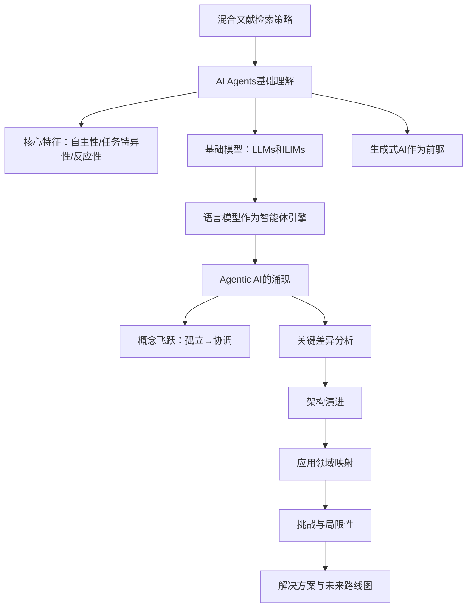
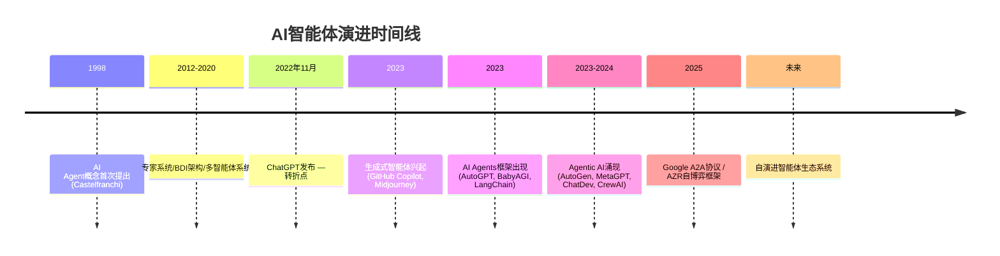

# AI Agents vs. Agentic AI：论文总结

## 1. 核心主张

> **AI Agents和Agentic AI是两种本质不同的范式**：AI Agents是面向特定任务、工具增强的单智能体系统，而Agentic AI是通过多智能体协作、持久记忆和动态编排实现复杂目标的协调系统。混淆二者将导致系统设计的过度工程或不足工程。

本文建立了从生成式AI → AI Agents → Agentic AI的演进分类体系，从五个核心维度（架构、机制、范围/复杂性、交互、自主性）系统化地区分这两种范式，并映射各自的应用场景、挑战和解决方案。

## 2. 问题诊断

| 问题 | 说明 |
|------|------|
| **术语混淆** | "AI Agents"和"Agentic AI"常被混用，缺乏清晰的概念边界 |
| **设计错配** | 开发者可能在简单场景中过度使用多智能体架构，或在复杂场景中低估协调需求 |
| **评估标准缺失** | 两种范式的性能指标、安全协议和资源需求存在本质差异，但缺乏分类基准 |
| **碎片化现状** | 现有文献零散地讨论AI智能体的各个方面，缺乏统一的比较框架 |

## 3. 综述范围与方法

**检索策略**：混合方法——12个平台（学术数据库7个 + AI工具5个），布尔组合检索。

| 维度 | 说明 |
|------|------|
| **覆盖平台** | Google Scholar, IEEE Xplore, ACM DL, Scopus, WoS, ScienceDirect, arXiv; ChatGPT, Perplexity, DeepSeek, HuggingFace, Grok |
| **时间范围** | 聚焦2022年（ChatGPT发布）至2025年，兼顾历史基础文献 |
| **筛选标准** | 新颖性、实证评估、架构贡献、引用影响 |
| **分析框架** | 顺序分层结构：基础理解 → 模型整合 → 架构演进 → 应用 → 挑战 → 解决方案 |

## 4. 分类体系

### 4.1 三阶段演进：生成式AI → AI Agents → Agentic AI

> **图2：研究思维导图。** 探索AI Agents和Agentic AI的概念、应用和挑战，涵盖架构、机制、范围/复杂性、交互和自主性五个维度。

| 阶段 | 核心特征 | 典型系统 | 局限 |
|------|---------|---------|------|
| **生成式AI** | 提示驱动、无状态、反应式内容生成 | GPT-4, DALL·E, BLIP-2 | 无自主性、无记忆、无工具使用 |
| **AI Agents** | 工具增强、目标导向、单智能体任务执行 | AutoGPT, LangChain Agent, ChatGPT+Search | 有限规划、无跨任务协调 |
| **Agentic AI** | 多智能体协作、持久记忆、编排式工作流 | CrewAI, MetaGPT, AutoGen, ChatDev | 协调瓶颈、涌现不可预测性 |

### 4.2 AI Agents核心特征

> **图4：AI Agents核心特征示意图。** 自主性、任务特异性和反应性三大基础特征。

| 特征 | 定义 | 示例 |
|------|------|------|
| **自主性** | 部署后在最少人工干预下运行 | 客服机器人自主处理工单 |
| **任务特异性** | 为狭窄、明确定义的任务优化 | 电子邮件过滤、日历协调 |
| **反应性与适应** | 响应实时刺激并基于反馈循环改进 | 个性化推荐、对话流管理 |

### 4.3 五维度比较框架

论文通过Tables I-IX建立了系统化的多维比较框架，核心维度包括：

| 比较维度 | AI Agents | Agentic AI |
|---------|-----------|------------|
| **核心功能** | 基于工具的任务执行 | 工作流编排和目标达成 |
| **架构** | LLM + 工具链（单智能体） | 多LLM + 共享记忆 + 编排器 |
| **运行机制** | 输入→工具→输出 | 输入→智能体1→智能体2→…→输出 |
| **任务复杂性** | 中等（单一任务） | 高（多智能体协调） |
| **自主性级别** | 中等（自主使用工具） | 高（管理整个过程） |
| **记忆** | 可选/短期 | 持久/共享/跨智能体 |
| **规划范围** | 单步 | 多步 |
| **学习机制** | 基于规则/监督 | 强化/元学习 |
| **交互风格** | 反应式 | 主动式 |
| **协调策略** | 无（孤立执行） | 层级或分散 |

### 4.4 架构演进

> **图8：从传统AI Agents到现代Agentic AI系统的架构演进。** 从核心模块扩展到高级组件和涌现属性。

**AI Agents架构四大组件：**

**Agentic AI四大架构增强：**

| 增强 | 说明 | 代表框架 |
|------|------|---------|
| **专门智能体集合** | 多个角色化智能体各司其职 | MetaGPT（CEO/CTO/工程师角色） |
| **高级推理与规划** | ReAct、CoT、ToT迭代推理 | AutoGen规划循环 |
| **持久记忆架构** | 情景记忆 + 语义记忆 + 向量记忆 | AutoGen暂存板 |
| **编排层/元智能体** | 协调生命周期、管理依赖、分配角色 | ChatDev虚拟CEO |

## 5. 关键对比与发现

### 5.1 应用领域对比

> **图9：AI Agents和Agentic AI在八个核心功能领域的分类应用。**

| AI Agents应用 | 特征 | Agentic AI应用 | 特征 |
|-------------|------|--------------|------|
| 客户支持自动化 | 单智能体+RAG+CRM API | 多智能体研究助手 | 检索器+摘要器+合成器+格式化器 |
| 电子邮件过滤/优先级排序 | 意图分类+自动标记 | 智能机器人协调 | 多机器人共享空间记忆+实时融合 |
| 个性化内容推荐 | 协同过滤+行为分析 | 协作医疗决策 | 诊断+验证+治疗方案智能体同步 |
| 自主调度助手 | 日历API+偏好学习 | 自适应工作流自动化 | 分散式任务执行+异常处理 |

### 5.2 挑战对比

> **图12：挑战示意图。** (a) AI Agents的关键局限性。(b) Agentic AI系统中放大的挑战。

| AI Agents挑战（5项） | Agentic AI挑战（8项） |
|---------------------|---------------------|
| 1. 缺乏因果理解 | 1. 放大的因果性挑战 |
| 2. 继承自LLMs的局限（幻觉、提示敏感） | 2. 通信和协调瓶颈 |
| 3. 不完整的智能体属性 | 3. 涌现行为和不可预测性 |
| 4. 有限的长期规划和恢复 | 4. 可扩展性和调试复杂性 |
| 5. 可靠性和安全性问题 | 5. 信任、可解释性和验证 |
| | 6. 安全和对抗性风险 |
| | 7. 伦理和治理挑战 |
| | 8. 不成熟的基础和研究缺口 |

> **关键发现：Agentic AI不仅继承了AI Agents的所有局限性，还因多智能体交互引入了全新的系统级挑战**——错误级联、协调失败和涌现不可控行为。

### 5.3 十大解决方案

> **图13：十种演进的架构和算法机制。**

| # | 解决方案 | 对AI Agents | 对Agentic AI |
|---|---------|------------|-------------|
| 1 | **RAG** | 缓解幻觉、扩展静态知识 | 跨智能体共享定位机制 |
| 2 | **工具增强推理** | 扩展与现实世界交互能力 | 编排管道中的结构化协调 |
| 3 | **智能体循环（ReAct）** | 迭代推理减少错误 | 协作连贯性+跨智能体调和 |
| 4 | **记忆架构** | 长期规划和会话连续性 | 分布式状态管理+全局协调 |
| 5 | **多智能体编排** | 模块化提示工程 | 角色专门化+元智能体协调 |
| 6 | **反思/自我批评** | 单智能体自评估 | 智能体间互评+质量控制 |
| 7 | **编程式提示管道** | 减少提示脆弱性 | 角色一致的可扩展通信 |
| 8 | **因果建模** | 区分相关与因果 | 安全协调+错误恢复 |
| 9 | **监控/审计管道** | 事后分析和调优 | 跨智能体审计轨迹 |
| 10 | **治理感知架构** | 角色访问控制+沙箱 | 跨角色/工作流的问责机制 |

## 6. 研究趋势

> **图14：AI Agents（左）和Agentic AI（右）未来路线图。**

**AI Agents演进方向：**
1. 主动智能（从反应式到主动式）
2. 深度工具整合
3. 因果推理能力
4. 持续学习框架
5. 信任与安全机制

**Agentic AI演进方向：**
1. 多智能体扩展
2. 统一编排框架
3. 持久记忆架构
4. 模拟规划能力
5. 伦理治理框架
6. 领域特定系统

## 7. 开放问题与未来方向

| 开放问题 | 现状 | 潜在方向 |
|---------|------|---------|
| **因果推理集成** | LLMs仅做统计相关，非因果推理 | 因果图、贝叶斯推理层、PDDL规划 |
| **标准架构缺失** | 编排/记忆/通信协议以ad hoc方式实现 | A2A协议等标准化努力 |
| **形式验证** | 不存在针对多智能体LLM系统的验证方法 | 模型检查、安全性证明扩展 |
| **可扩展协调** | 智能体增加≠智能增加，可能增加噪声 | 层级编排+智能资源调度 |
| **自演进能力** | 智能体依赖外部数据集和人类标注 | AZR框架：自生成+自验证+自解决 |
| **跨域泛化** | 大多仍为原型管道 | 领域特定系统+通用框架融合 |

> **AZR（Absolute Zero Reasoning）框架代表了一个变革性方向：通过消除对外部数据集的依赖，使智能体实现真正的自主推理和自演进能力。**

## 8. 总结性评价

**综述质量：**

| 维度 | 评价 |
|------|------|
| **覆盖全面性** | ★★★★☆ 系统覆盖了从基础到应用到挑战的完整脉络 |
| **分类清晰度** | ★★★★★ 多层次、多维度的分类框架是本文最大贡献 |
| **实用性** | ★★★★☆ 十大解决方案提供了可操作的技术路线图 |
| **时效性** | ★★★★★ 覆盖至2025年，包含Google A2A、AZR等最新进展 |
| **批判深度** | ★★★☆☆ 挑战分析较全面但解决方案讨论偏概念性 |

**适合读者：**
- 需要理解AI Agents vs Agentic AI概念边界的**研究人员和架构师**
- 需要选择单智能体还是多智能体方案的**工程团队**
- 关注智能体系统安全/治理/伦理问题的**政策制定者**
- 需要全景式理解智能体领域演进的**入门读者**

**核心贡献：** 本文最大的价值在于建立了**生成式AI → AI Agents → Agentic AI**的清晰演进图谱，并通过9张比较表格和14张图表提供了迄今为止最系统化的AI智能体分类体系，为该领域的研究和工程实践提供了共享词汇和参考框架。
