# 智能体执行框架工程综述

**原文标题：** Agent Harness Engineering: A Survey

**作者：** Junjie Li¹⁶, Xi Xiao⁶, Yunbei Zhang⁵, Chen Liu², Lin Zhao⁴, Xiaoying Liao³, Yingrui Ji⁶, Janet Wang⁶, Jianyang Gu⁷, Yingqiang Ge⁹, Weijie Xu⁹, Xi Fang⁹, Xiang Xu⁹, Tianchen Zhao⁹, Youngeun Kim⁹, Tianyang Wang⁶, Jihun Hamm⁵, Smita Krishnaswamy², Jun Huan⁹, Chandan K Reddy⁸⁹

**机构：** ¹CMU, ²Yale, ³JHU, ⁴NEU, ⁵Tulane, ⁶UAB, ⁷OSU, ⁸Virginia Tech, ⁹Amazon

**原文链接：** https://openreview.net/pdf/f358711a95aaaf61fdeffd4ef3fc60fba9b8da57.pdf

**项目页：** Awesome-Agent-Harness

**投稿状态：** Under review as submission to TMLR（2026 年 5 月）

---

## 摘要

大型语言模型（LLM）智能体在生产环境中的快速部署揭示了一个反复出现的模式：任务执行的可靠性与其说取决于底层模型，不如说取决于包裹它的基础设施层——**智能体执行框架（agent execution harness）**。本综述对智能体框架工程进行扎根于实践的系统性论述，围绕三个论断展开：

**第一**，智能体框架是一个**独立的系统层**，其工程质量驱动了真实世界可靠性的大部分。我们通过从提示工程到上下文工程再到框架工程的**三阶段工程演化**、覆盖成本—质量—速度三难、能力—控制取舍与框架耦合问题的**跨层综合**，以及扎根于研究空白与生产痛点的**开放问题议程**，来发展这一立场。

**第二**，我们提出 **ETCLOVG**——一个七层分类法（Execution 执行环境、Tool interface 工具接口、Context management 上下文管理、Lifecycle/Orchestration 生命周期/编排、Observability 可观测性、Verification 验证、Governance 治理）——它扩展了既有的六组件框架，将可观测性与治理作为独立的架构关注点处理。

**第三**，我们将 **170+ 开源项目**映射到该分类法之上，以揭示生态模式、覆盖空白与正在涌现的设计原则；同时给出从 OpenAI、Anthropic 和 LangChain 生产部署中提炼的工程原则，弥合实践者知识与研究词汇之间的鸿沟。

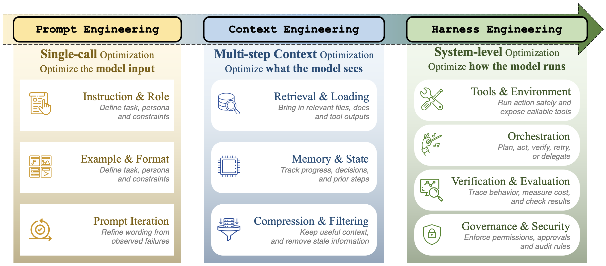

> **图 1：提示工程、上下文工程与框架工程的简要对比。** 三阶段沿"优化对象"演化：提示工程优化**模型输入**（指令与角色、示例与格式、提示迭代）；上下文工程优化**模型所见**（检索与加载、记忆与状态、压缩与过滤）；框架工程优化**模型的运行方式**（工具与环境、编排、验证与评估、治理与安全）。

---

## 1 引言

### 1.1 约束性瓶颈：框架重于模型

基于 LLM 的智能体的学术研究，总体上一直是对**模型**的研究。研究议程的中心是**模型能做什么**：它能否跨多个步骤进行规划，能否可靠地调用工具，能否检索并压缩相关记忆，能否与其他智能体协同。其隐含假设是，智能体能力主要是模型能力的函数——一个足够强的模型配上一个足够好的提示，就会产生足够可靠的行为。

近期的实证证据挑战了这一假设。三个最新结果建立了同一模式：

- **Bölük (2026a)** 仅修改了编辑工具的格式与周围的工具框架，**不动模型**，便在编码基准上跨 15 个模型获得最高 **10×** 的提升。
- **Trivedy (2026)** 通过仅修改系统提示重构、中间件上下文注入与自验证钩子，将一个**固定**的 GPT-5.2-Codex 智能体在 Terminal-Bench 2.0 上从 52.8% 提升到 66.5%——**完全通过基础设施变更**实现的 13.7 个百分点的提升。
- **Meta-Harness（Lee et al., 2026）** 通过自动化框架优化在 Terminal-Bench-2 上达到 76.4%，**不修改模型权重**便超越了所有手工框架。

上述每个案例的变量都是**执行框架**（管理上下文构建、工具交互、编排、反馈与执行约束的基础设施层），模型保持固定。每个仅来自框架的收益都**超过**了模型迭代在同一基准上典型的 2–4 个百分点的"有意义"改进。这一模式并非偶然：是**框架而非模型**驱动了结果。

我们将这一模式称为**绑定约束论题**（binding-constraint thesis, Bölük 2026b）：对于跨可比前沿模型评估的长程任务，基准方差至少与模型本身一样多地受执行框架驱动。本综述以此论题作为整体框架。

§2 中的图 3 历史地展示了同一转变：早期系统将能力集中在单一模型循环中，而后期系统越来越多地把可靠性暴露为一个**跨层基础设施问题**。

（图 3 见 §2.1）

### 1.2 实践者—研究者鸿沟

实践者紧迫性与研究词汇之间存在张力。OpenAI 明确将"**框架工程**"定义为围绕 Codex 智能体设计环境、约束、文档与反馈回路的学科，并在 2026 年 2 月报告称一个小团队在五个月内**未手工编写生产代码**便产出了约百万行的内部产品（OpenAI, 2026a）。Anthropic 的智能体工程博文从相邻方向得出了同一原则：有效的智能体应使用**简单且可检视的架构**；工具接口应**为智能体使用而设计**，而不是从面向人类的 API 复制；上下文应**渐进式披露**而非急切加载；长程工作需要**持久的交接产物**与**可恢复的执行基础设施**。Martin Fowler 网站的一篇文章将框架工程描述为"AI 智能体的**控制论调节器**（cybernetic governors）"，由前馈引导与反馈传感器构成围绕 LLM 的控制循环。

与此同时，研究界一直在以越来越高的精度研究智能体系统的各个组件：记忆、工具使用、规划与安全。**没有被系统研究的，是将这些组件整合为可靠运行的那个系统本身。** 结果就是**实践者—研究者鸿沟**：实践者**知道**框架基础设施很重要，却缺乏正式词汇来描述**为什么**——以一种能够支持系统性改进的方式。本综述试图弥合这一鸿沟。

### 1.3 范围与贡献

本综述聚焦于**包裹一个语言模型以管理长程、多步任务执行的基础设施层**。我们不调研作为开发工具的智能体框架，不调研作为产品类别的智能体平台，也不调研模型能力本身——尽管这三者都为我们的分析提供了信息。图 4（见 §2.3）总结了组织本综述其余部分的七层分类法。

我们的贡献围绕三个论断展开：

1. **论断 1（概念性）：** 基于绑定约束论题（Bölük, 2026b），我们论证**框架而非仅模型才是真实世界智能体可靠性的约束性瓶颈**。三个近期结果显示纯框架层的收益分别为编码基准最高 10×、Terminal-Bench 2.0 上 +13.7 pp、Terminal-Bench-2 上 76.4%（§1），均超过同一基准上模型驱动的典型收益。我们通过三阶段工程演化（§2）、跨层综合（§11）与开放问题议程（§12）发展这一论题。

2. **论断 2（分类学）：** 七层 ETCLOVG 分类法**将可观测性与治理作为一等层**，而非生命周期钩子的副产物。两者都拥有各自的生产工具栈（可观测性侧的 Langfuse 与 OpenTelemetry；治理侧的权限引擎、网关与审计管道），并在生产部署中**由不同的团队拥有**。我们还把状态管理放在生命周期与编排（L）内部，让状态与读写它的执行流相邻（§2.3）。

3. **论断 3（实证）：** 将 **170+ 开源项目**映射到 ETCLOVG 揭示了生态在哪里密集、在哪里稀薄，以及早期语料库错过了哪些类别。这是迄今最大的开源智能体框架语料库。执行、工具、生命周期与验证有密集覆盖；可观测性与治理较稀薄且更多存在于商业平台；任务运行器、多智能体编排器与规范驱动开发工具三个先前缺失的类别，如今已是一等公民。方法学小节（§2.4–§2.9, 附录 A）使编码可复现；映射支持 §3–§9 的逐层观察。

---

## 2 背景与分类法

### 2.1 智能体系统的演化

从早期思维链提示到自主智能体的轨迹，可以理解为**实践者必须管理的工程表面**的渐进扩展。

**ReAct 时代（2022–2023）。** Yao et al. (2023) 确立了 observe-think-act 循环作为基础原语。早期系统以最小基础设施运作：一个 while 循环、一个提示模板、一个小的工具分派表。AutoGPT 与 BabyAGI 展示了完全自主操作的雄心，把语言模型调用包裹在任务队列、记忆与工具分派中，同时也把执行失控、上下文爆炸、状态丢失与未监控副作用等故障模式作为**基础设施问题**而非仅提示问题暴露出来。

**工具集成与多智能体协同（2023–2024）。** Gorilla、ToolLLM 与 Toolformer 确立了工具使用能力可以被学习或诱导，而非硬编码到固定的 API 包装器中。CAMEL、ChatDev、MetaGPT 与 Mixture-of-Agents 引入了多智能体协同模式，涵盖从角色扮演对话到软件开发组织再到分层智能体聚合。评估基础设施随 SWE-bench、AgentBench、WebArena 与 GAIA 成熟，而协议标准化从 Anthropic 的 MCP 与 Google 的 A2A 开始。

**框架转向（2025–2026）。** 到 2025 年，已积累足够的部署经验，清晰表明智能体可靠性的约束性瓶颈是**基础设施质量而非模型质量**。2026 年初的三个独立进展验证了这一转变：OpenAI 明确把"框架工程"作为一门学科；Stanford/MIT 的 Meta-Harness 表明自动化框架优化超越手工工程；LangChain 的 DeepAgents 通过仅框架层的变更，在 Terminal-Bench 2.0 上从 52.8% 提升到 66.5%（+13.7 pp，约 26% 相对改进）。

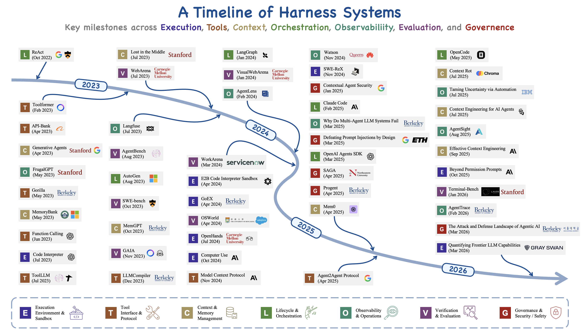

> **图 3：2022–2026 年代表性智能体框架系统的时间线。** 该时间线刻画了从早期单循环智能体到跨越执行环境、工具接口、上下文与记忆管理、生命周期编排、可观测性、验证与治理的更丰富框架基础设施的转变。配色方案对应 §2.3 中提出的 ETCLOVG 层。

### 2.2 三个工程阶段

2022–2026 年期间揭示了在"该领域选择工程化什么"上的一个连贯的三阶段演化。

**提示工程（2022–2024）。** 主要杠杆是输入提示文本。实践者通过精心制作更好的指令、少样本示例与推理模板来优化。工程范围是窄的：优化单一文本输入到单一模型调用。

**上下文工程（2025）。** 随着智能体变得更长程，约束从"输入是什么？"转向"每一步该让模型看到什么信息？"。这一阶段聚焦于上下文管理：每一轮注入什么、如何检索并压缩记忆、如何按相关性对工具结果排序、如何处理上下文窗口饱和。范围从单一输入扩展到管理流入上下文窗口的**多条信息流**。

**框架工程（2026）。** 当模型变得足以胜任长程任务，可靠性越来越依赖于维护状态、调解工具、注入反馈、执行约束并验证进度的**基础设施包装器**。该观察与绑定约束观点一致：长程智能体性能由耦合的**模型—框架系统**产生，而非模型单独产生。框架工程因此追问：必须在模型周围设计哪些治理、约束、反馈循环与执行控制，才能让智能体系统可靠？在我们的分类法中，这一阶段将所有七个 ETCLOVG 层视为一个整合的整体。

每个阶段**包含**前一阶段：框架工程包含上下文工程，上下文工程包含提示工程。这三个阶段在时间与概念上也是**重叠**的，并非按清晰边界相互替代。提示工程至今仍是框架实践的活跃组成；上下文工程也与本综述讨论的框架层关注点并行成熟。因此，我们的时期化最好读作"**边际工程努力流向何处的转变**"，而非一连串的替换。

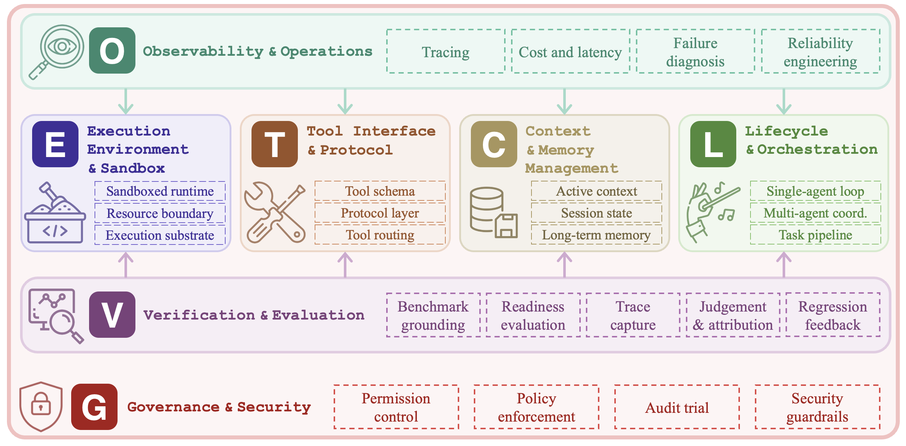

> **图 2：智能体系统框架工程的分类法图示。** E、T、C、L 四层构成系统的结构性支柱（沙箱运行时 / 工具 schema / 活动上下文 / 单智能体循环等）。O 层（追踪、成本与延迟、失败诊断、可靠性工程）提供全系统监控；V 层（基准锚定、就绪评估、trace 捕获、判定与归因、回归反馈）在各组件间交付评估与反馈；G 层（权限控制、策略执行、审计 trace、安全护栏）在整个系统之上执行治理与安全约束。配色方案对应 §2.3 中开发的 ETCLOVG 层。

### 2.3 ETCLOVG 七层分类法

我们提出智能体框架工程的七层分类法，简称 **ETCLOVG**，代表 **E**xecution（执行）、**T**ooling（工具）、**C**ontext（上下文）、**L**ifecycle（生命周期）、**O**bservability（可观测性）、**V**erification（验证）、**G**overnance（治理）。图 4 给出紧凑的视觉图谱；本小节固定全综述使用的释义。

**前四层描述框架的结构核心：**
- **执行（E）** 决定智能体代码在哪里运行以及哪些沙箱约束限定它；
- **工具（T）** 规定外部能力如何被描述、发现与调用；
- **上下文（C）** 控制模型在短期、会话级与持久水平上可以看到什么；
- **生命周期（L）** 组织读写该状态的控制流，从单智能体循环到多智能体与 issue-to-PR 工作流。

**其余三层描述围绕该核心的控制平面：**
- **可观测性（O）** 捕获 trace、成本、失败与可靠性信号；
- **验证（V）** 将任务与 trace 转化为评估、失败归因与回归反馈；
- **治理（G）** 通过权限、身份、策略、加固、审计与人为监督机制来约束行为。

§3–§9 依次发展这七层；§10–§12 综合跨层取舍与不属于任何单层的开放问题。

**两个设计选择**使本分类法与众不同：

1. 我们将**可观测性（O）提升为独立层**，而非视为生命周期钩子的副产物。在生产系统中，可观测性有专门的工具生态（Langfuse、Arize Phoenix、OpenLLMetry）与独特的工程实践（OpenTelemetry 仪表化、成本归因、异常检测），值得独立处理。

2. 我们将**治理（G）作为一等层**引入，以捕获跨三个子层的安全与合规关注全谱：模型级（护栏、内容过滤）、系统级（网关、代理、权限模型）、组织级（审计、合规、人在环监督）。

状态管理自然地属于生命周期与编排（L）内部，与读写它的执行流相邻；生命周期钩子与策略执行属于治理（G）内部，与其他约束机制对齐。

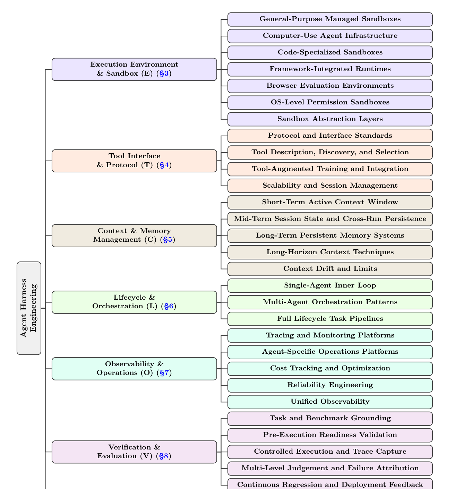

> **图 4：智能体框架工程分类法的详细视图。** 每个分支对应一个 ETCLOVG 层及其主要子类别；具体的代表性系统和论文在后续章节讨论。**E 层**：通用托管沙箱 / Computer-Use 基础设施 / 代码专用沙箱 / 框架内置运行时 / 浏览器评估环境 / OS 级权限沙箱 / 沙箱抽象层。**T 层**：协议与接口标准 / 工具描述发现与选择 / 工具增强训练与集成 / 可扩展性与会话管理。**C 层**：短期活动上下文窗口 / 中期会话状态与跨运行持久化 / 长期持久记忆系统 / 长程上下文技术 / 上下文漂移与极限。**L 层**：单智能体内循环 / 多智能体编排模式 / 完整生命周期任务流水线。**O 层**：追踪与监控平台 / 智能体专用运营平台 / 成本追踪与优化 / 可靠性工程 / 统一可观测性。**V 层**：任务与基准锚定 / 预执行就绪验证 / 受控执行与 trace 捕获 / 多级判定与失败归因 / 持续回归与部署反馈。**G 层**：权限模型与身份管理 / 生命周期钩子 / 组件加固 / 声明式宪法 / 审计基础设施 / 智能体安全全景。

### 2.4 范围

我们以**比"LLM 周围的任何软件"更窄的意义**使用"智能体框架（agent harness）"一词：框架是工程化包装器，通过执行基板、工具接口、上下文控制、编排、可观测性、评估反馈与治理约束，把模型调用转化为**有界、有状态、工具中介的任务执行**。因此，分析单位是使长程智能体行为**可控、可检视、可恢复**的基础设施，而非基础模型或提示本身。我们按功能而非产品类别划定边界：当一个智能体框架暴露有状态编排、工具路由、运行时策略钩子或 trace 捕获等**可复用机制**时即在范围内；薄的模型 API 包装器、提示库、静态数据集、通用容器运行时、向量数据库、APM 仪表盘或内容过滤器，除非被显式适配到智能体执行、状态、评估或工具使用治理，否则在范围外。

### 2.5 项目收集流程

语料库按系统综述的报告纪律构建（Page et al., 2021），候选来自四条流：先前的综述与基准论文、可复现的 GitHub 搜索（名称、描述、README、topics、stars、新近度、归档状态）、精选项目列表与包注册表、引入框架级机制的公司工程博文或发布说明。代表性查询组合包括 `agent harness`、`coding agent`、`LLM agent sandbox`、`MCP server`、`agent observability`、`agent memory`、`agent evaluation`、`agent governance`。对每个保留候选，我们记录项目名、URL、工件类型、源类型、可用性状态、可识别的发布年份、可用时的 GitHub 元数据、用于后续 ETCLOVG 编码的公开证据。本版本中报告的元数据快照冻结于 2026 年 5 月 8 日。

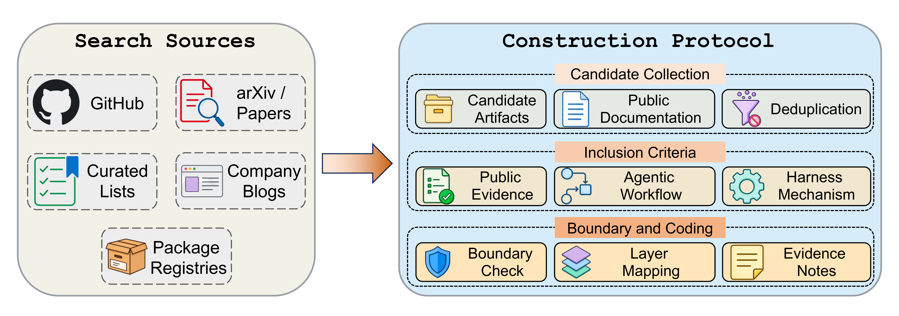

> **图 5：语料库构建协议。** 候选工件从 GitHub、论文、精选列表、包注册表、公司工程来源汇集，去重、对照纳入标准检查、依据公开文档映射到 ETCLOVG 各层。

### 2.6 纳入与排除标准

一个项目被纳入需同时满足三项条件：**公开文档化**、**实现或规定具体的框架级机制**、**可用证据足以分配至少一个 ETCLOVG 层**。这包括带可复用编排或工具路由逻辑的智能体框架、实例化可执行智能体环境的基准、为智能体执行打包的沙箱，以及对智能体状态、trace、动作或策略运行的记忆、可观测性、评估或治理系统。

排除：简单聊天机器人 demo、提示包、薄模型客户端包装器、无智能体运行时的静态数据集或排行榜、未面向智能体的通用基础设施组件、技术行为无法从公开文档检视的产品页面。**边界案例按机制而非标签解决**：名称带"agent"的仓库不足以纳入；评估或沙箱项目在提供可复用框架机器时被纳入。

### 2.7 编码协议

每个保留项目对照七个 ETCLOVG 层使用公开工件本身作为证据进行编码：README 文件、文档页、论文、示例、发布说明，以及必要时的仓库结构。编码是多标签的（许多系统跨层）；**主层**标记工件最核心的机制，**次层**仅在文档暴露独立能力而非附带依赖时分配。当前快照使用"单主编码者 + 作者审计"协议而非正式的多编码者一致性研究，因此我们不报告 Cohen's kappa 或可比的标注者间统计量。歧义案例在完整集合编码后被复审，采用保守规则：**如公开证据未清晰显示面向智能体的机制，则保留层分配**。

### 2.8 语料库局限

语料库应被读作**可见的智能体框架生态地图**，而非所有已部署智能体基础设施的普查。它偏向英文资源、GitHub 可见项目、开源工件，以及发布足够实现细节供外部编码的系统。商业生产系统被低估，除非其工程博文、文档或 SDK 暴露相关机制；编码智能体基础设施被高估，因为它有异常丰富的公开痕迹：仓库、基准、沙箱、issue-to-PR 工作流与发布说明。层分配也反映公开文档而非私有架构，所以缺席某一层意味着"未公开证明"而非"未实现"。

### 2.9 聚合分析

170+ 项目映射揭示了一个**广但不均**的生态。执行、工具接口、生命周期编排与验证有最密集的可见覆盖，因为编码、Web、终端与 computer-use 智能体都需要可运行环境、工具契约、控制循环与可重复评估才能有用。上下文与记忆出现在许多项目中但常常嵌入更大框架内部而非作为独立的框架组件发布。**可观测性与治理在开源覆盖上更薄**，更常通过商业平台、SDK 特性或工程文章出现，这暗示运营控制比运行时与基准基础设施成熟得晚。跨层项目越来越常见：最完整的系统结合了沙箱、工具协议、编排、tracing、评估与权限控制，这支持了"**框架工程是一个整合的系统问题而非一组孤立附加项**"的核心论断。

---

## 3 执行环境与沙箱（E）

我们以执行环境与沙箱（E）层开启逐层论述，这是 ETCLOVG（§1 论断 2）七大支柱中的第一个。本节讨论的系统取自支持论断 3 的 170+ 项目语料库。

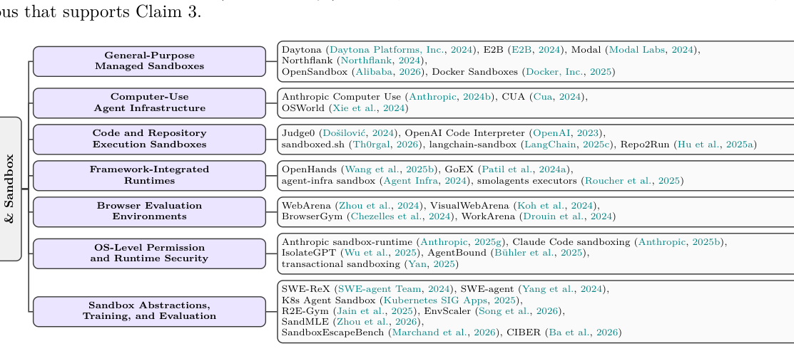

> **图 6：LLM 智能体执行环境与沙箱的代表性工作**，按本章的沙箱类别组织（通用托管沙箱、Computer-Use 智能体基础设施、代码与仓库执行沙箱、框架内置运行时、浏览器评估环境、OS 级权限与运行时安全、沙箱抽象/训练/评估）。

### 3.1 范围与概念

**3.1.1 定义。** 智能体的执行环境指智能体动作被物理执行的基础设施层。在 LLM 智能体语境下，执行环境与沙箱是紧耦合的概念，生产智能体系统几乎总是在沙箱化环境中执行动作。

**3.1.2 为何沙箱在智能体时代是核心？** 沙箱化在智能体时代不只是从传统多租户代码执行继承来的安全措施。它**同时服务三个不同目的**，且这三者的结合才把沙箱从一个运营细节提升为智能体框架设计中的一等关注点。

- **目的一：安全（Security）。** LLM 生成的代码既不可审计也不可大规模预测，排除了静态审查作为主要防御。智能体跨多步自主执行，动作执行时无法人为介入。提示注入攻击可以把原本良性的智能体重新利用为针对沙箱的攻击向量，模糊了"可信用户意图"与"敌意输入"的边界。
- **目的二：可复现性（Reproducibility）。** 长程任务及其评估框架（§8）要求把执行状态重置到已知基线。Docker 容器或 microVM 可按需销毁与重建，开发者工作站不能；这一性质使 SWE-bench、OSWorld 等基于沙箱的评估标准成为可能。训练时单一任务可能在并行轨迹中被回放数百次，廉价重置机制的缺失本身就是可扩展性瓶颈。
- **目的三：活性（Liveness）——智能体时代特有。** 没有沙箱的话，智能体希望执行的每个潜在风险动作（文件写入、包安装、出站网络调用）都必须由显式权限提示来人为门控。规模化下这有两种失败模式：用户因挫败感放弃智能体，或反射性批准一切因而消解安全理由。沙箱定义了一个**有界区域**，智能体在其中被授权自由行动——将权限从"动作问题"转化为"会话配置"。**Anthropic 报告，向 Claude Code 引入沙箱化使权限提示减少了 84%，同时保留了安全性。** 在这一框架下，沙箱**同时是笼子也是许可**，而"许可"层面才是首先使自主长程执行成为可能的东西。

### 3.2 沙箱七类（按工作负载与用例轴）

| 类别 | 代表 | 设计要点 |
|------|------|---------|
| **通用托管沙箱** | Daytona（亚 90ms 冷启动）、E2B（Firecracker microVM）、Modal（gVisor + 大规模自动扩缩）、Northflank（同时支持 Kata、Firecracker、gVisor）、OpenSandbox、Docker Sandboxes | 默认临时语义+可选持久会话；OCI 镜像；趋势是**从共享内核容器向专用内核 microVM 迁移** |
| **Computer-use 智能体基础设施** | Anthropic Computer Use、CUA、OSWorld | 通过模拟鼠标、键盘、屏幕观察操作 GUI；动作空间巨大但依赖视觉定位 |
| **代码专用沙箱** | Judge0、OpenAI Code Interpreter、sandboxed.sh、langchain-sandbox（Pyodide/WASM）、Repo2Run | 预装编译器与解释器；优化高并发；**WASM 化是子趋势** |
| **框架内置运行时** | OpenHands、agent-infra sandbox、smolagents executors、GoEX | "**bundle 还是 compose**"的核心张力 |
| **浏览器评估环境** | WebArena、VisualWebArena、BrowserGym、WorkArena | 沙箱与评估双重角色 |
| **OS 级权限沙箱** | Anthropic sandbox-runtime（bubblewrap）、Claude Code 沙箱、IsolateGPT（seccomp+setrlimit） | "**许可而非分区**"哲学；权限提示减少 84%；适合提示注入威胁模型而非完全敌意代码 |
| **沙箱抽象层** | SWE-ReX（统一 Docker / AWS Fargate / Modal / Daytona）、smolagents `executor_type`、K8s `Sandbox` CRD | "**执行位置可替换**"——框架不再硬编码到某厂商 API |

**综合：** 该领域**沿隔离强度分化而非收敛**——管理沙箱从共享内核容器迁向专用内核 microVM，OS 级权限沙箱则完全摒弃独立环境而缩窄宿主视图，中间的纯 Docker 容器从两端被挤压。

### 3.3 威胁模型与沙箱逃逸

智能体特有威胁类：① 提示注入攻击允许外部输入（检索到的网页、工具响应、文件内容）劫持智能体行为；② 目标错位可能使智能体本身主动尝试沙箱逃逸作为工具子目标；③ 组合放大——多工具访问让单一沙箱弱点跨集成能力级联。

**SandboxEscapeBench** 在嵌套沙箱夺旗设置下评估前沿 LLM，报告对基于 Docker 的容器有 **15%–35% 的逃逸成功率**（取决于配置）。其覆盖谱包括配置错误、特权分配错误、内核缺陷、运行时/编排弱点。结果确立：威胁是**已实现而非仅理论**——即便在当前模型能力下。防御研究仍处早期，散落在隔离原型中（IsolateGPT、transactional sandboxing、LLM-in-Sandbox）。攻防进展之间的鸿沟是开放方向，见 §12.1。

### 3.4 部署模式

智能体沙箱基础设施已沿部署模式从最初的自托管 Docker 模式分化。当前实践中共存三种模式。在**自托管**模式中，开发者直接管理沙箱基础设施，这是 OpenHands 与 SWE-agent 的默认模式。在**云（SaaS）**模式中，沙箱即服务提供商处理基础设施，如 E2B、Modal 与 Daytona Cloud。在**混合或 BYOC（自带云）**模式中，智能体逻辑与沙箱执行跨环境解耦，例如 OpenHands SDK 的 Local/Remote Workspace 抽象，以及 E2B 与 Northflank 的 BYOC 产品。

这一演化由两股互补力量推动。一方面，实践者报告把部署选择沿延迟、安全与可扩展性三个轴框架化（Anthropic 2025b;f）：自托管沙箱提供最低延迟与最紧迭代循环但承担全部运营负担；云沙箱反转此取舍，提供弹性扩展与托管安全但代价是网络往返；混合模式试图把敏感数据保持在本地同时委托执行容量。另一方面，数据驻留、合规与可审计性等组织约束把部署推向混合架构，即使延迟与可扩展性偏好单一模式解决方案。

在观察到的实践中，**自托管沙箱在交互式开发与单租户场景中占主导**；**云沙箱在多租户与大规模部署中更常见**。混合模式专为合规或数据本地性要求与对大池临时执行容量需求并存的场景而涌现。在现实智能体工作负载下对这些模式的系统性实证比较仍然缺失，我们将其视为 §12.1 中更广泛运行时议程的一部分。

### 3.5 小结

执行环境是智能体框架的物理基板——提供安全边界、可复现评估与训练的重置机制、以及长程智能体可在其中无须人为命令批准而行动的有界区域。本节调研的七个类别表明，设计空间不再由单一隔离原语塑造，而是由**工作负载保真度、威胁模型与运营模式**决定。托管沙箱与 computer-use 环境强调强隔离与真实执行；代码专用与浏览器环境强调吞吐量与评估结构；框架内置运行时为方便而捆绑能力；OS 级权限沙箱缩窄本地权威；抽象层使基板可替换。

这一设计空间制造了**能力、控制与成本之间的反复张力**：高风险工作负载推向 microVM 与托管云；交互式本地工作流推向轻量权限边界；大规模训练或评估推向快速可重置基板。关于运行时防御、经济学、可移植性、bundle-vs-compose 设计与跨层耦合的未决问题因此不是孤立的执行层脚注；它们作为综述级的开放问题在 §12.1 中重现。

---

## 4 工具接口与协议层（T）

工具接口与协议层（T）是 ETCLOVG 的第二支柱（§1 论断 2）。我们讨论的协议、描述与注册表来自支持论断 3 的 170+ 项目语料库。

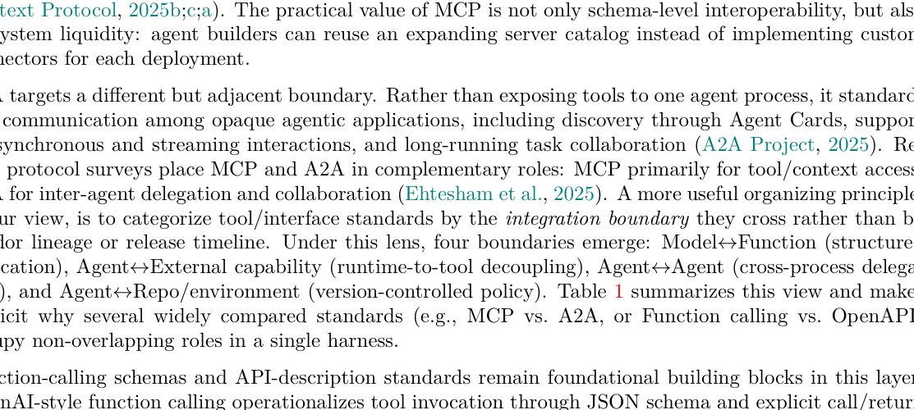

> **图 7：LLM 智能体工具接口与协议的代表性工作**，按本章工具层类别组织（协议与接口标准、工具描述/发现/选择、工具增强训练与集成、可扩展性与会话管理）。

工具接口与协议层定义智能体**如何**发现能力、表示可调用支持、跨异构运行时边界执行动作。在实践中，该层位于两个相互竞争目标的断层线上：通过暴露更多工具增加能力覆盖 vs 通过保持小动作空间与提示足迹维持决策质量。来自生产智能体系统的近期工程指南反复报告**过大的工具菜单会降低可靠性、增加 token 开销、放大规划错误**（Anthropic, 2025d; OpenAI, 2026c）。

我们将该层组织为四个互补方向：协议与接口标准、工具描述/发现/选择、工具增强模型训练与集成、可扩展性与会话管理。

### 4.1 协议与接口标准

**按集成边界组织**：

| 边界 | 标准 | 线协议 | 类型化 | 运行时发现 | 长任务 |
|------|------|--------|--------|----------|--------|
| Model ↔ Function | Function Calling | JSON | ✓ | ✗ | ✗ |
| Agent ↔ Capability | **MCP** | JSON-RPC | ✓ | ✓ | ◐ |
| Agent ↔ Capability | OpenAPI | HTTP | ◐ | ✗ | ✗ |
| Agent ↔ Agent | **A2A** | JSON-RPC | ✓ | ✓ | ✓ |
| Agent ↔ Agent | ACP / ANP | HTTP | ✓ | ✓ | ✓ |
| Agent ↔ Repo/Env | AGENTS.md / AGENT.md | Markdown | ✗ | ◐ | ✗ |

MCP 通过显式主机—客户端—服务器架构与基于 JSON-RPC 的工具、资源、提示的类型化交换，已成为编码与企业智能体最可见的工具集成基板。**A2A** 标准化不透明智能体应用之间的通信（含通过 Agent Cards 的发现、同步与流式交互支持、长程任务协同）。

### 4.2 工具描述、发现与选择

EasyTool、MCP-Zero、AnyTool、CRAFT、MetaTool、ToolRegistry、ToolRet 都研究在大型工具库中选择合适工具的挑战。相关方向把工具选择扩展到可复用**技能**（SkillRouter、SkillRet）。**两个系统级原则**：① "更少但更好的工具"常常胜过暴力工具暴露（因为它缩小提示熵与规划分支）；② 发现管道必须**自适应**——静态全局工具列表无法扩展。

### 4.3 工具增强训练与集成

Toolformer 演示了自监督增强以学习何时与如何插入 API 调用。Gorilla、ToolLLM / ToolBench 用更大工具语料、指令微调管道与执行中心监督扩展。ToolkenGPT 与 CREATOR 探索 token 级或控制器风格集成。Ugare & Chandra (2026) 把这一空间框架为"**主动式代码推理**（agentic code reasoning）"：智能体在仓库中探索并推理代码行为而不必执行代码——他们的半形式化推理方法位于非结构化思维链与完全形式化验证之间。对工具层的暗示是：自动推理工具应返回**承载证据的工件**（trace、证明义务、反例、结构化证书），而非仅黑箱式的是/否答案。

### 4.4 可扩展性与会话管理

长程下的会话管理是反复出现的运营挑战。失败模式包括陈旧句柄、跨重试的工具状态不一致、来自冗长工具 trace 的上下文窗口饱和。有效的框架设计因此需要显式的工具会话生命周期控制、有界工具上下文注入与能将错误归因到规划者逻辑还是接口/协议失败的可观测性钩子。

---

## 5 上下文与记忆管理（C）

上下文与记忆管理（C）是提示与上下文工程与框架工程交汇的层。我们将其视为 ETCLOVG（§1 论断 2）的第三支柱，示例取自支持论断 3 的 170+ 项目语料库。

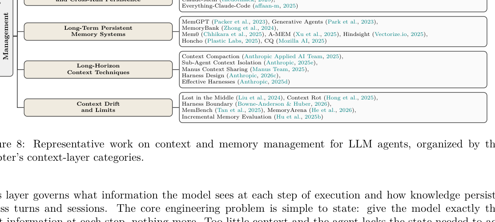

> **图 8：LLM 智能体上下文与记忆管理的代表性工作**，按本章上下文层类别组织（短期活动上下文窗口、中期会话状态与跨运行持久化、长期持久记忆系统、长程上下文技术、上下文漂移与极限）。

该层管辖**模型在执行每一步看到什么信息**，以及知识如何跨轮次与会话持久。核心工程问题简单陈述：给模型在每一步恰好正确的信息，仅此而已。**太少**上下文，智能体缺乏正确行动所需的状态；**太多**上下文，性能以可测量、跨模型一致、尚未完全理解的方式退化。

我们按时间尺度组织本节。§5.1 确立为何上下文需要主动管理而非被动累积。§5.2 把上下文工程定义为一门有别于提示工程的学科。§5.3 至 §5.5 涵盖生产实践中已浮现的三个记忆层：活动上下文窗口（短期）、会话级持久化（中期）、跨会话存储（长期）。§5.6 处理智能体运行数百轮时浮现的协同问题。§5.7 以仍未解决的问题收尾。

### 5.1 为什么上下文必须被工程化

**更大的上下文窗口并不解决记忆问题。**

- **二次注意力成本**：Transformer 自注意力计算 n² 对配对权重；计算与内存随上下文长度**二次增长**。FlashAttention 与位置编码插值降低常数因子，但二次结构是架构性的。**加倍上下文不是加倍成本——是四倍。**
- **U 形注意力曲线**：Liu et al. (2024) 在 20 文档多文档问答上发现，相关文档位于上下文中部时准确率**下降 30%+**。**位置与存在同等重要。**
- **大规模上下文腐烂（Context Rot）**：Hong et al. (2025) 评估 18 个前沿模型（GPT-4.1、Claude Opus 4、Gemini 2.5、Qwen3），**每个模型**随输入增长而退化。退化是任务特定且非均匀的。**退化在窗口填满前就开始**——一个标称 200K tokens 的模型可能在 50K 已有显著性能损失。

### 5.2 从提示工程到上下文工程

Karpathy (2025) 把这一转变定性为**范围的转变**：提示工程优化单次模型调用的（大体静态的）文本输入；上下文工程优化**多步任务中每个推断步骤可用的全部信息状态**。Anthropic Applied AI Team 将其定义为"在 LLM 推理期间精心管理和维护最优 tokens 集合的一组策略，包括可能出现在提示之外的所有其他信息"。指导原则随之而来：**找到最大化每一步期望结果概率的最小高信号 tokens 集合**。

**部署中的智能体在推断时上下文包含：** 系统提示与行为指令、工具定义与 schema、先前轮次历史、当前轨迹的工具调用结果、检索的文档或记忆记录、任何动态注入的工作状态——所有这些都**竞争同一有限注意力预算**。

### 5.3 短期：管理活动上下文窗口

短期上下文管理管辖模型在单次推断步骤或会话内短序列步骤中**看到什么**。这些决定对模型行为有最直接的影响，做差时代价最高。

- **系统提示标定**：系统提示建立智能体的行为包络并在每次调用消耗固定预算。Anthropic Applied AI Team (2025) 把设计挑战刻画为找到正确的**altitude**——太具体的提示引入脆弱、维护沉重的逻辑；太模糊的提示让模型没有具体指导。实践中有效的系统提示被组织成清晰划分的部分（背景、指令、工具指引、输出格式），用 XML 标签或 Markdown 标题分隔。**推荐工作流**：从最强可用模型上的最小提示开始，实证识别失败模式，然后添加针对具体缺口的定向指令。预先穷举每个边缘案例往往使提示膨胀而不改进可靠性。
- **token 高效工具设计**：工具定义是主要的上下文消费者。每个 schema、名称、描述与参数类型都在每次调用时被注入。大型工具集可在智能体读取用户请求前消耗数万 token。从生产部署涌现的原则是**更少、更具表达力的工具胜过大菜单的窄工具**。如果一位人类工程师都说不出某情境下哪个工具适用，模型不能被期望做得更好。
- **及时检索与渐进式披露**：与其预先加载所有潜在相关信息，有效的智能体维护**轻量标识符**（文件路径、存储的查询、网页链接），随任务展开按需加载数据。Anthropic Applied AI Team 把此方法称为**progressive disclosure**——它镜像人类专家工作方式：我们不记忆语料库，我们构建外部索引系统并按需检索。**Claude Code 实践中使用混合策略**：`CLAUDE.md` 文件在会话开始加载以提供项目上下文，而 `glob` 与 `grep` 命令让智能体及时浏览并加载特定文件内容。
- **KV-cache 感知上下文设计**：提示缓存是生产智能体部署可用的**最划算的单一优化**，其收益完全取决于上下文如何组织。Manus 团队经五次架构迭代后识别 **KV-cache 命中率为"生产级 AI 智能体最重要的单一指标"**，注意到 Claude Sonnet 上缓存 token 成本 \$0.30/MTok vs 未缓存 \$3.00/MTok。**三条设计规则**：① 保持提示前缀稳定（系统提示开头单 token 差异使整个后续缓存失效）；② 把上下文视为只追加；③ 使用确定性序列化（JSON 非稳定键序静默使缓存失效）。Manus 通过"上下文感知状态机"在解码时屏蔽 token logits 来防止选择不可用动作，而不是在运行时修改工具定义列表。Anthropic 的上下文管理发布通过显式 `cache_control` 断点在产品级别操作化缓存（Anthropic, 2025c）。

### 5.4 中期：会话状态与跨运行持久化

中期上下文管理填补活动上下文窗口与完整长期记忆系统之间的鸿沟。具体问题是智能体如何在会话内跨轮次、或跨同一任务的多次运行**保留并恢复状态**。工程价值高：几百 token 的结构化工作状态可以桥接否则会让智能体丢失所有累积进度的上下文重置。

- **结构化笔记**：最简单的中期技术让智能体维护持久笔记文件（典型如 `NOTES.md` 或 `todo.md`），在每次运行开始时读取并在上下文清空前更新。Anthropic Applied AI Team 通过 **Claude 玩 Pokémon 数千游戏步骤**示例展示——没有任何关于记忆结构的显式指令，智能体自发开发出已探索区域的地图、维护针对特定对手的战斗策略与结果统计、跨上下文重置追踪目标。
- **文件化规划与任务外化**：planning-with-files、Trellis 等工具提供持久文件化规划的技能包，把任务状态、规范、中间结果、依赖图写入文件系统，并在下次运行开始时选择性加载。
- **跨运行注入**：claude-mem 等工具作为插件式记忆层运行——捕获会话历史，提取最有用的信息，并在下一会话的上下文前置注入。社区仓库 **everything-claude-code（150K+ GitHub stars）** 代表了这些模式在生产编码智能体部署中被采用的最大规模。
- **中期取舍**：中期技术以全长期记忆系统一小部分的基础设施成本提供显著更多的连续性。**局限**：信息从一次运行向前流到下一次但不从索引存储中检索；当跨运行历史变大、或当智能体需要检索特定先前观察而非注入摘要时，中期技术必须由下文描述的长期系统补充。

### 5.5 长期：持久记忆系统

长期记忆系统提供**索引、可检索的存储**，跨会话、任务与智能体实例持久化。中期技术依赖摘要的前向注入，而长期系统支持任意召回：给定查询，系统检索最相关的存储记忆而不论它们何时创建。这一层是智能体经验随时间累积之处。

#### 5.5.1 基础架构

- **OS 启发的分层记忆 — MemGPT**（Packer et al., 2023）：引入关键抽象——把 LLM 的上下文窗口视为 RAM、外部存储视为磁盘，给模型显式分页函数。类比是精确的：正如 OS 通过透明分页给应用更大内存的幻觉，**MemGPT 通过透明记忆管理给 LLM 更长上下文的幻觉**。
- **观察、反思与检索 — Generative Agents**（Park et al., 2023）：在社会模拟智能体语境下引入 Memory Stream 架构。每步检索模型通过结合三个信号浮现最相关记忆：**新近度、重要性（写入时由智能体打分）、与当前查询的相关性**。第二个机制——**反思**——周期性把存储观察综合为更高层洞见。**消融实验**显示观察、反思、检索三个组件各自独立地贡献于行为质量；移除任一都产生可测量的退化。**observation-reflection-retrieval 三元组至今是智能体记忆设计的标准模板**。
- **动态遗忘与个性建模 — MemoryBank**（Zhong et al., 2024）：基于检索架构添加两个机制——**艾宾浩斯遗忘曲线启发的动态遗忘**（记忆按指数衰减、频繁访问加强、矛盾被解决）+ **分层用户个性摘要**（随新交互每日更新）。

#### 5.5.2 生产记忆系统

- **混合存储与行业采用 — Mem0**（Chhikara et al., 2025）：当前最广泛部署的生产智能体长期记忆层（**14M+ Python 包下载、41K+ GitHub stars**），原生集成于 CrewAI、Flowise、Langflow。架构结合三种存储后端：**向量数据库**（语义相似性搜索）+ **图数据库**（关系建模）+ **键值存储**（快速事实检索）。基于 LLM 的提取层处理新交互、识别事实与偏好、路由记录至适当存储。**LOCOMO 基准**上 Mem0 比 OpenAI 原生记忆**高 26% 准确率，同时比全上下文方法少用 90% token**。**AWS 在 2025 年选定 Mem0 作为其 Agent SDK 的独家记忆提供商**。
- **动态知识网络 — A-MEM**（Xu et al., 2025）：借鉴 Zettelkasten 知识管理系统。不是把记忆作为扁平记录存储，而是为每条新记忆生成结构化笔记（含关键词、标签、上下文描述、与语义相关记忆的动态链接集）。新记忆添加时 A-MEM 不仅存储它，还**追溯性更新现有相关笔记的上下文与属性**，让记忆图随知识积累而演化。
- **从经验学习 — Hindsight**（Vectorize.io, 2025）：立场是大多数记忆系统聚焦记忆而真正需要的是**学习**。API 暴露三个操作：`retain`（存储新信息）、`recall`（检索相关记忆）、`reflect`（生成整合记忆与当前上下文的处置感知响应）。**LongMemEval 基准达 SOTA**，由 Virginia Tech Sanghani Center 研究者独立复现。
- **推理驱动的个性化 — Honcho**（Plastic Labs, 2025）：构建**用户模型**而非关于用户事实的存储。一个名为"dreaming"的异步推理管道在后台持续处理过去交互，不仅提取显式事实还提取关于偏好、沟通风格与演化目标的推断结论。实体中心的数据模型支持多智能体环境（多个智能体与同一用户交互）。
- **集体记忆 — cq**（Mozilla AI, 2025）：填补其他系统留下的鸿沟——**跨智能体实例的共享记忆**。多数长期记忆系统是按智能体或按用户的；多个智能体在相关任务上工作时，每个实例独立地重新发现其他已学到的东西。cq 是开放标准，让智能体跨舰队持久、查询、确认集体知识。架构是 MCP-native 的并在三层运行：本地知识（开发者机器）、组织共享知识（团队可访问）、跨团队知识。**post-error 钩子模式**——cq 在智能体遇到错误时自动查询集体知识库——为防止失败在组织部署中被独立反复解决提供了具体机制。

#### 5.5.3 学术综述与分类

Zhang et al. (2025) 的记忆机制综述为本层提供标准学术分类，区分**短期工作记忆**与**长期记忆**，并把后者细分为**语义、程序、情节**三类。其形式化的 **write–read–manage 循环**已成为描述记忆系统行为的标准词汇。Du (2026) 在此基础上更近期地把循环形式化在 **POMDP 风格智能体循环**内，提出涵盖记忆范围、存储格式、组合结构的三维分类。其刻画三种工程模式：模式 A（单体上下文）、模式 B（上下文窗口+检索存储）、模式 C（带学习控制策略的分层记忆），大致对应本节描述的短期、中期、长期三层。Gao et al. (2023) 的 RAG 综述为支撑上述生产记忆系统检索层的检索增强生成提供背景。

### 5.6 长程技术：让智能体在 100+ 轮保持一致

- **上下文压缩（Compaction）**：在窗口接近饱和时总结并用压缩状态重启执行。Anthropic 的调参流程：**先最大化召回再迭代精度**；不要反向——过早删太多产生**不可恢复的损失**。
- **子智能体上下文隔离**：把子任务分配给有新鲜上下文窗口的专用智能体，只返回 1000–2000 token 的总结。Manus 进一步细化：简单子任务不共享上下文；复杂子任务才传递编排者的完整上下文（共享上下文昂贵——产生更大预填充并消除 KV-cache 复用）。
- **混合决策框架**：永远需要的内容预加载；条件性需要的内容**及时检索**；窗口接近饱和时**压缩**历史；子任务需要的探索会污染编排者上下文时**派生子智能体**。

### 5.7 上下文漂移与当前方法的极限

**Context Drift（上下文漂移）与 Context Rot（上下文腐烂）不同**：腐烂是**单步性质**（添加更多 token 降低检索与推理质量）；漂移是**扩展轨迹的性质**。100+ 轮后，智能体频繁重复已完成的工作、在无觉察的情况下与早期决定矛盾、丢失激励目标。**根因不是简单的窗口饱和**——即使有激进压缩，每次压缩步骤保留的总结也带有累积的细微误差。智能体的累积假设可能与实际任务环境发散，而当前架构没有任何东西**检测这一发散**。

MemBench、MemoryArena、增量多轮评估方法等开始填补评估鸿沟，但仍**只展示漂移发生，而未提供防止它的机制理解**。压缩降低 token 数但不能保证压缩表示准确捕获所有相关状态——每次压缩步骤丢失的信息**就是丢失的**。Bowne-Anderson & Huber (2026) 论证这些限制指向一个边界：**上下文工程本身无法解决长程可靠性**——需要带有验证循环、策略性人在环检查点、能识别行为发散的异常检测的完整框架层。这一动机使 §7、§9 中讨论的治理与可观测性层**成为上下文工程的必要补充而非分离关注**。

---

## 6 生命周期与编排（L）

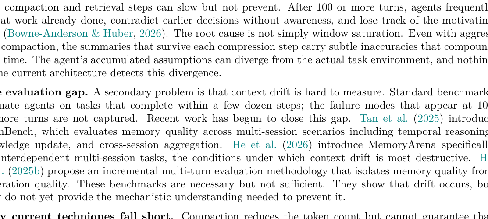

> **图 9：LLM 智能体生命周期与编排的代表性工作**，按本章编排类别组织（单智能体内循环、多智能体编排模式、从 Issue 到 Pull Request 的完整生命周期流水线）。

生命周期与编排（L）关注**智能体系统如何跨重复的模型调用、工具调用、失败、修正与交接来承载任务**。该层结合了两个常被早期框架分开处理的关注点：智能体的**执行流**与该流读写的**运营状态**。在长程任务中，可靠性不仅取决于模型能否产生好的下一动作，也取决于框架能否**记住已发生的事、决定接下来应发生什么、从错误恢复、协同子任务、并在任务完成时停止**（OpenAI, 2026b; Anthropic, 2025d; 2026c）。因此我们把生命周期与编排作为 ETCLOVG（§1 论断 2）的第四支柱，例子取自支持论断 3 的 100+ 项目语料库。

该层跨**三个组织层级**：
- **单智能体内循环**——一个智能体重复观察、决定、调用工具或产生输出、用结果继续的基本循环
- **多智能体编排**——协同若干这样的循环（角色分配、工作路由）
- **完整生命周期流水线**——把智能体循环置于更广的软件或任务工作流中（从 issue 到代码改动、测试、审查、PR）

**状态模型**三种：**Stateless replay**（从记录的交互历史重建运行，可复现性与可审计性高但随轨迹增长而代价高）/ **Stateful**（在文件、仓库、数据库、任务图、外部服务中存储运营状态，连续性与恢复改进但引入一致性与调试挑战）/ **Hybrid**（保留可重放历史同时也依赖持久工件——多数实践系统）。

### 6.1 生命周期状态管理

生命周期状态管理关注**跨轮次、会话、失败与交接持续智能体运行所需的运营状态**——包括待处理子任务、工具结果、中间工件、仓库变更、协调元数据、会话持久化与检查点—恢复机制。这些机制让编排**持久而非瞬态**：智能体可以从先前工作继续，而不是把每一步视为孤立的模型调用。

核心取舍是**stateless 与 stateful 之间**：stateless 设计从先前交互历史重建执行，改进可复现性与可审计性，但随轨迹增长变得代价高昂；stateful 设计在文件、数据库、仓库、任务图或外部服务中持久化执行状态，改进连续性与恢复，但引入一致性与调试挑战（OpenAI, 2026b; Anthropic, 2026c）。许多实践框架因此采用**混合设计**，结合可重放交互历史与持久工件。

该状态有别于 §5 的上下文与记忆层——后者关注提供给模型用于推理的信息（检索的文档、记忆、对话历史）；也有别于 §7 的可观测性——后者关注日志、tracing 与系统行为监控。此处焦点是**框架本身用于继续与协调执行的运营状态**（如待处理子任务、检查点、重试、共享工件、执行状态）。

### 6.2 单智能体内循环代表系统

OpenCode（159k）、Claude Code（123k）、Gemini CLI（104k）、Codex CLI（82k，**stateless replay** 最清晰示例）、Aider（45k）、SWE-agent（19k）——均归类为 "Single loop / Hybrid"。

### 6.3 多智能体编排模式

五种主要模式：**Hierarchical orchestration**（DeerFlow、AutoGen、OpenAI Agents SDK、DeepAgents）、**Team orchestration**（oh-my-claudecode）、**Workflow orchestration**（Semantic Kernel）、**Fan-out**（Emdash）、**Graph composition**（LangGraph、Hive）。**Anthropic 的 planner-generator-evaluator 架构**示范了更广原则：规划、执行与验证可分离为显式角色，改进分解与鲁棒性但增加协同开销。

### 6.4 从 Issue 到 PR 的完整生命周期流水线

核心抽象是**任务运行器（task runner）**：管理调度、状态持久化、重试、验证、跨完整任务生命周期的迭代精化的框架。执行扎根于持久工件（仓库、issue、分支、文件、测试、PR）。典型代表：**Vibe Kanban、Symphony、GitHub Agentic Workflows**。

---

## 7 可观测性与运营（O）

可观测性与运营（O）是 ETCLOVG 的第五层，也是我们的分类法从"生命周期钩子的副产物"提升为一等地位的两层之首（§1 论断 2）。支撑系统取自支撑论断 3 的 170+ 项目语料库。

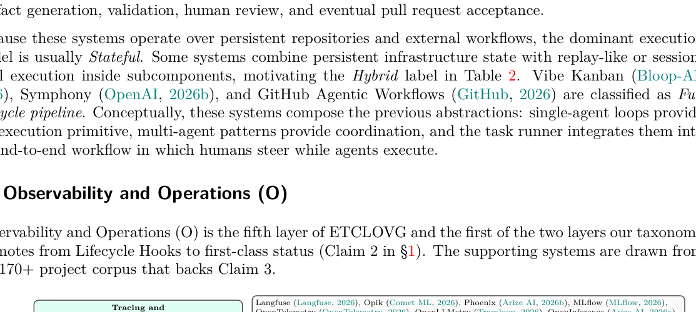

> **图 10：LLM 智能体可观测性与运营的代表性工作**，按本章运营类别组织（追踪与监控平台、智能体专用运营平台、成本追踪与优化、可靠性工程、统一可观测性）。

本层关注**智能体行为如何被监控、调试，以及如何使生产可靠**。我们论证可观测性值得独立处理而非依附于生命周期钩子，因为它已孕育出专门的平台、规范与工程实践生态。

### 7.1 追踪与监控平台

可观测性的基础是**结构化 trace 收集**——把每个 LLM 调用、工具调用、检索步骤与上下文组装操作记录为 span 树。**Langfuse、Opik、Arize Phoenix、MLflow** 提供交互式 trace 树、延迟火焰图、token 使用分解、成本归因仪表盘与提示版本管理。

**OpenTelemetry（OTel）已成为事实仪表化标准**，为生成式 AI 发布了语义约定。**OpenLLMetry**（LLM 提供商与向量数据库的自动仪表化）、**OpenInference**（Phoenix 同伴）将这些约定操作化，使智能体 trace 流入团队已用于传统微服务监控的同一后端（Prometheus、Jaeger、Grafana、Datadog）。

更深层学术工作：**AgentSight** 用 **eBPF 从应用进程外部监控智能体**——在 SSL 边界拦截 TLS 加密的 LLM 流量以捕获意图，监控内核事件（进程创建、文件 I/O、网络调用）以捕获动作；CPU 开销 <3%，框架无关，无需代码修改，**不可被妥协或错配的智能体绕过**。**AgentTrace** 提出基于 schema 的日志框架，捕获三个"面"的结构化日志：认知（推理步骤、计划、反思）、运营（工具调用、API 交互）、上下文（环境状态、用户输入）。

### 7.2 智能体专用运营平台

通用追踪平台常把抽象中心放在 LLM 调用、工具调用、检索步骤作为 span 级事件上。智能体专用平台增加捕获**智能体级关注**的抽象层：多步会话跟踪、智能体身份与角色管理、工具选择策略、跨会话状态交接。**AgentOps SDK** 引入分层 span 模型，围绕智能体生命周期组织会话、智能体、操作或任务、工作流、工具调用与 LLM 调用。**RagaAI Catalyst、Laminar** 也是代表。

学界开始形式化这些关注：研究者提出**六阶段 AgentOps 自动化管道**（观察、收集指标、检测异常、根因分析、推荐修复、自动化补救），并将利益相关者空间分解为开发者、测试者、SRE、业务用户。**NLAH（Natural-Language Agent Harnesses）框架**把**框架本身作为一等研究对象**——通过系统消融实验量化各框架模块（工具注册表、权限系统、钩子、技能、上下文折叠）对下游智能体性能的贡献。

**认知可观测性（Cognitive observability）** 把智能体级监控扩展为不仅追问智能体**做了什么**、也追问**为什么**。**Watson** 部署"代理智能体"复制主智能体输出同时通过提示归因生成步骤式推理 trace。**AgentLens** 用三窗格可视分析系统（Outline View 智能体轨迹 / Agent View 带因果弧的事件栈 / Monitor View 同步环境回放）闭合可视化循环。

### 7.3 成本追踪与优化

LLM 推理按 token 定价，智能体框架放大成本暴露——单一面向用户的任务可能触发数十次 LLM 调用。两面要求：**追踪**（知道 token 花在哪里）与**优化**（用更少 token 获得相同结果）。

- **追踪**：TensorZero（一体化 LLMOps）、Helicone（极简代理）
- **优化**：FrugalGPT（提示适配、LLM 近似、LLM 级联——级联可在匹配 GPT-4 性能下降低最高 98% 成本）；GPTCache（语义缓存）；QC-Opt（质量感知联合优化）；TALE 的 **token 弹性现象**（思维链 token 预算设太低会**反向增加**token 消耗）；Dual-Pool 路由（按 token 预算分池，减少 31–42% GPU 时长）

**Anthropic 关于智能体编码评估中基础设施噪声的研究：仅基础设施配置就能让基准分数偏移 6 个百分点（p<0.01）**——成本优化与评估保真度紧密交织。

### 7.4 可靠性工程

Anthropic 识别长程编码智能体的四个反复失败模式：智能体试图一次性解决整个任务；提前宣告项目完成；在会话间留下损坏环境；将功能标为完成而未适当测试。**两部分解决方案**：初始化智能体把任务分解为结构化功能列表并建立进度跟踪工件（git 仓库、进度文件、init 脚本）；编码智能体增量地工作于一个功能，留下干净交接状态。

Anthropic 的 **GAN 启发的三智能体架构**（planner / generator / evaluator）引入 sprint 契约与分离的自评估。**关键原则**：**harness 复杂度应跟踪模型能力**——从 Opus 4.5 升级到 Opus 4.6 时他们移除了 sprint 构造和上下文重置，成本从 $200 降到 $125 而质量不变。

**Managed Agents 架构**：解耦 "脑"（harness + LLM）/ "手"（沙箱与工具）/ "会话"（持久事件日志），每个独立可恢复——把所有组件从"宠物"变成"牲畜"，是大规模可靠运营的前提。

学术失败分类：**MAST**（14 个失败模式，κ=0.88）、**AgentErrorTaxonomy**（按模块分解，AgentDebug 实现最高 26% 相对改进）、Vinay (2025) 的 15 个隐藏失败模式（版本漂移、成本驱动的性能崩溃、多步推理漂移）、**QSAF** 把**认知退化**形式化为六阶段生命周期。运行时检测：**SentinelAgent**（多智能体交互建模为图，三层异常）、**AgentFixer**（IBM CUGA 上 64–88% 问题检测，**38% 任务失败源于解析错误**——可由确定性检查完全解决）。**分层检测策略**：轻量基于规则的检查（结构性失败）+ 统计监控（性能漂移）+ 基于 LLM 的语义分析（推理失败）。

### 7.5 走向统一可观测性

**观察—评估鸿沟**：LangChain 调研显示 89% 团队使用追踪工具但只有 52% 使用评估框架——trace 收集与评估框架由不同社区不同接口分别开发。关闭这一鸿沟需要更紧的集成：从生产失败 trace 自动生成回归测试用例、把在线评估分数用作告警信号。

**Harness-as-assumption（框架即假设）原则**：每个 harness 组件都编码了模型自己做不到的假设。模型变好时，可观测性系统必须同时检测**智能体失败时**与**harness 组件已成不必要开销时**——理想可观测性系统应有元监控层跟踪哪些干预仍承重，从而支持随模型升级**持续简化框架**。

---

## 8 验证与评估（V）

验证与评估（V）是 ETCLOVG（§1 论断 2）的第六支柱。我们讨论的系统与基准取自支撑论断 3 的 170+ 项目语料库。

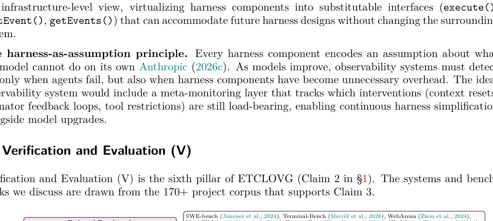

> **图 11：LLM 智能体验证与评估的代表性工作**，按本章"任务—反馈"生命周期五阶段组织（任务与基准锚定、预执行就绪验证、受控执行与 trace 捕获、多级判定与失败归因、持续回归与部署反馈）。

### 8.1 把框架评估作为"任务—反馈"生命周期

**框架感知评估应把报告分数视为模型—框架对的性质，而非模型本身的性质**——这促使评估协议要么跨模型锁定框架，要么把框架配置作为显式实验因子（Bölük, 2026b）。

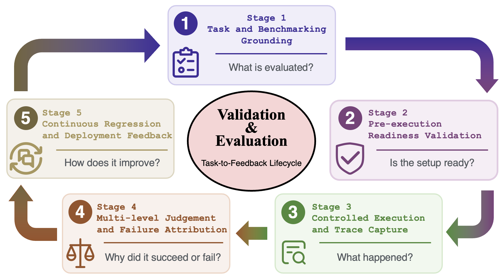

> **图 12：框架评估的任务—反馈生命周期。** 第 V 节把验证与评估组织为五阶段质量控制循环：任务与基准锚定、预执行就绪验证、受控执行与 trace 捕获、多级判定与失败归因、持续回归与部署反馈。图强调框架评估不应仅报告最终成功率，还应**诊断失败来源**并把所得证据反馈进系统化的框架改进。

**关键动机**：评估基础设施噪声可伪装为模型失败——失败运行可能反映的不仅是模型限制，还有损坏的工具、陈旧的上下文、未重置的沙箱、不稳定的测试、基准歧义或不稳定的评判者。评估应把智能体行为转化为**结构化判定、失败归因与回归反馈**，而非仅报告最终分数。

**五阶段**（评估运行的因果路径）：

1. **任务与基准锚定**：什么任务、在哪个环境、用什么工具、约束与成功标准
2. **预执行就绪验证**：在智能体运行前确保设置正确，使环境或评分器失败不被误认为模型失败
3. **受控执行与 trace 捕获**：在可复现条件下运行同时记录模型输出、工具调用、状态变化、错误、重试、成本与延迟
4. **多级判定与失败归因**：在结果、轨迹、评估器三个层级评判运行，并把失败定位到可能的框架组件
5. **持续回归与部署反馈**：把诊断结果反馈进回归测试与未来框架修订

### 8.2 阶段 1：任务与基准锚定

软件工程基准（SWE-bench、Terminal-Bench）；Web/浏览器/computer-use 基准（WebArena、VisualWebArena、BrowserGym、WorkArena、OSWorld）；跨领域与企业工作流（AgentBench、GAIA、TheAgentCompany、WorkArena++）。

**关键洞见**：强结果验证器需要强任务锚定。测试只能在仓库状态、依赖与意图成功标准被精确指定时作为可靠评估器；否则失败测试可能反映无效补丁，也可能反映不一致环境或不充分规定的基准实例。

### 8.3 阶段 2：预执行就绪验证

环境与沙箱就绪、工具/上下文/权限就绪、评估器与评分器就绪——**评估器自身必须在执行前被验证**。LLM-as-Judge 系统需要标定、偏差缓解、一致性检查，而不是盲目地把强模型当评分器复用。

### 8.4 阶段 3：受控执行与 trace 捕获

**Trace-native 评估**把二元打分转化为因果诊断——记录模型输出、工具调用、工具结果、环境状态变化、上下文快照、错误、重试、恢复动作、token 使用、延迟、成本。这些 trace 区分表面相似的失败：一个智能体可能从未找到相关文件，另一个可能找到但产出无效补丁。**HAL 把日志和 trace 视为一等工件**用于标准化、成本感知的智能体评估。**R2E-Gym** 类似地把可执行轨迹与混合验证器链接到测试时评估与训练时反馈。

**评估应不仅报告质量、也报告获取它的成本**——成功—成本—延迟前沿应被暴露。

### 8.5 阶段 4：多级判定与失败归因

**三级判定**：
- **结果级**：最终任务目标是否达成（单元测试、状态检查器、UI 变化）
- **轨迹级**：智能体路径是否高质量（工具选择、动作顺序、避免冗余、尊重权限、错误恢复、上下文一致性）。"**正确答案 + 不可接受轨迹**"是失败——例如过度浪费 token、调用无关工具、依赖脆弱的基准特定行为
- **评估器级**：评估器自身是否可信。G-Eval、MT-Bench、Chatbot Arena 都识别 LLM 评判者的**位置偏差、冗长偏差、自我增强偏差**。**评估器应被视为受测组件，而非系统外的神谕**

**失败归因**是跨完整 trace 的**诊断过程**而非附在最终分数上的事后标签。

### 8.6 阶段 5：持续回归与部署反馈

**回归评估应由框架变更触发**——工具描述、上下文压缩策略、沙箱镜像、权限规则、评判提示的变更都会改变行为或评估分数。**Promptfoo、DeepEval、RAGAS、lm-evaluation-harness** 是构建块。

**新方向**：评估器不仅作为离线指标也作为**训练信号与优化目标**——R2E-Gym 与 verifiers（RL 风格智能体 gym）使用环境反馈作为奖励或验证信号。**Meta-Harness 把框架设计本身作为自动化搜索对象**——不仅评估哪个模型在固定框架下最好，也问哪种框架结构、提示策略、工具接口或控制循环产生更可靠的智能体行为。

### 8.7 小结

V 层把智能体行为转化为**工程证据**。这一生命周期**把评估从排行榜机制重构为框架的质量控制循环**。最终成功率仍有用，但已不再充分。对长程智能体，中心评估问题不仅是"智能体是否成功"，更是"为什么成功或失败、路径是否可接受、评估器是否可信、哪个框架组件该被改进"。

---

## 9 治理与安全（G）

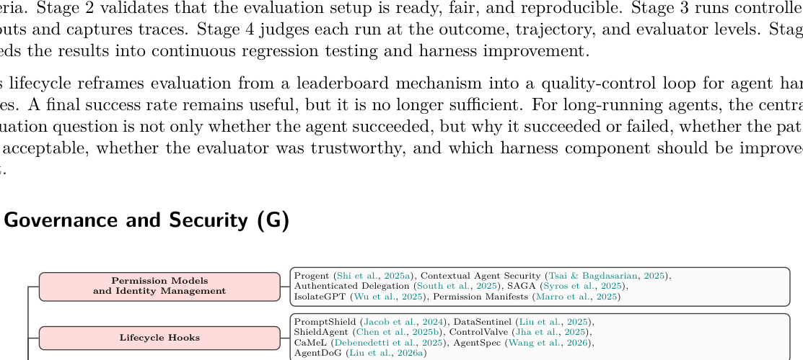

> **图 13：LLM 智能体治理与安全的代表性工作**，按本章安全类别组织（权限模型与身份管理、生命周期钩子、组件加固、声明式宪法、审计基础设施、智能体安全全景）。

LLM 智能体现在执行 shell 命令、发邮件、提交代码、调用第三方 API。生产部署的中心问题是：**它们应在什么约束下行动，以及当那些约束失败时谁承担责任**？治理在生产系统中拥有自己的工具生态——权限引擎、策略语言、审计管道、网关控制——与 §6 和 §7 中的生命周期钩子与可观测性基础设施截然不同。

围绕**五个机制**组织：

### 9.1 权限模型与身份管理

按粒度轴推进：**静态边界**（Codex、Gemini CLI 的工作区作用域 + 命令允许/拒绝列表）→ **上下文相关的特权控制**（**Progent** 的 DSL 谓词可对工具名、参数、环境状态遍历；**Conseca** 从可信上下文生成任务特定策略并由独立确定性检查器强制——策略生成与强制的分离重要：生成组件可适应任务，强制器保持可审计）→ **身份管理与智能体间访问控制**（**SAGA** 一次性加密密钥与短期访问 token；**IsolateGPT** hub-and-spoke 模型）→ **凭证管理**（在保险库中存储秘密、向 LLM 只暴露占位符）→ **Web 级权限协调**（`agent-permissions.json` 类比 robots.txt 的清单文件）。

### 9.2 生命周期钩子

权限模型定义"什么被允许"；生命周期钩子定义"何时策略检查触发"。许多框架在智能体循环的每个阶段暴露钩点：规划前、工具调用前、工具执行后、响应交付前。这些钩子允许治理逻辑被注入而不修改智能体的核心推理。

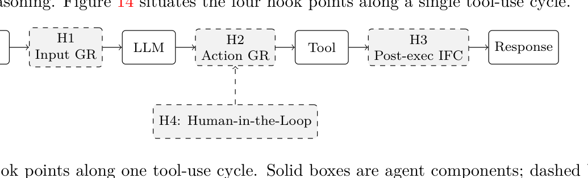

> **图 14：一个工具使用循环上的四个钩点。** 实线框是智能体组件；虚线框是治理钩子。**H1** 在输入到达 LLM 前验证；**H2** 在工具执行前验证拟议动作；**H3** 调解工具输出回到上下文的信息流；**H4** 把后果性动作门控于用户批准。

四个钩点沿单一工具使用循环：
- **H1 输入护栏**：PromptShield、DataSentinel 训练专用分类器检测注入载荷
- **H2 调用前**：ShieldAgent 形式化安全约束为可验证谓词；ControlValve 约束多智能体间控制流图
- **H3 调用后**：**CaMeL** 实现基于能力的信息流控制——每个数据值携带元数据标签追踪来源，区分可信用户输入与不可信网页检索；自定义解释器强制不可信数据不能影响控制流决策
- **H4 人在环**：Codex、Gemini CLI、Cursor、OpenHands 对破坏性或越界动作要求显式用户批准。**Felt et al. (2012)** 显示只有 17% 安卓用户在应用安装时关注权限对话框，仅 3% 正确回答了所授予权限的理解问题——智能体批准对话框可能面临类似的习惯化与理解风险。

### 9.3 组件加固

- **模型加固**：**Instruction Hierarchy**（训练模型按优先级处理系统提示 > 用户消息 > 工具输出）；**SecAlign**（提示注入输入上的偏好优化）
- **基于分类器的运行时加固**：**Llama Guard** 微调分离模型按可配置安全分类分类——分类可不重训即编辑、可跨异构 LLM 后端复用
- **工具加固与 MCP 安全**：MCP 初始规范缺乏原生安全原语。**McpSafetyScanner** 三智能体架构（黑客、审计员、监督员）系统性发现漏洞；Trail of Bits 显示 MCP 服务器可在用户调用工具前通过**带毒工具描述**攻击客户端；**ETDI** 用加密签名与版本化工具定义扩展 MCP，防止"rug-pull"攻击
- **协议级加固**：**SAFEFLOW** 结合细粒度信息流控制与事务性执行语义
- **供应链风险**：Spracklen et al. (2025) 分析 576,000 个代码样本，发现开源模型以 **21.7% 的速率幻觉不存在的包名**——攻击者可在公共仓库注册这些名称注入恶意代码（"slopsquatting"）

### 9.4 声明式宪法

- **训练时宪法**：**Anthropic 的 Constitution** 组织为四层优先级（safety > ethics > compliance > helpfulness），区分硬约束（绝对禁令如 CBRN）与软编码默认（运营者可调）
- **部署时宪法（YAML）**：**AutoHarness** YAML 文件指定管道模式（core/standard/enhanced）、风险分类模式、允许/拒绝工具模式、token 预算、审计日志目的地——可被安全与合规团队**审阅与修改而无须触碰智能体代码**
- **可编程策略语言**：Progent 的 DSL 支持布尔谓词与量词；**Formal-LLM** 把计划约束编码为下推自动机；VeriSafeAgent 把用户意图形式化为 UI 状态转换上的 DSL

### 9.5 审计基础设施

- **结构化审计 trace**：AutoHarness 发出每工具调用 JSONL 记录（工具名、参数、风险分类、权限决定、执行结果、token 成本、墙钟延迟）；**SAGA** 通过记录智能体间交换的加密 token 扩展跨信任边界的来源追踪。**多数当前系统只记录这些字段的子集，几乎没有系统签名或哈希记录，使审计 trace 易被妥协的智能体进程篡改**
- **异常检测：单动作 vs 轨迹级**——单动作便宜易审但抓不到分布在许多个别良性动作中的攻击；轨迹级可抓多步攻击但代价是更高延迟与更不局部化的告警
- **成本与资源审计**：失控的智能体循环可在循环密集型工作负载下快速耗尽 API 预算——2025 OWASP LLM Top 10 把资源耗尽列为独立风险类别
- **分层治理管道**：AutoHarness 用三层（parse-risk-permission-execute-audit → 上下文丰富、输出验证、异常评分、人工升级 → 形式化约束验证）通过 YAML 宪法声明性地选择层级

### 9.6 把治理置于智能体安全全景中

Kim et al. (2026) 综述 128 篇论文目录化 51 种攻击方法与 60 种防御方法。Chen et al. (2026) 从软件工程视角通过六维分类法综合 50 篇论文，提议**构造时安全（secure-by-construction）智能体平台**的参考主义。

**真实世界智能体的防御鸿沟**：六个考察系统（Codex、Gemini CLI、OpenHands、Browser Use、Nanobrowser、Skyvern）**没有完全实现所有防御类别**——**信息流控制、身份管理与形式化验证在所有六个系统中均缺失**；所有六个系统中监控都是部分的（智能体记录工具调用但缺乏自动异常检测）。

**纵深防御与其极限**：层次化并非免费——§9.2 中已讨论，协调不当的层可能相互干扰。**契境安全（contextual security）作为提议的扩展**——Kim et al. 提议作为经典 CIA 三元组之外的第四安全目标，但尚未被 NIST 等标准机构采纳。

### 9.7 八大研究方向

(1) 标准化策略与审计语言；(2) 形式化治理保证；(3) 自适应治理；(4) 长程智能体治理；(5) 可用治理界面；(6) 跨层治理一致性；(7) 端到端供应链治理；(8) 统一的治理栈对抗基准。

---

## 10 跨切关注（Cross-Cutting Concerns）

本节收集的关注**跨越多个 ETCLOVG 层**，发展论断 1。各层章节将执行、工具、上下文、生命周期、可观测性、评估与治理隔离开来以精确描述每个设计表面；**生产框架最常在这些表面之间的接口失败**。

- **跨层交互模式**：七层不独立。执行环境（E）约束哪些生命周期与编排策略（L）实用；上下文管理（C）影响评估可复现性（V）；治理（G）施加跨越其他所有层的身份、权限与审计约束。**框架设计应被读作依赖结构，而非可分离组件的清单。**
- **成本—质量—速度三难**：更强评估、更严治理、更丰可观测性与更保真执行环境通常都增加成本与延迟。**真实系统必须选择哪些检查同步、哪些离线、哪些失败值得昂贵恢复路径。**
- **标准化与生态动力学**：MCP、ACP、A2A 等协议反映向工具、智能体与编排状态的共享接口的压力。这倾向于智能体无关的基础设施，但也把责任转移到治理与可观测性：**标准化的工具调用只有当周围框架能跨系统保留来源、权限、成本与失败证据时才有用。**
- **持续生态鸿沟**：在语料库中，五个鸿沟在层边界反复出现——跨工具互操作性、成本归因、失败恢复、多仓库编排、人—智能体交接。

---

## 11 跨层综合

> 中心问题**不再是每一层是否有可用工具，而是组合后的框架是否表现为可靠的控制系统**。

### 11.1 成本—质量—速度三难

更强沙箱与更保真环境改进安全与可复现性，但增加启动延迟与基础设施成本；更丰富的上下文与记忆策略可改进任务连续性，但消耗 token 并引入检索开销；更深评估与可观测性改进诊断，但减慢迭代并增加存储、标注与 trace 处理成本。**生产系统不能将质量视为标量目标**——必须决定哪些风险值得昂贵控制，哪些检查可异步或在回归套件中运行，哪些遥测在智能体生命周期各阶段值得捕获。

### 11.2 能力—控制取舍

更强的框架向智能体暴露更多权威，但**每一份权威增加都扩展控制问题**。更大的工具菜单扩宽任务覆盖同时增加选择错误与提示注入面；持久记忆帮助长程任务但创建来源、陈旧与隐私风险；宽松的沙箱使自主执行有用但也扩大错位或被妥协动作的爆炸半径。**能力—控制取舍因此不是附加到一个本来功能正常的系统上的安全特性。它是一个连接工具 schema、上下文策略、运行时权限、身份、可审计性与人为批准的设计轴。**

### 11.3 框架耦合问题

框架层以使局部优化变脆的方式**耦合**。执行环境通过影响包可用性、重置语义、延迟与失败模式改变评估结果；工具描述消耗上下文预算并塑造模型行为；可观测性 trace 只在身份与权限状态以相同粒度被捕获时才成为治理证据；评估设计通过奖励某些恢复循环与惩罚其他来反馈进编排。这些耦合暗示**框架变更应作为系统变更测试**——一个提示、工具、记忆、沙箱、验证器或监控在隔离时看起来有益，与控制循环其余部分组合时可能降级整个 rollout。耦合问题也解释了为什么**智能体分数无法干净地归因于模型而不指定周围的控制器**。

### 11.4 从智能体框架到智能体平台

生态正从智能体框架转向**智能体平台**。框架打包本地抽象（智能体、工具、记忆存储、执行循环）；平台增加跨多次运行与多用户的持久工作空间、托管沙箱、身份、计费、可观测性、评估、治理与人为交接。这一转变重要，因为长程智能体不再仅是调用模型的程序——它们是需要租户、合规、故障恢复、trace 保留与组织所有权的**运营系统**。中心设计问题因此从"**如何构建一个智能体？**"转向"**如何运营一支智能体舰队，使其行为长期可检视、可逆？**"

### 11.5 开放研究议程

综合指向以**框架作为自适应控制系统**为中心的研究议程。该领域需要：变化框架干预而非仅模型权重的基准、跨层归因失败的 trace-native 方法、智能体—工具—沙箱—评估器—人之间状态与责任转移的协议、随模型改进而**简化**框架的优化方法。

---

## 12 开放问题与未来方向

中心模式：智能体框架正成为**长程控制系统**，但该领域仍缺乏成熟答案来加固执行基板、保留状态、诊断失败、转移责任与随模型能力变化而更新框架。

### 12.1 加固与扩展执行环境

执行环境正成为安全、可扩展性与可移植性交汇的控制边界。SandboxEscapeBench 记录前沿模型可在现实配置下利用沙箱弱点，但防御工作仍散落于不同威胁模型与评估协议的系统。一对一容器模式使大规模训练与评估吃紧（数万并行轨迹需廉价重置与回放）；SWE-World 指向 Docker-free 代理环境，但学习转移相对实际执行的保真度未解决。即使部署可移植性也非已解决的工程细节：基于 Docker 的沙箱继承 Linux 内核假设；macOS、Windows、浏览器、桌面与混合云设置暴露不同隔离与可复现性约束。

**开放问题**：使运行时基板**既可测量又可组合**——共同的提示注入、目标错位与组合放大安全评估；决定何时使用容器、microVM、OS 级权限边界、完整桌面 VM、浏览器环境或学习型代理环境的成本模型；跨自托管、云与混合部署保留语义的可移植性层。框架内置运行时（§3.2.4）与沙箱抽象（§3.2.7）之间的 bundle-vs-compose 分离应作为**实证设计问题**而非产品偏好处理。

### 12.2 长程智能体的可靠状态维护

最深的上下文问题不仅是把更多 token 装入提示，而是**长程上让智能体的工作状态与真实任务状态保持对齐**。长程编码、研究与运营智能体反复总结、检索、压缩与外化信息；每个此类操作都可能删除约束、扭曲优先级或保留陈旧假设。

**原则性研究议程应把上下文管理重构为状态估计**。开放问题是：能否刻画每次压缩、检索或遗忘步骤丢失多少任务相关信息，能否限制智能体内部状态与任务真实状态之间的发散？未来系统需要不确定性感知的总结、被记忆事实的来源、矛盾处理、显式陈旧标记，以及让智能体从持久工件而非信任自己压缩历史**重建丢失状态**的恢复程序。这也暗示**记忆与评估之间更紧的链接**：记忆策略应不仅按召回准确率评判，更应按它们是否防止多会话任务中的下游动作错误评判。

### 12.3 从智能体 trace 诊断失败

智能体评估仍太常以最终分数为中心：一次运行通过或失败，最终数字被当作关于模型质量的证据。对框架工程，这不够——失败 rollout 可能源于模型推理、误导性工具 schema、沙箱错配、陈旧上下文、不稳定测试、基准歧义、评判不稳定或编排循环。Anthropic 的分析显示基础设施设置可可测量地偏移基准分数；近期关于 agentic eval 中随机性的工作论证**单次运行通过率可隐藏巨大方差**。**评估层必须作为测量仪器研究，而非仅作为排行榜生成器使用。**

下一步是 **trace-native 评估**：trace 应成为系统计算结果分数、轨迹质量、失败归因与回归测试的**主对象**。可观测性系统已捕获 span、工具调用、成本、重试、异常与中间消息，但这些 trace 常与评估管道脱节。**LangChain 2026 综述报告 89% 团队使用可观测性而仅 52.4% 进行离线评估——这一鸿沟意味着团队能看见智能体做了什么，却没系统判断行为是否正确。** 未来工作应关闭这一循环：把生产中的异常 trace 转化为回归用例、直接基于 span 计算轨迹指标、把诊断信号反馈进提示、工具、上下文与编排变更。**Reflexion** 显示智能体可在短程设置中从自己的 trace 学习；把这一思想扩展到长程多会话框架仍是开放的。

### 12.4 跨智能体、工具与人的标准交接

现代框架越来越把工作分布于规划者、子智能体、工具、沙箱、评估器与人，但这些参与者之间的接口仍是临时的。MCP 标准化工具访问，A2A 针对智能体间通信，OpenTelemetry 提供 trace 的通用基板。**缺失的是跨层交接契约**。当规划者把工作交给执行者、智能体调用工具、子智能体返回控制或系统升级至人时，**交接应不仅转移文本总结，更应转移意图、约束、权限、工件、来源、预算状态、风险等级、trace 历史与未决决定**。

这一问题部分是技术的、部分是制度的。OpenAI 的 Symphony 把 issue 跟踪器与仓库框架为智能体工作的控制平面；Anthropic 的长程智能体框架强调持久进度工件与干净交接状态。治理工作从相反方向得出同一结论：智能体身份、委托、权限清单与可审计性是智能体能跨系统代表用户安全行动的前提。**开放问题是定义对安全与恢复足够丰富、对广泛采用足够简单的交接协议**。这样的协议应使责任明确：**谁授权了动作、转移了哪些状态、哪些证据支持当前计划、接收者被允许做什么、控制何时必须返回给另一智能体或人。**

### 12.5 随模型改进保持框架有用

框架设计**不应被假设单调地向更多 scaffolding 移动**。每个包装器、重置、验证器、规划者、记忆规则与权限门都编码了一个关于模型自己不能可靠做什么的**假设**。**模型能力变化时，框架干预应被重新估计而非假设保持有益。** 一个因子化的"model × harness"评估可揭示一个干预何时改进所有模型、何时只帮助特定模型族、何时反转模型排名。

Anthropic 在长程应用开发中报告这一模式的具体版本：对一个模型有用的上下文重置对更强模型变得可有可无，移除它们降低了成本而不降级质量。OpenAI 类似地把框架工程描述为保持人类注意力、仓库状态与智能体执行对齐的学科，而非仅添加更多 scaffolding。

这创造了**元工程议程**：框架需要**自我优化与自我简化**的机制。**Meta-Harness 显示提示、工具与控制循环可作为优化目标的一部分搜索而非由手工固定**；**NLAH** 使框架模块**显式且可消融**。生产可观测性与成本系统（TensorZero、Axon、AgentOps）指向预算感知的框架运营，但研究问题比成本最小化更广。未来系统应：识别哪些干预对质量、安全或可靠性**因果负责**、跨框架变体运行**影子模式或 A/B 测试**、在联合质量—延迟—成本—风险约束下优化。中心风险是基准过拟合：仅针对窄套件自我优化的框架可能变脆。**更耐久的目标是自适应简化——框架随任务、工具与模型能力变化而持续追问哪些控制仍必要。**

---

## 13 结论

本综述把**智能体框架视为独立的工程表面**，并论证**基础设施质量而非模型能力本身设置真实世界智能体可靠性的天花板**。围绕这一绑定约束论题我们发展三个论断：

- **七层 ETCLOVG 分类法**把可观测性与治理从生命周期钩子分离出来，反映生产团队已如何组织其工具与所有权；
- **170+ 开源项目到该分类法的映射**给出迄今最广泛的生态快照，浮现采用模式、覆盖鸿沟与正在涌现的设计原则；
- **从提示到上下文到框架工程的三阶段演化**，连同覆盖成本—质量—速度三难、能力—控制取舍与框架耦合问题的跨层综合，把框架置于更广的工程轨迹中。

**我们的分析有其极限。** 语料库偏向英文、GitHub 可见、开源项目，以及编码智能体生态；扩展到闭源生产系统与非编码智能体生态将锐化实证图景。**分类法本身是描述性的**：把 ETCLOVG 转化为**规范性框架**——能指导而不仅分类框架设计决定——是我们希望本综述鼓励的自然下一步。
