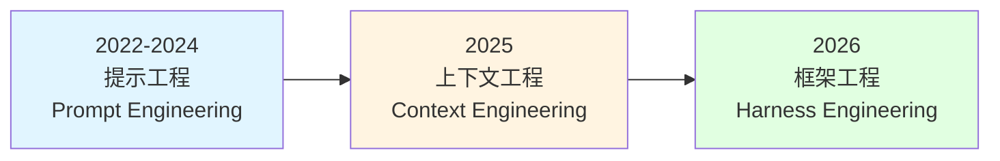
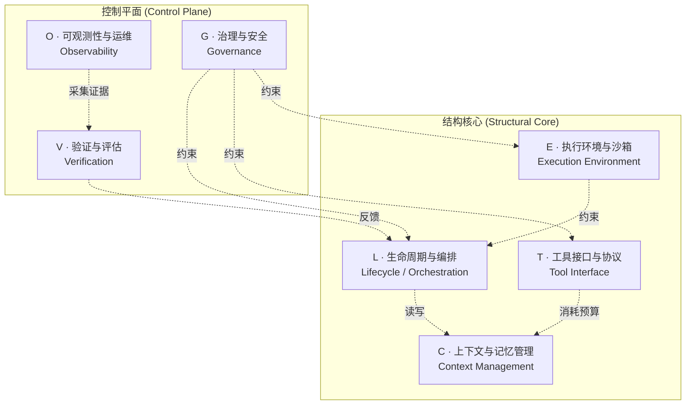
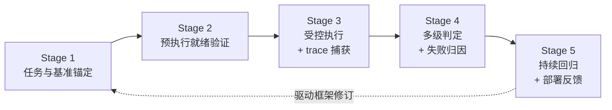
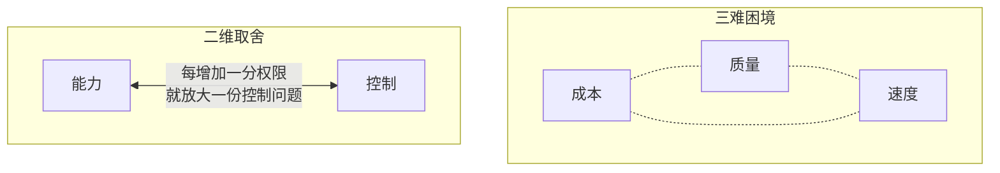

# 论文总结：智能体执行框架工程综述

**原文：** Agent Harness Engineering: A Survey
**作者：** Junjie Li, Xi Xiao, Yunbei Zhang, Chen Liu 等（CMU、Yale、JHU、NEU、Tulane、UAB、OSU、Virginia Tech、Amazon 等机构联合）
**来源：** OpenReview（投稿 TMLR） | 2026 年 5 月
**项目页：** Awesome-Agent-Harness
**篇幅：** 71 页，13 章 | 覆盖 170+ 开源项目 | 提出 ETCLOVG 七层分类法

---

## 一、核心论断：约束性瓶颈是"执行框架"而非"模型"

> **绑定约束论题（Binding-Constraint Thesis）**：对于跨可比前沿模型评估的长程任务，基准测试方差更可能由**执行框架（execution harness）**驱动，而非模型本身。

### 三个 2026 年初的关键实证证据

| 研究 | 干预对象 | 收益 | 模型是否改动 |
|------|---------|------|------------|
| **Bölük (2026a)** | 仅修改编辑工具格式与周围工具框架 | 编码基准最高 **10×** 提升（跨 15 个模型） | ❌ |
| **Trivedy (2026, LangChain DeepAgents)** | 系统提示重构 + 中间件上下文注入 + 自验证钩子 | Terminal-Bench 2.0 从 52.8% → **66.5%**（+13.7 pp） | ❌（GPT-5.2-Codex 固定） |
| **Meta-Harness (Lee et al., 2026)** | 自动化框架优化搜索 | Terminal-Bench-2 达 **76.4%**，超越所有手工框架 | ❌ |

> **关键观察**：每个框架层收益（10×、+13.7 pp、76.4%）都**超过**典型模型迭代在同一基准上常见的 2–4 个百分点改进。

### 三阶段工程演化

> **图 1：提示工程、上下文工程与框架工程的简要对比。** 三阶段沿"优化对象"演化——从优化**模型输入**（单调用优化）到优化**模型所见**（多步上下文优化）再到优化**模型运行方式**（系统级优化）。

| 阶段 | 工程对象 | 优化范围 | 代表性问题 |
|------|---------|---------|----------|
| **提示工程**（Prompt） | 单次模型调用的输入文本 | 一次输入、一次调用 | 如何写好指令与示例？ |
| **上下文工程**（Context） | 流入上下文窗口的多路信息 | 多步骤、多信息流 | 每一步该让模型看到什么？ |
| **框架工程**（Harness） | 包裹模型的完整基础设施 | 全部 7 层 ETCLOVG | 如何让长程智能体可靠运行？ |

> 后一阶段**包含**前一阶段，三者重叠并行，并非替代关系。

---

## 二、问题诊断：实践者—研究者鸿沟

| 阵营 | 状态 |
|------|------|
| **实践者**（OpenAI、Anthropic、LangChain） | OpenAI 在 2026 年 2 月明确将"harness engineering"作为学科；小团队 5 个月内不写一行生产代码即产出约百万行内部产品 |
| **研究界** | 持续精确研究记忆、工具使用、规划、安全等**单独组件**，但缺乏对"将这些组件整合为可靠运行系统"的**系统性研究** |

> 实践者**知道**框架基础设施很重要，却缺乏**正式词汇**来描述**为什么**——本综述意图弥合这一鸿沟。

---

## 三、ETCLOVG 七层分类法（核心贡献）

<b>E</b>xecution · <b>T</b>ooling · <b>C</b>ontext · <b>L</b>ifecycle · <b>O</b>bservability · <b>V</b>erification · <b>G</b>overnance

> **图 2：智能体系统框架工程的分类法图示。** E、T、C、L 四层构成系统的**结构性支柱**；O 层提供全系统监控；V 层在各组件间交付评估与反馈；G 层在整个系统之上执行治理与安全约束。

### 与既有六组件框架的区别

> 本综述将 **Observability（可观测性）** 与 **Governance（治理）** 从"生命周期钩子的副产物"提升为**一等架构关注点**。理由：它们在生产部署中已拥有：
> - 独立的工具生态（Langfuse / OpenTelemetry vs 权限引擎 / 网关 / 审计管道）
> - 不同的团队所有权（SRE vs 安全团队）

### 七层结构总览

### 七层详细对应表

> **图 4：智能体框架工程分类法的详细视图。** 每个分支对应一个 ETCLOVG 层及其主要子类别。完整的 7 层 × 4–7 子类别是本论文映射 170+ 项目的组织骨架。

| 层 | 范围 | 核心关注点 | 关键技术 / 代表系统 |
|----|------|----------|-------------------|
| **E** 执行环境 | 智能体代码"在哪里"运行 | 安全、可复现性、活性（liveness） | E2B、Modal、Daytona、Firecracker microVM、gVisor、OpenHands、SWE-ReX、computer-use 沙箱 |
| **T** 工具接口 | 外部能力"如何"被描述、发现、调用 | 协议标准化、工具选择、训练—接口耦合 | MCP、A2A、OpenAPI、Function Calling、AGENTS.md、ToolRet、ToolRegistry |
| **C** 上下文记忆 | 模型"看到什么"（短/中/长期） | 上下文窗口、跨会话持久化、长程一致性 | MemGPT、Mem0、A-MEM、Honcho、KV-cache 优化、渐进式披露、压缩 |
| **L** 生命周期 | 控制流如何读写状态、跨故障恢复 | 单智能体内循环、多智能体编排、issue-to-PR 流水线 | Claude Code、Codex CLI、LangGraph、AutoGen、DeerFlow、Symphony、Vibe Kanban |
| **O** 可观测性 | 追踪、监控、成本、可靠性 | 结构化 trace、span 树、成本归因、异常检测 | Langfuse、Arize Phoenix、OpenTelemetry、AgentOps、AgentSight（eBPF）、Watson |
| **V** 验证评估 | 任务定义 → 反馈的五阶段闭环 | 基准 / 预执行验证 / 受控执行 / 多级判定 / 回归 | SWE-bench、Terminal-Bench、OSWorld、HAL、Meta-Harness |
| **G** 治理安全 | 权限、身份、策略、加固、审计、人为监督 | 三子层：模型级、系统级、组织级 | Progent、CaMeL、SAGA、AutoHarness、Constitutional AI、AgentSpec |

### 一个关键设计决定

> **状态管理（state management）放在 L 层内部**——与读写它的执行流相邻；**生命周期钩子与策略执行放在 G 层**——与其他约束机制对齐。

---

## 四、各层关键技术速查

### 4.1 E 层：七类沙箱

| 类别 | 隔离强度 | 代表 | 设计取舍 |
|------|---------|------|---------|
| 通用托管沙箱 | microVM / gVisor | E2B、Modal、Daytona | 弹性 + 严格隔离，network 往返延迟 |
| Computer-use 基础设施 | 完整 VM | Anthropic CU、CUA、OSWorld | 像素级保真，启动慢、密度低 |
| 代码专用沙箱 | WASM / 容器 | Judge0、Code Interpreter、langchain-sandbox（Pyodide） | 高吞吐、毫秒级实例化 |
| 框架内置运行时 | Docker | OpenHands、smolagents 执行器 | 一键即用，框架耦合 |
| 浏览器评估环境 | Playwright + 沙箱 | WebArena、BrowserGym、WorkArena | 兼任评估器 |
| OS 级权限沙箱 | bubblewrap / Seatbelt / seccomp | Anthropic sandbox-runtime、IsolateGPT | "缩窄宿主视图"，Claude Code 减少 84% 权限提示 |
| 沙箱抽象层 | 跨后端统一 API | SWE-ReX、smolagents `executor_type`、K8s Sandbox CRD | "执行位置可替换" |

> **趋势**：向**两极分化**——一端往 microVM（强隔离），一端往 OS 级权限边界（轻量"许可"），中间的纯 Docker 容器被两边挤压。

> **威胁现实**：SandboxEscapeBench 报告前沿 LLM 对 Docker 容器的逃逸成功率为 **15%–35%**（取决于配置）。

### 4.2 T 层：按"集成边界"组织协议

| 边界 | 标准 | Wire | 类型化 | 运行时发现 | 长任务 |
|------|------|------|--------|----------|--------|
| Model ↔ Function | Function Calling | JSON | ✓ | ✗ | ✗ |
| Agent ↔ Capability | **MCP** | JSON-RPC | ✓ | ✓ | ◐ |
| Agent ↔ Capability | OpenAPI | HTTP | ◐ | ✗ | ✗ |
| Agent ↔ Agent | **A2A** | JSON-RPC | ✓ | ✓ | ✓ |
| Agent ↔ Repo/Env | AGENTS.md | Markdown | ✗ | ◐ | ✗ |

> **两条系统级原则**：① "更少但更好的工具" 胜过工具堆砌；② 发现管道必须**自适应**——静态全局工具列表无法扩展到快速演变的仓库。

### 4.3 C 层：三层记忆架构

| 层级 | 时间尺度 | 类比 | 代表技术 |
|------|---------|------|---------|
| 短期（活动上下文窗口） | 单步—短序列 | RAM | 系统提示标定、token 高效工具设计、**KV-cache 感知**（Manus 称为"生产 AI 智能体最重要的单一指标"）、渐进式披露 |
| 中期（会话状态） | 跨轮次 / 跨运行 | 临时文件 | NOTES.md / todo.md 结构化笔记、文件化规划（Trellis、planning-with-files）、claude-mem 跨运行注入 |
| 长期（持久记忆） | 跨会话 / 跨任务 | 磁盘 | MemGPT（OS 类比）、Generative Agents（observation-reflection-retrieval）、MemoryBank（艾宾浩斯遗忘曲线）、**Mem0**（向量+图+KV 混合，AWS Agent SDK 独家）、A-MEM（Zettelkasten）、Honcho（用户建模）、cq（集体共享记忆） |

> **两个核心病理**：
> - **Context Rot（上下文腐烂）**：单步性质，输入越长性能越差，200K 上下文模型在 50K 已有显著损失
> - **Context Drift（上下文漂移）**：长程轨迹性质，100+ 轮后智能体重复工作、自相矛盾、丢失目标。压缩与检索**只能减缓不能解决**

> **"U 形注意力曲线"**：相关文档放在上下文中部时，准确率比放在首尾下降 30%+。

### 4.4 L 层：三级编排

| 级别 | 模式 | 代表系统（带 GitHub stars） |
|------|------|---------------------------|
| **单智能体内循环** | Single loop | OpenCode（159k）、Claude Code（123k）、Gemini CLI（104k）、Codex CLI（82k）、Aider（45k）、SWE-agent（19k） |
| **多智能体编排** | Hierarchical / Team / Workflow / Fan-out / Graph composition | DeerFlow、AutoGen、LangGraph、Semantic Kernel、OpenAI Agents SDK、DeepAgents、Hive、Emdash |
| **完整生命周期流水线** | Issue → PR | Vibe Kanban、Symphony、GitHub Agentic Workflows |

> **执行模型**：Stateless replay（如 Codex CLI）/ Stateful（多数多智能体）/ Hybrid（多数实践系统）。

### 4.5 V 层：评估 = 五阶段"任务—反馈"生命周期

> **图 12：框架评估的任务—反馈生命周期。** 评估不是终端的"打分步骤"，而是**对智能体框架的全生命周期质量控制循环**：Stage 1 任务锚定 → Stage 2 预执行就绪验证 → Stage 3 受控执行与 trace 捕获 → Stage 4 多级判定与失败归因 → Stage 5 持续回归与部署反馈。

> **关键重构**：评估不是终端的"打分步骤"，而是**对智能体框架的全生命周期质量控制循环**。

> **观测—评估鸿沟**（LangChain 调研）：89% 团队使用可观测性工具，但只有 **52.4%** 进行离线评估——团队"看得见智能体做了什么，却没系统判断行为是否正确"。

> Anthropic 量化：**仅基础设施配置变化就可让基准分数偏移 6 个百分点**（p < 0.01）。

### 4.6 G 层：五大机制

> **图 14：一个工具使用循环上的四个治理钩点。** **H1** 输入护栏（PromptShield / DataSentinel）· **H2** 动作护栏（ShieldAgent / ControlValve）· **H3** 信息流控制（CaMeL 能力型 IFC）· **H4** 人在环（但 Felt et al. 2012 显示仅 17% 用户阅读权限对话框、仅 3% 理解所授予权限——习惯化是真实风险）。

| 机制 | 关键问题 | 代表工作 |
|------|---------|---------|
| **权限模型与身份管理** | 静态边界 vs 上下文相关的细粒度策略 vs 跨边界身份委托 | Progent（DSL）、Conseca、SAGA、IsolateGPT（hub-spoke）、`agent-permissions.json` |
| **生命周期钩子** | 输入护栏 / 调用前 / 调用后 / 人在环 四个钩点 | PromptShield、ShieldAgent、CaMeL（信息流控制）、AgentSpec |
| **组件加固** | 模型加固 vs 分类器加固 vs 工具/MCP 加固 | Instruction Hierarchy、SecAlign、Llama Guard、ETDI（签名工具定义）、SAFEFLOW |
| **声明式宪法** | 训练时（Constitutional AI）vs 部署时（YAML）vs 可编程 DSL | Claude's Constitution、AutoHarness（YAML）、Formal-LLM（下推自动机） |
| **审计基础设施** | 单动作 vs 轨迹级异常检测、成本审计、分层管道 | SAGA（加密 token 链）、AgentAuditor、SentinelAgent、OWASP LLM Top 10 |

> **关键观察**：当下没有任何主流智能体（Codex / Gemini CLI / OpenHands / Browser Use / Skyvern）**完整实现**所有防御类别。**信息流控制、身份管理、形式化验证**在所有六个考察系统中完全缺失。

---

## 五、第三大贡献：170+ 开源项目映射

> **迄今最大的开源 agent-harness 语料库**，按 ETCLOVG 编码。

### 生态全景的核心发现

| 层 | 覆盖密度 | 主要载体 |
|----|---------|---------|
| E 执行 | **密集** | 开源项目 |
| T 工具 | **密集** | 开源 + MCP 服务器目录 |
| L 生命周期 | **密集** | 开源（CLI 工具大量涌现） |
| V 验证 | **密集** | 学术基准 + 开源框架 |
| C 上下文 | 中等 | 多嵌入大框架内，独立组件较少 |
| **O 可观测性** | **稀疏** | 多在商业平台 |
| **G 治理** | **稀疏** | 多在商业平台、SDK 特性、工程博文 |

### 三个被既有语料库忽略的新一等类别

1. **任务运行器（Task runners）**——issue-to-PR 全生命周期编排
2. **多智能体编排器**——DeerFlow、AutoGen、LangGraph 等
3. **规范驱动开发工具（Spec-driven dev tools）**——AGENTS.md 等仓库级约定

---

## 六、跨层综合（Claim 1 的核心证据）

### 三大系统性张力

| 问题 | 表述 | 启示 |
|------|------|------|
| **成本—质量—速度三难** | 更强沙箱 / 更深评估 / 更丰可观测性 → 提升质量但增加成本和延迟 | 必须显式决定哪些检查同步、哪些异步、哪些失败值得昂贵恢复 |
| **能力—控制取舍** | 工具菜单变大 → 任务覆盖↑ + 选择错误↑ + 注入面↑ | 安全不是"附加"，而是与工具/上下文/权限**耦合**的设计轴 |
| **框架耦合问题** | E 影响 V（包可用性/重置语义）；T 消耗 C 预算；O trace 需 G 的身份才能成为审计证据 | **本地优化是脆弱的**；框架变更应作为**系统变更**测试 |

### 框架 → 平台 的生态迁移

| 框架（Framework） | 平台（Platform） |
|------------------|-----------------|
| 智能体、工具、记忆、执行循环的**本地抽象** | 持久工作空间 + 托管沙箱 + 身份 + 计费 + 可观测性 + 评估 + 治理 + 人为接管 |
| "如何**构建**一个智能体？" | "如何**运营一支**智能体舰队，使其行为长期可检视、可逆？" |

---

## 七、五大开放问题（§12）

| # | 开放问题 | 核心挑战 |
|---|---------|---------|
| **1** | **加固与扩展执行环境** | 统一的逃逸基准、容器 / microVM / OS 权限 / 学习型代理环境的成本模型、自托管—云—混合的可移植性 |
| **2** | **长程智能体的可靠状态维护** | 把"上下文管理"重构为**状态估计**问题：可量化每次压缩 / 检索 / 遗忘的信息损失，给出"内部状态 vs 真实任务状态"的发散界 |
| **3** | **从轨迹诊断失败** | Trace-native 评估：trace 应成为**主对象**（不仅仅是 final score），自动把生产异常转为回归用例；关闭 89% / 52.4% 的"观测—评估"鸿沟 |
| **4** | **跨智能体 / 工具 / 人的标准化交接** | 交接契约应携带：意图、约束、权限、产物、出处、预算、风险等级、trace 历史、未决决策——而不仅仅是文本摘要 |
| **5** | **随模型进步保持框架有用性** | 每个钩子都编码了"模型自己做不到什么"的**假设**——这些假设会过期。需要**自动简化框架**的元工程：影子模式、A/B、Meta-Harness 式搜索 |

> **Anthropic 的具体案例**：从 Opus 4.5 升级到 Opus 4.6 时，他们**移除了 sprint 构造和上下文重置**，成本从 $200 降至 $125，质量不变。

---

## 八、与本仓库已有综述的对比定位

| 综述 | 焦点 | 与本文关系 |
|------|------|----------|
| LLM Agent Externalization | 外化（记忆、技能、协议、harness）的**统一视角** | 本文是其中 **Harness Engineering 分支**的最深入展开 |
| Agent Skills Survey | 技能作为程序性工件的生命周期（表征→获取→检索→演化） | 技能位于本文 **T 层 + C 层中段** |
| LLM Agent Survey / LLM Reasoning to Autonomous Agents | 智能体方法学全景 | 多聚焦"模型能力"；本文论证"**框架质量是 binding constraint**" |
| AI Agents vs Agentic AI | 概念分类与挑战 | 概念层；本文是**工程实现层** |

---

## 九、核心要点速记（执行版）

> 1. **绑定约束论题**：长程任务的可靠性，**框架层 > 模型层**。证据是 10×、+13.7 pp、76.4% 三个 2026 年初的结果。
> 2. **三阶段演化**：Prompt → Context → Harness，后者包含前者。
> 3. **ETCLOVG 七层**：E 执行 / T 工具 / C 上下文 / L 生命周期 / O 可观测 / V 验证 / G 治理；本文创新地将 **O 和 G 提升为一等层**。
> 4. **结构核心 (E/T/C/L) + 控制平面 (O/V/G)**：状态归 L，钩子归 G。
> 5. **生态稀疏区**：O 和 G 在开源生态中**显著薄弱**，多在商业产品。
> 6. **三大张力**：成本—质量—速度三难、能力—控制取舍、框架耦合问题。
> 7. **核心方法论**：评估应是**框架的回归测试系统**；harness 应能**自我简化**。
> 8. **harness-as-assumption 原则**：每个钩子都是"模型还做不到什么"的假设，模型进步时这些假设会过期。

---

## 十、对后续工作的指引

1. **基准设计**：变化的应是 **harness 干预**而非仅模型权重——出现 `model × harness` 的因子化评估
2. **trace-native 方法论**：归因失败到具体层
3. **跨层协议**：智能体、工具、沙箱、评估器、人之间的状态与责任**传输协议**
4. **harness 优化方法**：随模型变强而**简化**而非堆叠 scaffolding
5. **保留开放问题**：上下文漂移、长程一致性、跨组织 supply chain 治理仍未解决
