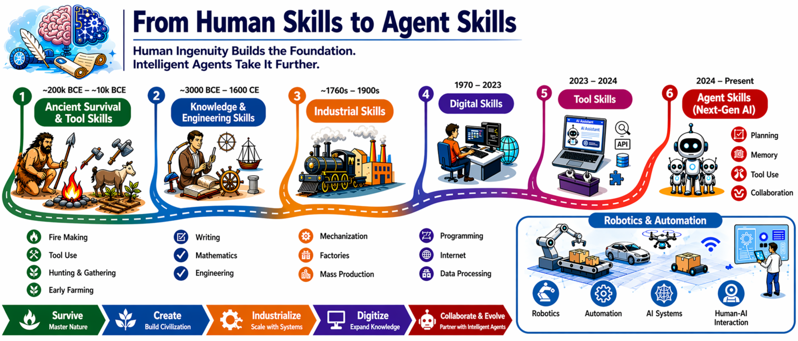
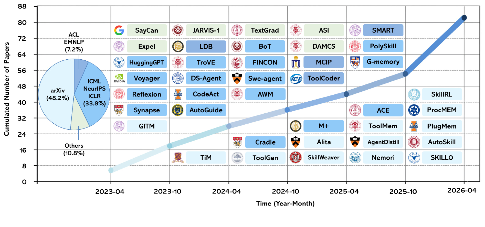
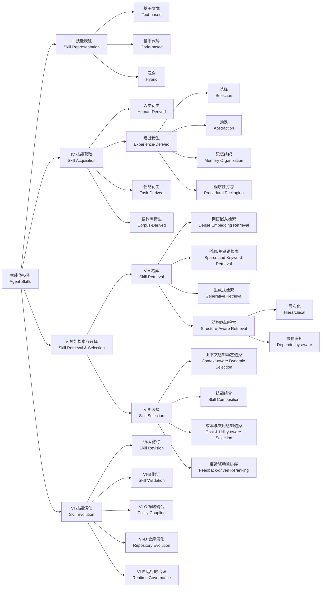
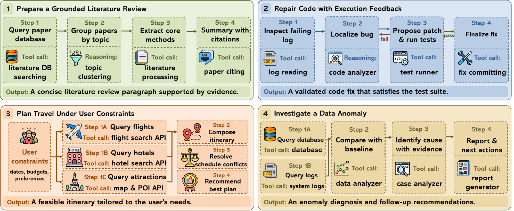
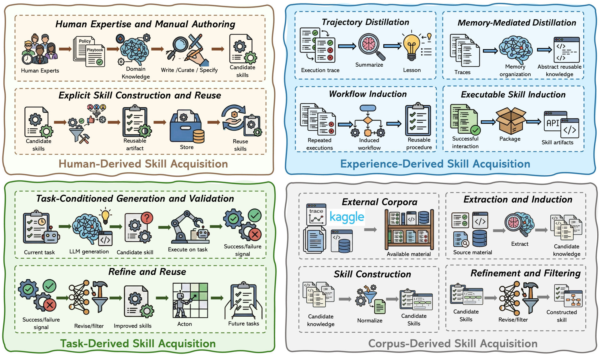
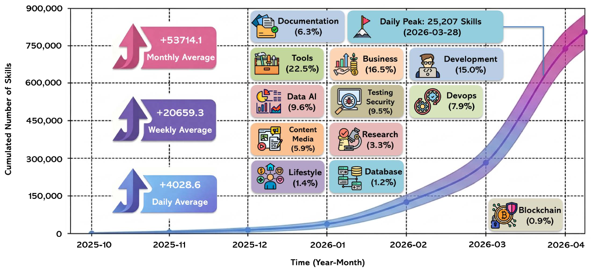
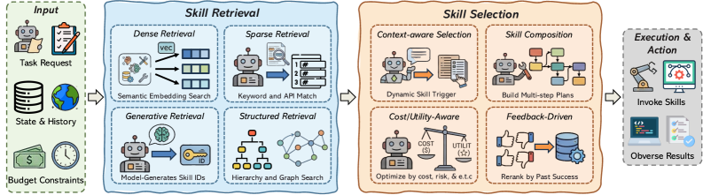
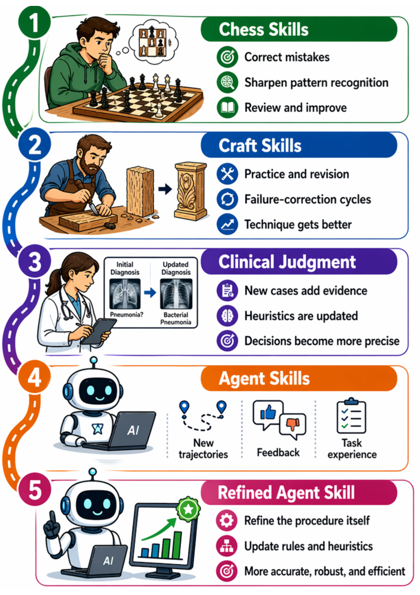
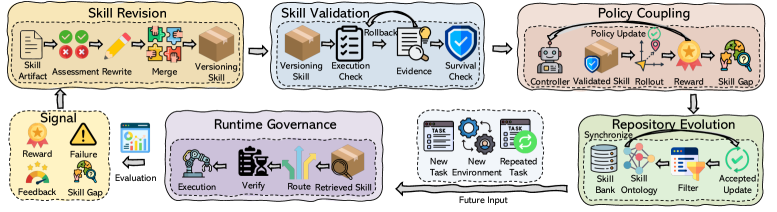
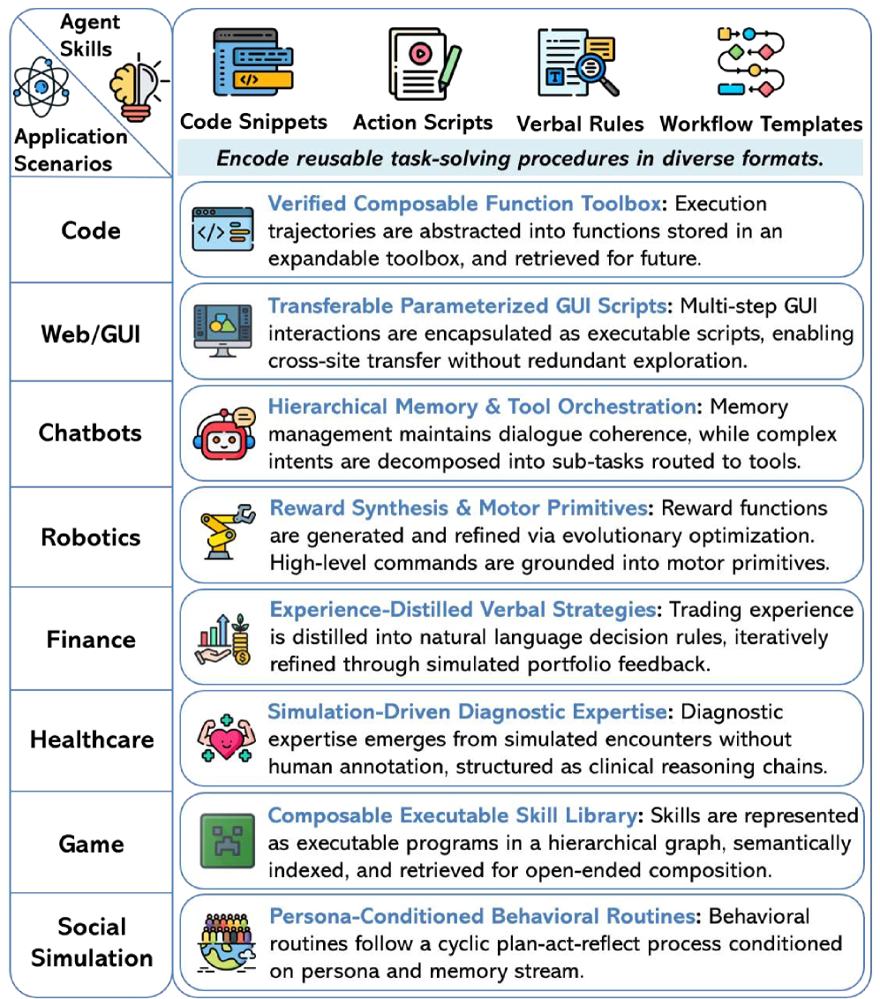

# 智能体技能综述：分类法、技术与应用

**原文标题：** A Comprehensive Survey on Agent Skills: Taxonomy, Techniques, and Applications

**作者：** Yingli Zhou, Shu Wang, Yaodong Su, Wenchuan Du, Yixiang Fang, Xuemin Lin

**机构：** （根据 arXiv 提交者信息，作者团队隶属于香港中文大学（深圳）等机构）

**原文链接：** https://arxiv.org/abs/2605.07358 （本翻译基于 v2 版本，2026 年 5 月 19 日修订）

**相关资源：** https://github.com/JayLZhou/Awesome-Agent-Skills

---

## 摘要

基于大型语言模型（LLM）的智能体通过工具、记忆与结构化交互进行推理、规划与行动，正在成为自动化复杂工作流的一种有前途的范式。OpenClaw 和 Claude Code 等近期系统体现了从被动的响应生成向行动导向的任务执行的更广泛转变。然而，随着智能体走向开放式、真实世界部署，对每个任务都依赖**从零开始的推理与底层工具调用**变得越来越低效、易出错且难以维护。本综述通过**智能体技能**（agent skills）的视角审视这一挑战。我们将技能定义为**可复用的程序性工件**（reusable procedural artifacts），它们在任务特定的约束下协调工具、记忆与运行时上下文。在这一视角下，智能体与技能扮演互补的角色：智能体处理高层推理和规划，而技能构成**操作层**，使可靠、可复用、可组合的执行成为可能。因此，技能对于现代智能体系统的可扩展性、鲁棒性与可维护性至关重要。我们围绕智能体技能生命周期的四个阶段——**表征、获取、检索与演化**——组织文献，并回顾每个阶段中的代表性方法、生态资源与应用场景。最后，我们讨论了在质量控制、互操作性、安全更新与长期能力管理方面的开放挑战。所有相关资源（论文、开源数据和项目）已在 https://github.com/JayLZhou/Awesome-Agent-Skills 收集供社区使用。

---

## I 引言

基于大型语言模型（LLM）的智能体正成为自动化复杂任务的一种强大范式。从根本上讲，LLM 智能体是一个自主系统，它以 LLM 作为认知引擎来感知环境、解释任务上下文、对抽象目标进行推理，并通过规划、工具使用、记忆检索与结构化交互来执行动作。OpenClaw、Manus 与 Claude Code 等近期开创性系统生动地体现了这一范式，标志着智能系统从被动的响应生成向主动的、行动导向的任务执行的更广泛过渡。

随着 LLM 智能体被部署到越来越多的场景中并承担越来越复杂的任务，**工具增强**已成为核心设计原则，由 API、插件和 MCP 等协议层支持。然而，实践经验表明，仅仅访问工具并不能决定**何时**应调用某种能力、**如何**协调多个工具、如何处理失败，或如何验证输出。随着任务变得更加长程化和异构化，要求智能体为每个任务都从零开始推导这些程序步骤会导致严重的脆弱性、高延迟和不可靠性。这一"**程序性鸿沟**"（procedural gap）已成为主要瓶颈。

这一鸿沟促使我们从根本上转向一种**以技能为中心**的智能体系统视角。在本综述中，我们将**智能体技能**定义为可复用的程序性工件，它们编码了在具体约束下协调工具、记忆与运行时上下文的特定"如何做"知识。在此框架下，智能体与技能形成一种高度协同的层次化关系：智能体作为高层认知规划者，负责意图解释和目标分解；而技能构成关键的操作层，将这些抽象计划转化为鲁棒的低层执行。技能的重要性在于它充当智能体的"**肌肉记忆**"。通过将程序性知识外化为可复用工件，技能使智能体能够绕过冗余的逐步推理、大幅减少执行错误，并将瞬时动作转化为持久能力，使其在重复任务中易于检索、组合、修订和治理。

更广义地说，将经验积累为可复用的技能是人类学习中的一个长期模式。人们不会从头解决每一个任务；他们逐步将重复的实践、示范、失败和专家指导转化为可复用的程序。如图 1 所示，这一外化过程可以被看作一段长长的轨迹：从**具身工艺知识**到**编码化的工程程序**，再到**数字工具和可编程工作流**，如今到达**智能体原生的技能生态系统**。

> **图1：技能的历史演化。** 从具身的人类生存与手工艺，到工程、工业、数字时代，再到智能体时代的技能系统。

在这一背景下，近期的 LLM 时代已将以技能为中心的智能体变成一个快速增长的研究领域。图 2 展示了从 2023 年 4 月到 2026 年 4 月代表性论文的快速增长。与此同时，进展分散在多条线索中：从人类专业知识、轨迹、任务和语料库中获取技能；从大规模异构技能库中检索；在状态和预算约束下进行运行时选择和组合；以及部署后的修订、演化与治理。这种碎片化推动了对智能体技能与以技能为中心的智能体生态系统进行专题化、系统化综述的需求。

> **图2：智能体技能研究的增长（2023年4月至2026年4月）。** 图中展示了代表性论文的累计数量及示例系统。

为应对这一需求，本综述对智能体技能和以技能为中心的 LLM 智能体生态系统进行专题化、系统化的回顾。我们围绕四个生命周期模块组织文献：**技能表征、技能获取、技能检索、技能演化**。除了方法分类外，我们还回顾代表性的生态资源、应用设置，并综合质量控制、安全、成本、互操作性、维护与长期能力治理方面的开放挑战。

综上，本综述做出以下贡献：

- 我们将**智能体技能识别为现代 LLM 智能体生态系统的基础组件**，明确刻画其与智能体的关系，并阐述其在弥合原始工具访问与鲁棒任务执行之间的程序性鸿沟方面的关键作用。
- 我们围绕四个核心生命周期阶段——**技能表征、技能获取、技能检索、技能演化**——组织现有研究，并回顾每个阶段中的代表性方法。
- 我们总结了代表性的智能体技能平台、应用场景与开放挑战。
- 我们勾勒出智能体技能研究的有前景方向。

本文剩余部分组织如下。第 II 节介绍核心概念与形式化前置内容。第 III 节呈现本综述使用的技能分类法。第 IV、V、VI 节分别讨论技能获取、检索与演化。第 X 节讨论相关工作。最后，第 VIII 与 XI 节展望未来方向并总结全文。

---

## II 前置知识

在本节中，我们介绍以技能为中心的 LLM 智能体生态系统的核心前置知识，包括 LLM 智能体、程序性鸿沟、从工具到技能的过渡，以及本综述使用的生命周期分类法。

### II-A LLM 智能体

LLM 智能体是一个使用语言模型作为核心推理引擎的系统，通过与环境的迭代交互自主完成多步任务。其操作遵循**感知—推理—行动**循环：

$$
o_t \to r_t \to a_t \to o_{t+1},
$$

其中 $o_t$ 是当前观察，$r_t$ 是推理状态，$a_t$ 是产生的动作。OpenClaw 和 Manus 等近期系统体现了从被动响应生成到行动导向执行的这一转变。将现代智能体与独立 LLM 区分开来的是它们能够**行动**：查询外部系统、调用工具、编写并执行代码，以及与其他智能体协作。这种行动能力是本综述所研究的能力堆栈的基础。

### II-B 智能体知识与程序性鸿沟

智能体行为不仅取决于基础模型的推理能力，还取决于智能体在必须行动时**可用的知识**。在此，我们简单区分被动知识与主动知识，以阐明智能体技能在能力堆栈中的位置。

**被动知识**是在部署前通过预训练、监督微调以及 RLHF 等对齐过程被吸收到模型参数中的知识。它包括事实关联以及散漫的程序性先验，例如指令遵循、分解、代码或计划生成。这些先验支持一般推理，但它们仍然是静态的、不透明的，且在专业或快速变化的领域往往较弱。

**主动知识**是在运行时通过与环境交互获得的。它包括检索文档、调用 API 和工具、访问 MCP 服务器、执行外化的智能体技能并观察结果。主动知识比参数化知识更动态、更具落地性，但仅有访问并不能决定**应该使用什么**、**何时使用**、**如何与其他能力衔接**，或**如何验证其输出**。

为弥合这一程序性鸿沟，智能体技能将程序性知识**打包**为可复用的程序性工件，可在跨任务中存储、检索、修订和治理。本综述的其余部分因此聚焦于这一主动程序层，而非整个智能体知识。

> **图3：本综述的智能体技能分类法。** 原文使用 LaTeX `forest` 环境渲染为分类树（HTML 版未导出为独立图片），此处按原文文字描述以 Mermaid 重建：文献围绕技能生命周期组织——表征（按资源配置分基于文本/基于代码/混合）、获取（按来源分人类/经验/任务/语料库）、检索与选择（按信号分稠密/稀疏/生成/结构感知；按决策维度分上下文/组合/成本/反馈）、演化（修订/验证/策略耦合/仓库演化/运行时治理）。

> **图4：智能体技能的示例说明。** 每个技能被组织为由多个步骤组成的可复用程序，其中每一步可能涉及推理、工具调用或与外部资源的交互。例如，文献综述技能查询论文数据库、按主题分组、提取核心方法并生成带引用的总结；代码修复技能检查失败日志、定位缺陷、提出补丁、运行测试并基于执行反馈迭代修订；旅行规划与异常调查则展示了技能如何协调并行工具调用、满足用户约束、比较证据并生成可操作的输出。

### II-C 从工具技能到智能体技能

主动 LLM 系统的演化可以被解读为**从工具增强到技能增强**的转变。工具增强型智能体使外部能力在规模上变得实际可用；技能增强型智能体的出现，则源于研究者认识到仅有能力访问还不够，智能体还需要**可复用的程序性工件**来规定这些能力如何在上下文中被编排。

搜索引擎、代码解释器、数据库以及特定领域 API 等工具将智能体扩展到远超参数化记忆所能覆盖的范围。模型上下文协议（MCP）等标准通过为异构供应商提供统一的发现与调用机制，进一步降低了集成摩擦。实际上，MCP 让智能体更容易**触及**外部能力。

但访问本身并不能产生可靠的行为。工具暴露的是一个**原子能力**：它规定了**可以做什么**，而不是**应该如何使用它**。搜索工具不会告诉你何时应优先使用搜索而非记忆检索；API 工具不会告诉你模式（schema）变化时该怎么办；代码解释器不会告诉你如何验证输出。MCP 与类似基础设施解决的是**互操作性**问题，而不是**将多个工具调用变成鲁棒工作流的程序性问题**。随着任务复杂性增长，这种编排负担仍然落回到推理时的 LLM 上，并成为脆弱性的主要来源。这一鸿沟通过引入规定外部能力**何时及如何应被应用**的可复用程序性工件来解决。

### II-D 技能：定义与形式化

系统不是将工具调用视为孤立的操作，而是将成功的程序作为显式技能存储和复用。

###### 定义 1（智能体技能）

技能是一个**有界范围的可复用程序性工件**，它外化了任务聚焦的"如何做"知识：不仅是**可以做什么**，还有**何时行动**、**如何执行**、**哪些启发式和失败模式重要**、**如何判断完成**。形式上，一个技能被建模为元组：

$$
S = (M, \mathcal{R}, \mathcal{C}),
$$

其中：

- $M$ 是智能体可加载并遵循的**根指令文档**；
- $\mathcal{R} = \{r_1, \ldots, r_K\}$ 是一组**辅助资源**——参考文档、可复用模板、可执行脚本，或扩展技能能力的领域工件；
- $\mathcal{C}$ 编码**适用性条件**，决定技能何时应被检索和应用，可表示为元数据、自然语言描述或嵌入。

此元组无需在每个系统中都完全实例化，但它捕捉了**程序性知识如何成为一个显式、可检查的对象**，适合存储、检索与编排。

这些组件共同外化了任务聚焦的"如何做"知识：不仅是**可以做什么**，还有**何时行动**、**如何执行**、**哪些启发式与失败模式重要**、**如何判断进度与完成**。在实践中，智能体技能越来越多地通过 SkillNet、ClawHub、SkillHub、SkillsMP 和 Skills.sh 等专用平台进行管理（表 I）。

技能与原始工具及 MCP 服务器的不同之处在于：技能编码了**情境化的程序性知识**（触发条件、顺序、回退、陷阱），并以**有界的、可复用的工件**形式出现，可以被加载、检查、共享和修订，而不会变成无差别的手册——这一约束随着库的扩展变得至关重要。它们不必以工具为中心：**认知技能**（如审查清单、分析工作流）主要使用内部知识，但仍然提供超越临时提示的结构和复用。**工具暴露操作；技能打包在上下文中使用它们的"如何做"**。

**表 I：代表性的智能体技能平台**

| 平台 | 规模 | 网址 |
|-----|------|-----|
| SkillNet | 300k+ | http://skillnet.openkg.cn/ |
| ClawHub | 40k+ | https://clawhub.ai/ |
| SkillHub | 80k+ | https://www.skillhub.club/ |
| SkillsMP | 700k+ | https://skillsmp.com/ |
| Skills.sh | 90k+ | https://skills.sh/ |

### II-E 智能体技能的生态系统

智能体系统应被理解为**生态系统**而非孤立的推理模块。技能可从示范、轨迹、文档或反馈中创建；在仓库中索引；在任务、延迟或预算约束下被检索和选择；与工具、记忆和其他智能体一起执行；并随环境变化而被修订、验证或退役。由于这些阶段紧密耦合，错误可以在整个生命周期内传播：不完整的技能更难被检索；薄弱的检索信号可能激活不合适的程序；陈旧的依赖可能破坏原本有用的行为。在接下来的章节中，我们回顾此生态系统中的每个核心生命周期模块。如图 3 所示，我们的分类法从这种生命周期视角组织现有研究。

---

## III 技能表征

在第 II 节的基础上，我们对智能体技能在实践中的**打包方式**进行分类。每个技能由基于指令的主文档 $M$、可选的辅助资源 $\mathcal{R}$ 和触发条件 $\mathcal{C}$ 组成。从语义上讲，技能外化了程序性知识，包括操作结构、分支启发式和规范约束，其中 $M$ 作为主要的人类可读表示。尽管 $M$ 可以采用不同形式——简短提醒、清单、标准操作程序（SOP）或更详细的工作流——这些变体次于我们的分类法。系统之间更具影响的区别在于 $\mathcal{R}$ 的配置方式。

然而在实践中，$M$ 和 $\mathcal{C}$ 本身往往不够。许多技能依赖辅助资源 $\mathcal{R}$ 来提供领域参考、可复用工件或可执行支持，从而将技能的能力扩展到仅依赖 $M$ 之外。

### III-A 按资源配置的分类法

我们基于 $\mathcal{R}$ 中资源的类型将技能分为三种配置：**基于文本**、**基于代码**和**混合**。

#### III-A1 基于文本的技能

$\mathcal{R}$ 由文本工件组成，例如参考、示例、模板、评分量表或模式。这些资源改进**落地与复用**，而无需引入可执行的依赖项。

#### III-A2 基于代码的技能

$\mathcal{R}$ 由可执行工件组成，例如脚本、辅助函数、笔记本或包装器。这使**可重复的子任务**和更强的**操作确定性**成为可能，但将软件打包带入技能生命周期：版本控制、测试和依赖管理都成为持续的成本。

#### III-A3 混合资源的技能

$\mathcal{R}$ 结合了文本和可执行工件，旨在保留可解释性的同时支持确定性执行。这里的协调负担最高，因为必须在文档、代码及其绑定之间保持一致性。

**示例。** 图 4 展示了不同任务场景下智能体技能的四个代表性示例。每个技能被组织为由多个步骤组成的可复用程序，其中每一步可能涉及推理、工具调用或与外部资源的交互。例如，文献综述技能查询论文数据库、按主题分组、提取核心方法，并生成带引用的总结。代码修复技能检查失败日志、定位缺陷、提出补丁、运行测试并基于执行反馈迭代修订。同样，旅行规划与异常调查展示了技能如何协调并行工具调用、满足用户约束、比较证据并生成可操作的输出。

### III-B 比较与小结

三种配置的差异不在于 $M$ 的存在与否，而在于**它周围的东西**。文本资源改进**理解**；代码资源改进**执行可靠性**；混合配置同时追求两者，代价是更高的复杂性。退化情况——近乎空的 $\mathcal{R}$——将全部负担放在 $M$ 上。在生态规模上，这一分类法塑造了技能的索引、验证、维护与编排方式，并对轻量级提醒、工作流包以及带有附加代码和参考的更丰富技能给出了统一的描述。

---

## IV 技能获取

**技能获取**是构造或生成新技能的过程。在实践中，这意味着获得可复用的程序性指导或可执行的技能工件。

> **图5：技能获取方法概览。** 从广义上看，文献可按技能获取的主要直接来源组织为四个家族：❶ 人类衍生获取，❷ 经验衍生获取，❸ 任务衍生获取，❹ 语料库衍生获取。

从广义上讲，文献可按技能获取的主要直接来源组织为四个家族：

1. **人类衍生获取**：直接从专家知识和人工策划中获取技能。
2. **经验衍生获取**：从轨迹、示例或过往执行中构建技能。
3. **任务衍生获取**：根据当前任务的需求按需构建。
4. **语料库衍生获取**：从外部文本或结构化语料库（如文档、仓库、界面跟踪）中提取技能。

### IV-A 人类衍生获取

**人类衍生获取**直接从领域专家获取技能。在这一类别中，人们显式地编写可复用的程序、定义其预期范围，并在需要时附上支持材料或使用约束。

通过反复实践，他们积累了**默会的"如何做"**知识、异常处理策略和上下文敏感的判断，可以将这些外化为可复用技能。例如，医生可以将诊断经验总结为治疗程序、用药处方和药物特定使用配方；工程师可以编码故障排除工作流和操作手册；政策专家可以形式化审查标准和安全约束。通过这样做，人类衍生获取将**领域知识与专业经验**转化为智能体可以检查、复用和适配的显式程序性工件。

> **图6：人类衍生技能累计数量的趋势。** 基于 SkillsMP（https://skillsmp.com/）的统计数据。

**讨论。** 人类编写的获取方法的权衡很直接：

- **优势**：精确性——专家可以以细致的语义控制编码默会判断、惯例和安全关键规则。
- **劣势**：可扩展性差——人工策划的增长和维护速度慢；在实践中，人类衍生技能通常作为更自动化获取的**种子层**。

图 6 显示了基于 SkillsMP 统计的技能近期增长与多样化。这一趋势反映了一种渐进转变：更多由领域专家设计的技能正被纳入智能体平台（参见表 I）。这种扩展极大地提高了智能体执行专业领域特定任务的能力。

**表 II：按经验处理操作组织的代表性经验衍生方法**

| 方法 | 来源 | 形式 | 关键特征 | 会议/年份 |
|------|------|------|---------|-----------|
| *选择* |  |  |  |  |
| Voyager | 成功的具身轨迹 | 代码 | 保留成功的可执行轨迹 | NeurIPS'23 |
| SkillCraft | 成功的工具轨迹 | 代码 | 过滤有用的工具使用轨迹 | arXiv'26 |
| *抽象* |  |  |  |  |
| Reflexion | 失败轨迹 | 文本 | 将失败转化为教训 | NeurIPS'23 |
| ExpeL | 成功与失败 | 文本 | 抽象可复用教训 | AAAI'24 |
| BoT | 问题求解轨迹 | 文本 | 提炼推理模板 | NeurIPS'24 |
| Trace2Skill | 轨迹 | 文本 | 整合轨迹级技能 | arXiv'26 |
| FINCON | 决策事件 | 文本 | 提炼决策洞见 | NeurIPS'24 |
| AgentEvolver | 处理后的轨迹集 | 文本 | 总结跨任务经验 | arXiv'25 |
| *记忆组织* |  |  |  |  |
| TiM | 交互历史 | 文本 | 更新反思性记忆 | arXiv'23 |
| G-Memory | 集体经验 | 文本 | 构建层次化记忆 | NeurIPS'25 |
| Nemori | 对话历史 | 文本 | 整合语义记忆 | arXiv'25 |
| Intrinsic Memory | 交互历史 | 文本 | 维护上下文记忆 | arXiv'25 |
| DAMCS | 多模态交互 | 混合 | 组织多模态 KG 记忆 | arXiv'25 |
| *程序性打包* |  |  |  |  |
| JARVIS-1 | 成功的多模态任务执行 | 混合 | 保留任务-计划程序 | TPAMI'25 |
| Synapse | 成功的计算机控制轨迹 | 混合 | 打包轨迹示例 | ICLR'24 |
| AWM | 交互轨迹 | 文本 | 归纳工作流技能 | ICML'25 |
| PolySkill | 成功的交互轨迹 | 代码 | 构建程序化技能 | ICLR'26 |

### IV-B 经验衍生获取

**经验衍生获取**将智能体过去的运行——执行轨迹、示例、交互历史和反馈——视为**原材料**，从中抽象出**反复出现的模式**（包括失败）为可复用、可迁移的技能，而不是将这些信息仅留作瞬时记忆。这反映了一种熟悉的学习直觉——**挖掘经验，提炼程序**——目前是研究最多的获取家族，具有最广泛的具体机制和系统。

主要区分方法的并非经验的**来源**（通常是先前运行的轨迹、日志和反馈），而是**该材料在固化为技能之前的处理方式**。具体而言，系统可能：

- **选择并保留**成功的事件作为可复用示例；
- 将长轨迹**抽象**为紧凑的教训、启发式或声明性指导；
- 将分散的证据**组织**为可跨任务迁移的结构化记忆；
- 将提炼的"如何做"**打包**为更丰富的工件，如工作流、API 或可执行模块。

以这种方式看待，经验衍生获取是**一条从执行轨迹到技能工件的流水线**，由经验处理操作（选择、抽象/总结、记忆组织、程序性打包）介导。这些步骤很少孤立：一条流水线通常链接几个步骤。本节其余部分依次介绍每个操作。

**第一种常见操作是选择**。由于并非所有经验对于技能构造同等有用，系统通常从过滤历史轨迹开始，只保留那些成功、信息丰富或具代表性的轨迹。**Voyager** 是典型示例：它保留成功的具身轨迹，并将其作为后续可执行技能构造的基础。**SkillCraft** 在工具使用环境中遵循类似模式，先选择有用的工具使用轨迹，再进一步抽象为可执行技能。在这个意义上，选择充当**经验质量控制阶段**：它决定执行历史的哪些部分成为可复用的原材料，而失败或嘈杂的轨迹要么被丢弃，要么作为纠正性证据传递给面向抽象的方法。

**第二种操作是总结与抽象**。在这里，具体轨迹被压缩为可复用的程序性知识，如教训、启发式、指南或声明性技能描述。**Reflexion** 从失败的尝试中提取口头反思，将特定错误转化为简短的纠正规则。**ExpeL** 超越了单轨迹反思，从累积的成功与失败中抽象出更高层次的教训。**FINCON** 将先前金融决策事件中提炼出的经理级洞见存储为可复用指导，而 **Buffer of Thoughts** 将先前的问题求解经验提炼为可在新任务中实例化的可复用推理模板。**Think-in-Memory (TiM)** 同样使用"后思考"提取可复用的自然语言经验，**Trace2Skill** 将这一方向进一步推进，通过分层整合局部轨迹级教训为显式的可复用技能工件。在这些方法中，共同模式是情节性执行不被完整保留，而是被压缩为**更易于检索和复用的紧凑知识单元**。

**第三种操作是记忆组织**。一些方法不是将每条轨迹独立对待，而是将累积的经验重新组织为更持久和结构化的记忆形式。**Think-in-Memory** 将反思整合到记忆更新中，使新执行重塑后续推理而非保持为孤立记录。**G-Memory** 通过将集体经验组织为支持不同抽象层级复用的**层次化记忆图**，使这种结构化更加显式。**Nemori** 提供了一个相关示例，将情节性交互进一步提炼为更稳定的语义记忆；而 **Intrinsic Memory Agents** 维护结构化的上下文记忆，使累积的经验能在更长的时间范围内保持可用。**AgentEvolver** 将跨任务经验总结为可复用的自然语言指导单元供后续探索；**DAMCS** 将多模态过往交互组织为支持检索和结构化通信以进行协作规划的**层次化知识图记忆**。这些系统在表示和范围上不同，但都体现了同样的设计动作：过去的执行被重新组织为**结构化记忆**，可供后续决策和适配使用。

**第四种操作是程序性归纳与打包**。一些系统不仅提取文本指导，还将重复成功的执行转化为更丰富的可复用程序，如工作流、计划、API 或可执行模块。**Agent Workflow Memory (AWM)** 是代表性案例，因为它直接从先前交互轨迹归纳可复用工作流，并将其存储为带触发器、多步程序和参数槽的工作流技能。相关系统如 **JARVIS-1**、**Synapse** 和 **Ghost in the Minecraft** 同样从成功经验保留了更结构化的程序性支持，通常保留排序、分解或动作依赖。**Voyager、SkillCraft 和 Trace2Skill** 朝可复用技能打包方向进一步推进，而 **PolySkill** 等可执行技能系统展示了成功的交互经验如何可以被抽象为**直接可调用的程序化技能**而不仅仅是自由形式的教训。这一操作的特点不仅是保留更多信息，而是**将经验打包为更接近直接复用**的工件，无论是工作流模板、结构化程序还是可执行模块。

综合来看，这些方法表明经验衍生获取不是由单一输出形式定义的。其统一特征是**技能从过去的执行中构建**，而主要的设计变化在于**这些轨迹在复用前的处理方式**。因此，不同系统占据从已选择的轨迹、到总结的教训、到结构化记忆、到打包工作流和可执行技能工件的**频谱上的不同点**，并不意味着任何一种形式普遍优于其他。

### IV-C 任务衍生获取

**任务衍生获取**直接从当前任务的需求构建技能。任务本身充当生成的**触发器**：LLM 或相关的合成模块提出候选工作流、脚本、工具包装器或其他技能工件，执行结果决定它是被丢弃、修订还是保留。因此，关键思路不仅仅是模型生成，而是**任务条件下的技能构造**，随后是事后保留或精炼。

例如，**CREATOR** 直接根据任务需求生成可调用的工具，而 **ToolMakers** 显式地将技能创建与技能使用分开，使生成的技能可以后续复用而不仅仅与单个事件绑定。**Cradle** 和 **CodeAct** 合成用于即时控制和行动的程序性工件，展示了任务如何可以直接诱导可复用的操作程序，而不是仅产生最终答案。**Alita** 和 **TROVE** 等系统将这一模式进一步推进，将任务条件生成与执行时验证及后续保留相结合，而 **SkillWeaver** 显式地从 Web 交互中**发现 API 式技能**，通过后续使用过滤它们，并随时间将其精炼为可复用的可调用工件。

### IV-D 语料库衍生获取

**语料库衍生获取**从外部文本或结构化资源中派生技能，而非从当前任务或智能体自身经验中。典型来源包括文档、软件仓库、数据集、界面跟踪和知识库，核心过程是将这些资源**提炼为可复用的程序性技能**。

代表性系统展示了此过程的不同实例化。**AppAgent** 从界面结构中提取程序性信号；**AutoGuide** 从外部知识源派生上下文感知指南；**HuggingGPT** 和 **ToolBench/ToolLLM** 从模型卡和 API 描述中编译程序性指导。在数据科学环境中，**DS-Agent** 遵循更案例驱动的路线：它挖掘外部竞赛资源（例如不同类型任务的金银牌 Kaggle 解决方案撰写），抽象出反复出现的解决方案模式，并将它们转化为后续任务的可复用程序性指导。

### IV-E 讨论

没有单一获取家族占主导，它们的实际重要性正变得**更加互补**而非更加排他。在 LLM 的辅助下，人类专家现在可以比以前更轻松地将领域知识外化为可复用技能，通过起草程序、精炼使用条件和打包支持资源，编写开销大大降低。类似地，语料库衍生获取已变得越来越有效，因为 LLM 可以将文档、仓库、案例报告和其他外部工件转化为更显式的程序性指导，从而**扩展候选技能的可获取供应**，超越智能体亲身经历的范围。

同时，另两个家族同样重要。经验衍生获取仍然是最丰富、研究最广泛的路径，因为执行轨迹为将技能落地于观察到的行为并通过过滤、抽象、记忆组织和程序性打包**持续改进**它们提供了自然底物。任务衍生获取在智能体面对**新需求**（无法等待专家、语料库或长期经验积累）时不可或缺，因为它能在候选技能生成后进行验证与保留，实现**按需构造**。

综合来看，这四个家族不应被视为竞争性替代方案，而应被视为**构建鲁棒技能生态系统的互补路径**：

| 家族 | 主要贡献 |
|------|---------|
| 人类衍生 | 语义精确性与高信任专业知识 |
| 经验衍生 | 行为落地性与多样性 |
| 任务衍生 | 响应性 |
| 语料库衍生 | 可扩展的冷启动覆盖 |

在实践中，最强大的技能库可能来自它们的**组合**，而 LLM 作为共同催化剂，降低了所有四条路线上技能创建、转换和维护的成本。

---

## V 技能检索

随着智能体系统随时间累积可复用经验，瓶颈逐渐从**技能获取**转向**技能访问**：核心问题不再是是否存在有用的技能，而是**系统能否在正确的时刻浮现并激活正确的技能**。当技能仓库在规模和异构性上都增长时（涵盖自然语言指令、工作流记忆、可执行 API，以及带元数据和辅助资源的打包技能工件），这一挑战尤其突出。在此类设置中，**技能使用最好被视为多阶段流水线**：系统必须先缩小搜索空间，再在当前任务和环境状态下做出执行决策。这条流水线通常比一次性语义匹配更丰富：运行时可能首先通过名称、描述或元数据**发现候选技能**；只在需要时**渐进披露**更详细的指令和资源；最终将选定的技能绑定到具体的工具、API、文件或子智能体进行**执行**。

这一视角促使我们区分**技能检索**与**技能选择**。

- **技能检索**关注如何将大型技能池缩减为可管理的候选集，例如通过语义匹配、词法查找、生成式访问或结构感知搜索。
- **技能选择**则关注最终应调用哪个候选技能、是否应组合多个技能，以及这些选择应如何适应当前观察、子目标和资源预算。

换言之，**检索处理候选召回**，而**选择处理执行导向的决策**。区分这两个阶段为本节提供了更清晰的分析框架，尽管实际系统经常将它们紧密交织。

这一区分还阐明了为何检索技能不能被视为传统文档检索的直接实例。与文档不同，技能是**可执行单元**：调用它们可能触发工具调用、工作流转换、外部副作用和非平凡的成本。因此，仅有语义相关性很少足够。一个有用的技能还必须**在当前状态下可执行**、满足相关前置条件、与其他技能正确交互，并相对于其成本提供足够的效用。本节其余部分因此将技能使用视为两阶段问题：我们首先回顾现有系统如何检索候选技能，然后分析它们如何排序、组合和选择以供执行。

> **图7：技能检索与选择。** 检索阶段通过稠密嵌入、稀疏关键词、生成式或结构感知方法将大型技能池缩减为候选集；选择阶段在上下文感知、组合、成本/效用与反馈驱动等维度上进行执行导向决策。

### V-A 技能检索

本小节聚焦技能使用流水线的第一阶段：系统如何从大型仓库中**检索一小组候选技能**用于下游决策。与引言不同，这里的重点不是检索为何一般而言重要，而是**候选召回如何在现有系统中被操作化**。我们按检索技能的主要信号组织前期工作，包括稠密语义匹配、稀疏词法匹配、技能标识符的直接生成，以及由技能间结构关系引导的检索。

#### V-A1 稠密嵌入检索

当任务以自然语言描述，且技能配有文本描述、工作流摘要或其他语义元数据时，**稠密检索**是最常见的策略。其基本思想是将当前任务和候选技能映射到**共享嵌入空间**，然后通过向量相似度检索最相关的技能。**Voyager** 仍是典型示例，因为即使存储的技能本身是可执行代码，语义检索也应用于文本技能描述。**SAGE、AutoSkill 和 MemSkill** 等近期以技能为中心的系统显示了这种模式在程序化技能、结构化技能记录和显式的记忆管理技能中的普遍性。**ExpeL** 和 **ReasoningBank** 等更轻量级的、面向记忆的变体通过将稠密检索应用于经验教训或结构化推理记忆，扩展了这一线索。

这使稠密检索成为任务表述差异很大但系统仍需通过共享语义层达到可复用技能的**自然入口**。这种灵活性也解释了为何稠密检索很少是全部故事。**意义上的最近邻并不总是适用性上的最近邻**，尤其是一旦库暴露的约束比文本相似性所能捕捉的更丰富。因此，稠密检索通常**开启候选集**，而后续阶段用元数据、结构或执行感知的检查来精炼它。

#### V-A2 稀疏与关键词检索

**稀疏检索**将候选召回视为对附加在技能工件上的**显式符号字段与元数据**的匹配。在当前技能文献中，它主要通过对这些显式描述符的词法或字段感知访问来运作。**SAGE** 通过其"查询 N-gram"检索变体说明了这一点，而 **SkillWeaver** 严重依赖显式接口描述和适用性相关元数据。**AutoSkill、Memento-Skills 和 SkillNet** 进一步表明，一旦技能被外化为结构化工件，**词法匹配和元数据搜索就成为语义检索的有用补充**，而不是过时的基线。

与稠密检索相比，这条线索更狭窄但通常更可靠，尤其当库暴露稳定的名称、接口字段或触发提示时。因此，它在检索错误来自符号不匹配而非语义覆盖缺失的设置中最有用。然而，一旦请求变得释义化或欠规约，词法证据迅速退化，这就是为何稀疏检索通常**锐化或过滤更广候选池**而非替代它。

#### V-A3 生成式检索

**生成式检索**将候选召回视为**标识符生成**，因此模型在解码期间直接生成目标工具或技能 token，而不是查询单独的检索索引。这一思路在 **ToolGen** 中最为显式，它在解码期间将候选访问重新表述为标识符生成。**ToolLLM** 提供了一个相关但更松散的例子，其中生成与大规模工具调用紧密耦合，尽管检索阶段不像上述那样被显式重新表述。

从概念上讲，这条线索很有吸引力，因为它**消除了候选召回与下游动作生成之间的边界**。然而，这种紧密耦合也使得将检索质量与调用行为分开变得更难，并且在大候选空间中保证覆盖或标识符有效性变得更难。在技能综述范围内，生成式检索因此**最好被视为相邻机制**，而不是显式技能库的主导模式。

#### V-A4 结构感知检索

**结构感知检索**假设技能库具有**应指导召回的内部组织**，而不是将所有候选视为扁平池。当前文献中两种反复出现的形式最为明显：**层次化检索**（逐步缩小搜索空间）和**依赖感知检索**（通过结构兼容性约束过滤候选）。

- **层次化检索**通过粗到细的结构组织候选，使检索首先在更高层减少搜索空间，然后才解决更细粒度的选择。**SkillRL 和 AgentSkillOS** 是最清晰的代表，因为它们都使用显式层次结构从广泛的技能区域移向更具体的候选，而 **TOOL-PLANNER 和 SkillNet** 在工具包或生态级设置中展示了相同的直觉。**GraphSkill** 提供了一个相关示例，通过从高层类别遍历结构化文档到叶级算法条目，因此粗剪枝发生在更细粒度检索之前。这种设计在主要困难是**大型仓库上的搜索空间缩减**而不是检查检索到的技能当前是否可执行时尤其有用。

- **依赖感知检索**相反，更少关注缩小空间，而更多关注**排除违反前置条件、状态约束或组合要求的候选**。**SkillWeaver** 通过前置条件和先决条件过滤说明了这一点；**CUA-Skill** 使结构兼容性成为技能使用的一部分；**ToolExpNet** 展示了依赖关系如何可以直接重塑哪些候选在检索后仍然可信。这种视角在问题不仅是**哪个技能相关**，而是**哪个技能能在当前条件下参与有效执行路径**时变得重要。

#### V-A5 讨论

综合来看，这些范式表明**技能检索不是一个单一的匹配问题**，而是在**语义灵活性、符号精度和结构可执行性**之间的权衡。当任务以开放式自然语言表达时，稠密检索最有效；当成功取决于精确名称、参数或接口级提示时，稀疏检索更可靠。生成式检索通过将检索折叠到解码本身更进一步，但代价是对覆盖和标识符有效性的较弱控制。结构感知检索则在技能形成具有扁平相似性无法捕捉的层次或依赖图的组合空间时最有用。**总体而言，该领域正从一次性相关性匹配转向多信号、执行感知的候选召回**。

### V-B 技能选择

在检索阶段之后，本小节考察现有系统如何在检索到的候选集上做出**选择决策**。我们将前期工作组织为四个共同视角：上下文感知动态选择、技能组合、成本与效用感知选择、反馈驱动的重排序。这些类别最好被理解为**互补的决策维度**，而不是严格互斥的类别。因此，一个实际系统可能同时结合多个视角，例如动态选择加上成本感知路由，或组合规划加上基于反馈的更新。

#### V-B1 上下文感知动态选择

**上下文感知动态选择**将技能选择视为**条件于当前观察、子目标和交互历史的在线决策过程**。而不是从固定候选集中一次性选择技能，这一视角**随着执行展开修订选择**。当同一技能库必须支持变化的局部状态而非仅静态任务描述时，这一模式最为明显。**AutoGuide** 通过从当前环境状态选择上下文条件指南清晰地说明了这一点。**MemSkill** 和 **Memento-Skills** 将相同思路扩展到不断演化的技能库，其中路由依赖于当前状态以及变化的内部上下文。

#### V-B2 技能组合

**技能组合**将技能选择视为**选择和组织多个技能**的问题，而非选择单个最佳候选。在此视角下，复杂任务通过**装配可复用技能的序列、集合或工作流**来解决。因此，核心问题不仅是哪些技能相关，还包括它们**应如何排序和连接**以供执行。**SkillWeaver、AWM 和 ASI** 最清晰地展示了这一点，将 API、工作流或程序化例程视为可组合成更大行为的可复用单元。**AgentSkillOS** 和 **CUA-Skill** 通过形式化依赖模式使编排结构显式化，更进一步。**HuggingGPT** 仍是有用的早期参考，因为它确立了选择的工作流视角，尽管它比后来的以技能为导向的系统更工具中心。

这一视角支撑了当前技能选择文献的很大一部分，因为许多任务**不是通过选择一个最佳技能来解决的**。相反，系统必须决定可复用模块如何被排序、分组或嵌套到更大的可执行行为中。这种表达能力伴随新的失败模式，因为接口兼容性、排序约束和错误传播都成为选择问题的一部分。因此，技能组合通常与规划或结构指导耦合，而不是被视为简单的 top-k 排名。

#### V-B3 成本与效用感知选择

这些方法的核心思想是：系统不应仅偏好**最相关的技能**，而应同时考虑**预期收益与成本、风险或副作用**。**MemSkill** 和 **Memento-Skills** 展示了这一转变的方法侧，因为它们的路由策略由下游效用或行为成功塑造，而非仅由表面相关性塑造。**SkillOrchestra** 提供了一个更清晰的成本感知变体，它基于当前技能需求、预期能力和部署成本在候选智能体之间路由。**SkillsBench** 通过表明即使精心策划的技能在某些任务上也可能具有**负效用**，提供了最清晰的实证动机。

这一视角很重要，因为已部署系统为错误选择付出的代价不仅在于准确性，还在于浪费的计算、延迟和不必要的执行。同时，文献仍使用异构的效用概念，没有共享的技能选择正式目标。因此，与其他三个子类不同，**成本与效用感知选择最好被理解为应当通知选择的新兴设计准则**，而不是成熟的独立方法家族。

#### V-B4 反馈驱动的重排序

**反馈驱动重排序**使用**历史执行信号**更新技能偏好，而不是仅依赖当前候选-查询匹配。关键思想是成功或失败历史可被用来**重新排序候选**并改进后续决策。**SkillRL 和 CUA-Skill** 是最强的以技能为中心示例，因为执行结果直接改变后续对可复用技能的优先级。**ToolExpNet、ExpeL 和 SMART** 提供了相邻变体，其中经验通过反馈知情的指导、记忆修订或校准修改后续偏好排序。

与效用感知选择不同（后者改变系统所优化的目标），反馈驱动重排序**改变过去结果如何重写后续偏好排序**。这一机制对长期运行的智能体最有价值，**今天的错误应成为明天的排名信号**。但反馈很少干净，在当前系统中通常与记忆编辑或策略适应纠缠，而非孤立的重排序器。因此，反馈驱动重排序通常作为更广泛选择流水线之上的**增强层**出现。

#### V-B5 讨论

综合来看，这些范式表明**技能选择最好被理解为策略问题**，而不是检索候选之上的最终排序步骤。上下文感知方法强调对当前状态的适应。组合方法强调跨多个技能的协调。成本感知方法强调效用与预算之间的显式权衡。反馈驱动方法强调随时间从执行结果中学习。这些维度并不互斥，许多实际系统同时结合多个。**总体而言，文献表明技能选择正从静态相关性选择转向序贯、执行感知的决策**。

**表 III：代表性技能检索方法。** 该表按子类、核心设计、结构先验或选择标签、决策输入与发表场所比较每种方法。

| 子类 | 方法 | 核心设计 | 标签 | 决策输入 | 会议/年份 |
|------|------|---------|------|----------|-----------|
| *技能检索* |  |  |  |  |  |
| | Voyager | 文本描述的代码技能检索 | Flat | 任务 | TMLR'24 |
| 稠密 | SAGE | 程序技能相似性检索 | Flat | 任务指令 | arXiv'25 |
| | AutoSkill | 混合改写查询检索 | Flat | 改写+元数据 | arXiv'26 |
| 稀疏/关键词 | Memento-Skills | 行为路由混合检索 | Flat | 状态+查询 | arXiv'26 |
| 生成式 | ToolGen | 直接生成工具/技能标识符 | Flat | 任务查询 | ICLR'25 |
| | SkillRL | 层次化通用-特定检索 | Hierarchy | 指令+技能库 | arXiv'26 |
| 结构感知 | SkillWeaver | 前置条件感知 API 过滤 | graph | 状态+元数据 | arXiv'25 |
| *技能选择* |  |  |  |  |  |
| 上下文感知 | AutoGuide | 轨迹派生的指南路由 | Ctx | 上下文+轨迹 | NeurIPS'24 |
| | AWM | 工作流记忆复用 | Comp | 任务/子目标 | ICML'25 |
| 技能组合 | ASI | 验证的程序技能组合 | Comp | 任务+先验技能 | COLM'25 |
| 成本/效用 | MemSkill | 奖励耦合记忆路由 | Ctx+Util+Fb | 跨度+记忆 | arXiv'26 |
| | CUA-Skill | UI 感知失败重排序 | Ctx+Comp+Fb | UI+记忆+失败 | arXiv'26 |
| 反馈重排序 | ToolExpNet | 图引导经验重排序 | Ctx+Comp+Fb | 图+经验 | ACLF'25 |

> **注：** 在标签列中，Flat、hierarchy 和 dependency graph 表示检索侧结构先验；Ctx = 上下文感知，Comp = 组合，Util = 效用感知，Fb = 反馈驱动表示选择侧标签。

### V-C 检索与选择中的设计维度

在本小节中，我们突出了塑造技能检索与选择两个阶段的主要设计维度。

#### V-C1 从检索/选择视角看表征

**技能表征**很重要，因为检索和选择只能使用表征所暴露的信号。纯文本技能主要暴露语义和词法提示；纯代码技能通常难以检索或排序，除非有附加的名称、签名、文档字符串或文本摘要。**混合技能**同时暴露语义描述和执行相关的结构，使其更易于检索且在下游选择期间更容易约束。从这一视角看，表征最好被理解为**系统在检索和选择期间能看到和操作的东西**。

#### V-C2 状态与适用性

**状态与适用性**形成检索与选择之间的主要桥梁。一个技能可能与任务描述相关，但**在当前观察、环境状态或前置条件约束下仍然不可用**。状态决定哪些候选在检索期间通过前置条件或依赖检查存活，以及在中间观察或失败之后先前检索的候选是否在选择期间仍然合适。

#### V-C3 粒度与组合

**粒度**决定系统实际正在检索或选择什么。一些系统在单个原始技能层面运作，而其他系统检索工作流记忆、可执行模块或可组合技能组。随着粒度增加，问题从选择一个候选转移到**组织更大的可执行结构**。因此，检索对象的粒度直接塑造下游选择是路由问题还是装配问题。

#### V-C4 目标、反馈与评估

**目标、反馈与评估**应一起分析，因为它们都决定系统正在优化什么以及该目标如何随时间更新。选择不仅关乎相关性，还关乎技能在效用、可靠性或执行负担等约束下**是否值得调用**。然后执行反馈通过更新偏好、抑制或精炼的候选改变未来行为。这使得评估特别困难，因为标准检索指标（如 top-k 召回率）**不衡量最终执行是否成功**或所选技能是否产生了正净效用。**SRA-Bench** 通过分别考察技能检索、技能纳入和最终任务执行，使这一差距具体化。然而，完整的评估框架仍需要将候选质量、执行结果、成本效率与反馈驱动的适应**连接在一起**，而不是孤立地衡量每一个。

---

## VI 技能演化

人类技能通过纠正、整合和复用而改进，而不是仅通过累积。一个棋手在反复的错误重塑后续模式识别时改进；一个工匠在失败修订可执行例程时改进；一个临床医生在先前案例更新早期诊断启发式时改进。共同机制是**渐进精炼**：**反馈改变能力背后的可复用程序**，而不是仅扩展经验记录。

> **图8：从人类技能精炼到智能体技能演化。** 反馈持续修订一个可复用程序，使能力随时间深化。

对于智能体系统，这一类比仅在**技能演化与技能获取分离**后才有用。获取解释候选技能如何首先获得。**演化询问已形成的技能工件如何在形成之后被修订、验证、优化、共享和治理**。图 8 提供了激励性类比，而图 9 给出本节其余部分使用的工件级精炼过程。演化中的对象可能是 **Skill.md 文件**、技能文件夹、程序 API、工具箱函数、技能库或技能图。因此，轨迹、任务结果、用户反馈、奖励、失败和技能缺口是**技能底物的更新信号**，而不是本节的组织类别。

- **技能修订**改变存储工件的内容。
- **技能验证**测试拟议更改是否应存活。
- **策略耦合**让验证的技能与使用它的控制器一起适应。
- **仓库演化**将接受的更新转变为索引化和同步的技能底物。
- **运行时治理**然后在后续任务条件下从该底物中检索候选、路由它们执行、应用信任检查并退役不安全或陈旧的技能。

只有在治理后的复用之后，循环才闭合。一旦治理后的技能被执行，其结果可以产生下一个奖励、失败、反馈、技能缺口或信任信号，返回到修订阶段。

> **图9：通过分阶段精炼的技能演化。** 更新修订技能，验证过滤变化，受信任的技能被索引、检索、执行并进一步改进。

表 IV 比较了实例化修订、验证、策略耦合和仓库演化的工件改变方法；运行时治理在散文中讨论，因为它控制复用而不是直接重写技能工件。

**表 IV：实例化技能精炼各阶段的代表性方法。** 每一行标识持久的技能侧工件、更新它的触发器、演化算子、控制存活的验证检查，以及演化技能被复用的范围。

| 方法 | 演化工件 | 更新触发器 | 演化算子 | 验证检查 | 复用范围 |
|------|---------|-----------|---------|---------|---------|
| *技能修订* |  |  |  |  |  |
| EvoSkill | 技能文件夹 | 失败轨迹 | 创建、重写 | 留出验证 | 跨任务 |
| Memento-Skills | 技能文件夹 | 执行反馈 | 归因、重写 | 单元测试回滚 | 跨会话 |
| AutoSkill | SKILL.md | 用户反馈+对话历史 | 添加、合并、丢弃 | 维护者批准 | 个人 |
| XSkill | 技能文档+经验记录 | 视觉回放+使用历史 | 更新、合并、移除、精炼 | 技能管理器检查 | 跨任务 |
| *技能验证* |  |  |  |  |  |
| SkillWeaver | 程序 API | 实践结果 | 调试、文档化、更新 | 生成的测试+调试 | 跨智能体 |
| ASI | 程序技能 | 成功轨迹、网站变化 | 归纳、验证、更新 | 测试轨迹执行 | 跨任务 |
| CoEvoSkills | 多文件技能包 | 替代验证器反馈 | 生成、精炼、共同演化 | 替代验证 | 跨任务 |
| TroVE | 函数工具箱 | 流式执行 | 增长、选择、修剪 | 执行一致 | 跨任务 |
| PSN | 技能图 | 失败轨迹 | 修复、重构 | 成熟度门+回滚验证 | 跨任务 |
| Audited-SG | 技能图 | 验证器报告 | 验证、晋升 | 可回放证据包 | 生态 |
| *策略耦合* |  |  |  |  |  |
| SkillRL | SkillBank | RL 奖励+验证失败 | 生成、精炼 SkillBank | 验证检查点 | 跨任务 |
| ARISE | 分层技能库 | 成功轨迹+层次化奖励 | 选择、生成、添加、更新、驱逐 | 置信度门+技能验证 | 跨任务 |
| *仓库演化* |  |  |  |  |  |
| Uni-Skill | SkillFolder 仓库 | 技能缺口 | 扩展、落地缺失技能 | 视频对齐示例 | 跨任务 |
| SkillX | 多级技能 KB | 执行反馈+探索轨迹 | 精炼、扩展、更新 | 技能过滤器 | 跨任务 |
| SkillNet | 技能仓库+本体 | 仓库贡献 | 创建、评估、连接 | 仓库评分量表 | 生态 |
| SkillClaw | 共享技能仓库 | 跨用户轨迹 | 精炼、创建、同步 | 环境验证+同步检查 | 跨用户 |

> **注：** 表格排除了仅经验、仅记忆、一次性获取、仅路由和仅威胁分析方法。**更新触发器**表示改变现有技能底物的信号；**演化算子**表示工件级操作；**验证检查**表示用于控制存活、复用或生态接受的证据。

### VI-A 技能修订

**技能修订**是演化的**内容改变阶段**：反馈修改一个持久的技能对象，系统决定是否应保留该修改。**EvoSkill** 符合这种模式，因为失败的执行触发关于是否精炼现有技能或创建缺失技能的决策。接受的结果被物化为带触发器元数据、指令和辅助脚本的结构化技能文件夹。留出验证步骤使其成为演化而非无约束的自我编辑：**候选文件夹必须先改进未来性能才能被保留**。

部署时修订增加了更强的要求：技能必须被**重写而不破坏未来的库**。**Memento-Skills** 通过读取相关技能文件夹、在该指导下执行，并在重写将被复用的提示或程序前归因失败来解决此问题。其**单元测试门和回滚步骤使修订可逆**。因此，更新不仅仅是记忆读写，而是执行、归因、重写、验证和后续复用的序列。

**纵向修订**强调跨更新的身份。**AutoSkill** 将反复出现的行为表示为可编辑的 `SKILL.md` 工件，并在用户反馈精炼现有能力时通过添加、合并或丢弃决策更新它们。**XSkill** 将这一思路扩展到多模态智能体，与经验记录一起维护技能文档；其技能管理器可以随视觉落地回放和使用历史的累积更新、合并、移除或精炼技能内容。在两种情况下，演化单元都不是新轨迹，而是其内容跨后续使用整合的**持久技能**。

共同主张因此狭窄但强：当反馈改变一个命名的、可复用的工件，且该工件在更新后仍然可用时，这些系统就展示了技能演化。

### VI-B 技能验证

**技能验证**将演化转化为**生存问题**：修订的技能必须通过检查才能被信任作为未来能力。**SkillWeaver** 将 Web 智能体技能构造为 API，并通过实践、生成的测试和文档更新磨练它们——有用的证据，尽管比完整的语义验证弱，因为通过测试可能只表明函数避免了即时执行失败。**Agent Skill Induction (ASI)** 通过将**可执行性视为获取与演化之间的边界**来锐化此检查：归纳的程序仅在针对测试轨迹验证后才进入精炼周期，先前的技能可以在网站变化时被更新。**CoEvoSkills** 针对更丰富的**多文件技能包**，将技能生成器与一个**替代验证器**（surrogate verifier）耦合，使验证反馈本身在无法访问真值测试内容的情况下与技能**共同演化**。**TroVE** 将修复单元从一个技能扩展到函数工具箱，通过执行一致性增长和修剪条目；而 **Programmatic Skill Networks (PSN)** 进一步推进到带失败定位、成熟度门和回滚验证重构的**可执行符号技能图**。**Audited Skill-Graph** 通过仅在由验证器报告和可回放证据包支持时才将候选技能晋升到有向图中，增加了证据层。在这些方法中，可执行技能演化依赖于**生存检查**——执行、一致性、回放或回滚——然后被建议的更新才成为可复用底物的一部分。

### VI-C 策略耦合

**策略耦合**将技能底物视为控制器训练状态的一部分。**SkillRL** 构建一个分层的 SkillBank，在 rollout 期间检索通用和特定任务的技能，并在强化学习期间执行递归技能演化。验证失败暴露现有技能不足的区域，而奖励驱动的策略更新改变系统接下来遇到的失败和技能缺口。因此，**技能库是动态训练组件**而不是静态上下文缓存。

**ARISE** 通过分层的**经理-工人**设计使耦合显式。技能经理在执行前选择相关技能，并在执行后将成功轨迹总结为分层缓存-蓄水池库。分层奖励鼓励任务成功和有用的技能使用，而置信度和验证检查控制生成或更新的技能是否被插入。库是智能体状态的一部分：**选择、生成、添加、更新、驱逐、加载和删除与策略共同适应**。

这一阶段比一般持续学习更狭窄。一个方法只有在**策略优化改变技能底物，且改变的底物随后影响策略的动作空间或 rollout 分布**时才属于这里。这就是为何 **CASCADE** 在后面被视为边界情况：它提供了关于累积可执行科学例程的有用证据，但其中心机制是连续学习和自我反思以进行科学工具使用，而不是技能库和控制器的 RL 式共同优化。

### VI-D 仓库演化

**仓库演化**询问接受的技能变化如何**超越单个工件**扩展。**Uni-Skill** 针对固定库无法覆盖新任务分解的机器人操作设置。其规划器检测缺失技能、请求补充技能描述，并使用 SkillFolder 在带注释的机器人视频片段的分层仓库中将这些描述落地。因此，演化主张应被理解为**仓库扩展和落地**，而不是对现有条目的成熟自主修订。

仓库演化的论据在仓库本身被精炼、过滤和连接时更强。**SkillX** 将多级技能知识库视为被改进的对象：轨迹被提炼为规划、功能和原子技能层级；得到的技能被精炼和过滤；通过经验引导的探索扩展覆盖范围。**SkillNet** 将重点转移到**共享基础设施**。它通过动态本体构造、关系图、数据驱动的过滤和涵盖安全、完整性、可执行性、可维护性和成本意识的多维评估组织大型仓库。

**集体演化**增加了同步问题。**SkillClaw** 跨用户聚合轨迹，让智能体演化器精炼现有技能或创建新技能，在用户环境中验证候选更新，并将接受的更改同步回共享仓库。这使仓库演化既依赖**更新质量**又依赖**传播控制**。本地系统必须避免坏的重写；仓库系统还必须避免重复技能、不一致关系、弱覆盖和不安全分发。因此，这一阶段的输出不是执行的技能，而是**可搜索的底物**，从中运行时治理可以在后续任务上下文下检索候选。

### VI-E 运行时治理

只有当运行时控制在正确条件下检索并使用演化的技能时，它才改变行为。**SkillRouter** 因此不是核心修订方法，但它为大型技能池暴露了一个**必要的选择层**。其检索-重排序流水线表明完整技能体提供比仅靠名称或描述更强的路由证据。一旦技能被精炼和索引，系统仍需要一个能**检索改变后的工件**而非过时或表面相似工件的选择器。

**治理**解决相应的失败模式：演化或共享的技能可能可执行但**不安全可信于运行时**。**Audited Skill-Graph** 通过将晋升与可回放证据绑定，代表了这一边界的积极一面。**PoisonedSkills** 代表了消极一面：第三方技能文档可能隐藏智能体后续作为受信任操作指导执行的恶意逻辑。**SkillClaw** 同样表明集体演化需要在同步更新传播给用户之前进行验证。

运行时治理通过决定**存储的更新是否实际影响未来行为**来闭合分阶段循环。修订改变技能、验证决定变化是否应存活、策略或仓库机制传播结果、运行时治理然后检索、路由、信任检查、执行或退役候选。执行产生下一个奖励、失败、反馈、技能缺口或信任信号。**来源、权限边界、污染检测和退役**是必需的，以使演化的生态系统不会简单地累积更多可执行风险。

### VI-F 讨论

当方法直接修改命名工件并暴露对更新的检查时，**技能演化的证据最强**——修订方法如 EvoSkill、Memento-Skills、AutoSkill 和 XSkill；验证方法如 SkillWeaver、ASI、CoEvoSkills、TroVE 和 PSN；以及底物级方法如 SkillRL、ARISE、SkillX 和 SkillClaw——它们的共同分母是**持久底物被改变并在生存条件下被后续复用**。**仓库规模的自主性更加部分**：Uni-Skill、SkillNet 和 Audited Skill-Graph 使仓库演化可检查和可治理，但**未解决在许多技能、路由器、评估器和用户交互后的长期因果归因**。边界情况锐化了范围：**CASCADE** 展示了无工件级修订的累积技能增长；**SkillRouter** 和 **PoisonedSkills** 表明后续选择和信任可以决定演化是否帮助或损害部署；**SKILL0** 通过通过上下文 RL 课程内化技能，以外部治理换取运行时效率。

---

## VII 开放挑战

尽管智能体技能的生命周期已较为成熟，但其各个阶段仍存在若干关键开放挑战。

### VII-A 技能获取

- **抽象质量**：经验衍生获取必须决定从嘈杂轨迹中保留什么和丢弃什么。保持过于局部的技能表现为情节性记忆；过度抽象的技能则失去操作价值。
- **触发器规约薄弱**：许多获取流水线产生看似合理的程序，但**关于何时使用它的条件薄弱**。结果是技能本身可能有用，但由于路由不当在部署中仍然失败。
- **资源漂移**：随着库成熟，附加的脚本、参考和模式可能变得陈旧或与主文档不一致。因此，**获取不是一次性步骤**——它创建了后续章节必须检索、演化和维护的工件。
- **大规模录入质量**：更快的获取流水线可以比库验证和策划候选技能更快地生成它们。这造成熟悉形式的**技术债务**：低质量技能累积、检索变得更嘈杂、编排质量恶化。

### VII-B 技能检索

当前文献已提供若干检索和选择策略，但中心困难现在不在于定义孤立的方法类别，而在于**使技能使用在规模上鲁棒**。这些开放挑战源于技能是可执行的、结构化的和持续演化的工件，而非被动知识片段。

- **可扩展技能库**：随着技能随时间被添加、合并、修订或弃用，检索和选择必须保持鲁棒。现有系统使此挑战显而易见，但它们**仍缺乏一致同步索引、元数据和优先级的通用机制**。
- **约束感知组合**：问题不仅是找到相关技能，还要找到可以连接成可行执行路径的技能。当前工作通过前置条件、工作流记忆或组合模块处理部分问题，但这些约束仍以系统特定方式建模，而非通过**共享抽象**。
- **多目标选择**：行为成功和效用可以与表面相关性分离，但该领域**仍缺乏将成功、成本、延迟、安全性、风险和用户偏好结合到一个决策目标中的通用方式**。因此，许多系统仍优化狭窄代理，而留下决策问题的其余部分隐式。
- **执行中心评估**：检索召回率或选择准确性无法表明最终决策是否改进了端到端执行、节省了成本，或引入了负向下游效应。更强的评估应在单一协议中**连接候选质量、最终决策质量、执行成功、效率、恢复和长期效用**。
- **个性化选择**：在不同用户历史、习惯、约束或偏好下，相同任务可能需要不同技能。早期个性化技能库系统暗示了这一方向的前景，但**个性化尚未成为选择目标的一等部分**。
- **自适应选择与恢复**：在真实环境中，技能使用是一个持续的控制过程：智能体必须在失败后修订选择、切换到替代品并在更新状态下重新规划。因此，**检索、选择、执行和库演化应共同建模**，而非视为孤立步骤。未来进展将不仅依赖更好的相似性匹配，还依赖可扩展的技能管理、结构化约束、更丰富的目标和执行中心的评估。

### VII-C 技能演化

- **粗糙的工件级评估**：最终任务成功无法揭示晋升的工件是否实际被复用、跨任务迁移或因正确原因被选择。**TRACE** 和 **STULIFE** 推动朝向生命周期行为而非端点准确性；**MIRAGE** 警告正确答案并不确立底层机制是适当的。大多数文献仍报告结果增益**而不隔离演化工件的因果贡献**。
- **不对称修订**：当前系统在**添加工件方面比安全地重写或退役工件好得多**。**EvolveR** 显式打分、合并和修剪原则；**Memento-Skills** 使技能库一旦可写就不可避免地需要回滚和写入门控；**MemEvolve** 在更深一层显示了不对称性，**更好的内容无法补偿不充分的容器**。增长比清理被更好理解。
- **弱规约的仓库规模治理**：一旦工件变得可共享，问题就从**保留什么**转向**谁可以发布、信任、弃用，以及当工件错误时由谁承担责任**。**SkillNet** 和 **SkillOS** 解决资产管理；**SkillRouter** 表明路由本身是控制瓶颈；**skills.vote、Audited Skill-Graph、PoisonedSkills 和 Anthropic Agent Skills** 暴露了可发现性、来源、污染和外部管理生态信任的压力。
- **混淆的增益与长期信任**：报告的改进可能不是来自更好的工件，而是来自**更强的评判者、更好的任务合成、更丰富的落地或更多的测试时计算**——如 **AgentEvolver、Explorer 和 ReasoningBank** 中所见，UI 数据规模研究表明**仅规模就能显著移动指标**。可写记忆、桥接对象和技能仓库进一步引入了当前评估仅部分解决的**长期信任要求**。因此，鲁棒的自我演化依赖于**可信谱系、可解释修订和因果评估**，而非仅依赖持久性和复用。

---

## VIII 未来研究方向

我们勾勒出五个推进智能体技能研究的方向。

- **统一的技能模式（Unified Skill Schema）**：尽管技能抽象被广泛采用，$\mathcal{M}$ 的编写方式以及辅助资源的链接和维护方式存在显著异质性。一个**标准化模式**——定义范围、触发条件、依赖、版本控制和安全约束的通用字段——将使技能更易于跨生态共享、检索和治理。

- **资源感知的联合优化（Resource-Aware Joint Optimization）**：当前系统将检索、规划和执行视为孤立阶段。在规模上，推理延迟、token 成本和工具调用风险成为一等约束。我们应追求**端到端优化**，在效用、延迟和执行成本之间权衡，包括动态模型路由和工作负载感知调度。

- **非平稳性下的技能库演化（Skill Library Evolution under Non-Stationarity）**：API 被弃用、工具行为发生变化、任务分布随时间改变。技能库需要**生命周期级的鲁棒性**：漂移检测、兼容性检查、安全在线更新和版本化回滚。基准测试应衡量**部署后稳定性和回归恢复**，而不仅仅是零样本成功。

- **多模态与领域特定基准测试**：当前基准集中在以文本为中心的设置。实际部署越来越需要在领域约束下进行感知-动作集成。**具身智能体、自动驾驶和低空 UAV 场景**是代表性目标，其中技能必须在**安全性、延迟和长程决策质量**方面被评估。

- **因果驱动的技能诊断（Causality-Driven Skill Diagnosis）**：许多失败跨越检索、选择和执行，无法从表面级日志解决。系统应将失败归因于具体原因——检索不匹配、策略误选、工具故障或不安全组合——并触发针对性修复。这需要**轨迹级因果遥测**，将运行时决策连接到事后诊断和安全更新。

---

## IX 应用场景

智能体技能根据领域需求表现不同。我们将代表性场景组织为八个类别，并突出主要的技能形式和获取策略。图 10 展示了这些场景。

> **图10：智能体技能的应用场景。** 涵盖软件工程、Web/GUI 任务、聊天机器人、机器人、金融、医疗、游戏与社交模拟八个领域。

| 应用领域 | 技能形式与功能 |
|---------|---------------|
| **软件工程** | 打包代码生成、调试和仓库感知重构等重复工作流，使智能体可以应用已验证的例程而非每个问题从零开始解决 |
| **Web/GUI 任务** | 编码动态界面上的多步交互例程，支持导航、表单填写和从 UI 变化中恢复 |
| **聊天机器人** | 通过编码记忆更新策略、工具路由例程和失败恢复程序，稳定长程对话 |
| **机器人** | 作为连接感知、动作和奖励优化的可复用控制例程，使智能体跨任务组合和适配运动行为 |
| **金融** | 编码用于分析、规划和投资组合调整的可复用决策启发式，应对变化的市场条件 |
| **医疗** | 将诊断推理和治疗规划结构化为一致的程序，用于医疗决策支持 |
| **游戏环境** | 通过持续交互发现的可组合行为单元，使智能体在长程任务中构建和复用复杂的动作集合 |
| **社交模拟** | 编码在约束下协调规划、行动和反思的可复用社会行为例程 |

---

## X 相关工作

本节回顾相邻研究流并阐明本综述相对于先前文献的定位。

- **LLM 智能体中的工具使用**：广泛的工作研究 LLM 如何调用外部工具、API、数据库和执行环境以提高事实性和可操作性。早期系统主要以 API 为中心，专注于提示推理-行动循环中的调用规划和执行。随着工具空间扩展，**工具检索**成为一等问题：系统必须将开放式用户意图映射到大型候选集中的正确工具，对**查询-工具对齐、检索质量和"检索-然后-调用"集成**给予越来越多关注。然后，基础设施叙事从临时 API 接线转向**协议引导的互操作性**：函数调用模式和 MCP 式接口将推理与能力服务分离，实现标准化访问控制、模式中介和跨提供商组合。

- **RAG 与智能体记忆**：以检索为中心的研究提供了**非参数化落地**的核心机制，从稠密/稀疏检索和经典 RAG 流水线到任务约束下的智能体检索。最近的工作也超越扁平文本检索，转向**结构感知和基于图的检索**设置，其中文档层次结构、依赖结构或图组织影响候选构造和重排序。与此同时，面向记忆的工作研究智能体如何通过记忆管理和整合**保留和重新激活长程经验**。除了记忆模块，系统级记忆架构（如层次化和图组织的记忆系统）进一步强调记忆作为多步智能体协调的**操作底物**。**EverMemOS、HyperMem 和 MSA** 等近期系统进一步推动长上下文和长期记忆能力。一条互补的评估线索也在通过测试时适应和记忆质量的**记忆聚焦基准测试工作**出现。这些方向与我们的主题紧密相关，并在以**外化为导向的综合工作**中也得到强调，但它们的主要对象仍然是检索和记忆状态，而**我们的综述聚焦于智能体生态系统中可复用的程序性技能及其生命周期**。

---

## XI 结论

本综述通过**智能体技能**的视角审视基于 LLM 的智能体系统——智能体技能是协调工具、记忆和运行时上下文的**可复用程序性工件**。虽然智能体处理高层推理和规划，但技能构成的**操作层**使可靠、可组合的执行成为可能。我们围绕四个生命周期阶段——**表征、获取、检索与选择、演化**——组织文献，提供了程序性知识如何被外化、激活和维护的统一描述。**将技能视为一等构建块**，而不是偶然的提示或工具包装，是改进智能体系统**可扩展性、鲁棒性和可治理性**的关键。我们希望此框架为未来对智能体技能系统、其支持基础设施以及可复用机器能力的长期管理的研究提供有用的基础。

---

## 参考文献（节选）

完整参考文献请参阅原文 https://arxiv.org/abs/2605.07358 （v2 版本），本综述涵盖 129 篇代表性文献，涉及智能体技能生命周期各阶段的核心工作，包括 Voyager、Reflexion、ExpeL、Trace2Skill、AWM、SkillWeaver、ASI、CoEvoSkills、TroVE、SkillRL、ARISE、SkillX、SkillNet、SkillClaw、Memento-Skills、AutoSkill、XSkill、EvoSkill、PSN、Audited Skill-Graph、PoisonedSkills、SKILL0、ReasoningBank、MemSkill、SRA-Bench、MCP、HuggingGPT、ToolLLM、ToolGen 等代表性方法和平台。
