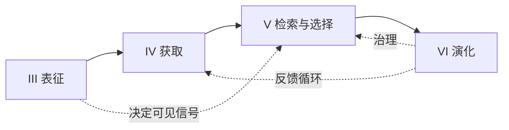
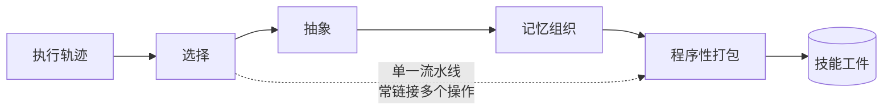
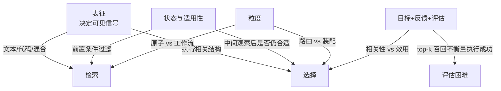
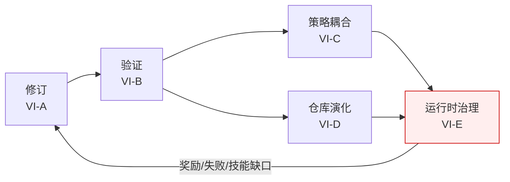
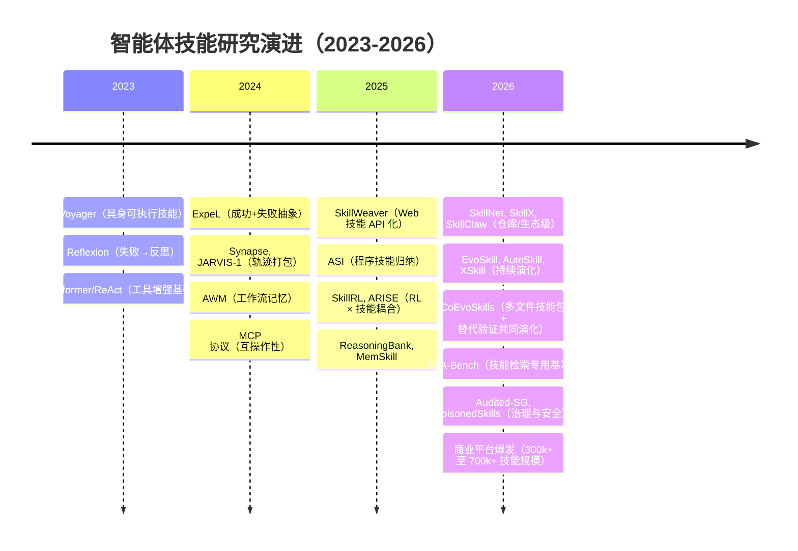
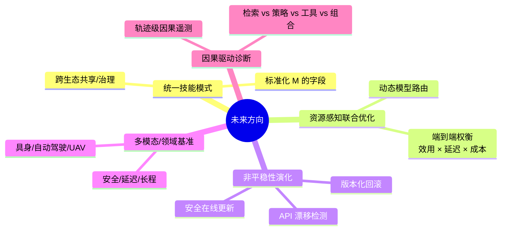

# 论文总结：智能体技能综述——分类法、技术与应用

**原文：** A Comprehensive Survey on Agent Skills: Taxonomy, Techniques, and Applications
**作者：** Yingli Zhou, Shu Wang, Yaodong Su, Wenchuan Du, Yixiang Fang, Xuemin Lin
**来源：** arXiv:2605.07358v2 | 2026 年 5 月（v1: 5月8日，v2: 5月19日）
**资源库：** https://github.com/JayLZhou/Awesome-Agent-Skills
**篇幅：** 涵盖 129 篇代表性文献 | 4 大生命周期模块 + 8 大应用领域

---

## 一、核心主张

> **图1：技能的历史演化。** 从具身工艺知识，到编码化工程程序，到数字工具与可编程工作流，再到智能体原生的技能生态系统。

本综述提出一个统一视角：**智能体技能（Agent Skills）是弥合"原始工具访问"与"鲁棒任务执行"之间程序性鸿沟的关键操作层。**

形式化地，一个技能被定义为元组：

$$
S = (M, \mathcal{R}, \mathcal{C})
$$

其中 $M$ 是根指令文档，$\mathcal{R}$ 是辅助资源（参考、模板、可执行脚本），$\mathcal{C}$ 是适用性条件。

**关键论断**：

> 智能体与技能形成互补的层次关系——**智能体负责高层认知规划，技能构成将抽象计划转化为鲁棒低层执行的操作层**。技能是智能体的"肌肉记忆"，通过外化程序性"如何做"知识，使智能体绕过冗余的逐步推理，将瞬时动作转化为持久能力。

---

## 二、问题诊断：程序性鸿沟

虽然 MCP 等协议解决了**工具互操作性**问题，但仅有工具访问无法回答四个核心问题：

| 问题 | 工具能解决吗？ | 谁能解决？ |
|------|--------------|----------|
| **何时**应调用某种能力？ | ❌ | 技能的触发条件 $\mathcal{C}$ |
| **如何**协调多个工具？ | ❌ | 技能的指令文档 $M$ |
| 失败如何处理？ | ❌ | 技能的辅助资源 $\mathcal{R}$ |
| 输出如何验证？ | ❌ | 技能的程序性"如何做" |

依赖智能体为每个任务**从零推理**这些程序步骤，会带来三重恶果：
1. **脆弱性** — 长程任务中错误累积
2. **高延迟** — 重复推导浪费计算
3. **不可靠** — 行为不一致难以调试

> **作者断言**：随着任务变得更长程、更异构，"程序性鸿沟"已成为 LLM 智能体走向真实世界部署的**主要瓶颈**。

---

## 三、综述范围与方法

> **图2：智能体技能研究的增长（2023年4月至2026年4月）。** 代表性论文数量与示例系统呈快速增长。

| 维度 | 说明 |
|------|------|
| **覆盖文献** | 127 篇代表性论文 + 5 大商业技能平台（SkillNet、ClawHub、SkillHub、SkillsMP、Skills.sh，规模达数十万至百万级） |
| **时间窗口** | 2023 年 4 月至 2026 年 4 月（GPT-4 时代到 Claude Code 时代） |
| **分类框架** | **4 阶段生命周期**：表征 → 获取 → 检索（含选择）→ 演化 |
| **理论锚点** | 形式化定义 $S=(M, \mathcal{R}, \mathcal{C})$ 元组；区分**被动知识**（参数化）vs **主动知识**（运行时） |
| **与同类综述差异** | 不同于"工具使用综述"聚焦能力扩展，也不同于"记忆综述"聚焦状态保存；本综述**专注于程序性工件的生命周期** |

---

## 四、分类体系

### 4.1 技能表征（§III）：按资源配置分类

| 配置 | $\mathcal{R}$ 内容 | 优势 | 劣势 |
|------|------------------|------|------|
| **文本支持** | 参考、示例、模板、评分量表 | 落地与复用，无可执行依赖 | 执行不确定 |
| **代码支持** | 脚本、辅助函数、笔记本、包装器 | 可重复、操作确定性强 | 引入版本控制/测试/依赖管理成本 |
| **混合资源** | 文本 + 可执行 | 保留可解释性 + 支持确定性执行 | 协调负担最高（需保持一致性） |

> **图4：智能体技能的示例说明。** 文献综述、代码修复、旅行规划、异常调查四个场景中的技能都是由多步骤组成的可复用程序，每步可能涉及推理、工具调用或外部资源交互。

### 4.2 技能获取（§IV）：按来源四分

> **图5：技能获取方法概览。** 四个家族：人类衍生、经验衍生、任务衍生、语料库衍生。

#### 四家族横向对比

| 家族 | 来源 | 代表方法 | 主要贡献 | 主要局限 |
|------|------|---------|---------|---------|
| **人类衍生** | 专家手写程序 | 医疗 SOP、工程手册、SkillsMP 平台 | 语义精确性、高信任 | 可扩展性差，需作为"种子层" |
| **经验衍生** ⭐ | 执行轨迹、日志、反馈 | Voyager, Reflexion, ExpeL, AWM, Trace2Skill, PolySkill | 行为落地性、多样性 | 抽象质量难控，"过局部 vs 过抽象" |
| **任务衍生** | 当前任务需求按需生成 | CREATOR, ToolMakers, Cradle, CodeAct, Alita, TROVE, SkillWeaver | 响应新需求快 | 需事后验证、保留 |
| **语料库衍生** | 文档、仓库、API 描述、Kaggle 竞赛 | AppAgent, AutoGuide, HuggingGPT, ToolLLM, DS-Agent | 可扩展冷启动覆盖 | 与实际执行可能脱节 |

> **图6：人类衍生技能累计数量的趋势。** 基于 SkillsMP 平台统计，显示专家设计的技能正快速被纳入智能体平台。

#### 经验衍生：四种处理操作的流水线

> **关键洞见**：经验衍生方法的差异**不在于经验来源，而在于"处理方式"**。

| 操作 | 角色 | 代表方法 | 输出形式 |
|------|------|---------|---------|
| ❶ **选择** | 经验质量控制 | Voyager（保留成功轨迹）, SkillCraft | 已筛选轨迹 |
| ❷ **抽象/总结** | 压缩为知识单元 | Reflexion（失败→规则）, ExpeL, BoT, FINCON, TiM, Trace2Skill | 教训/启发式/模板 |
| ❸ **记忆组织** | 重组为持久结构 | TiM, G-Memory（层次图）, Nemori, DAMCS（多模态 KG） | 结构化记忆 |
| ❹ **程序性打包** | 转为可调用工件 | AWM（工作流）, JARVIS-1, Synapse, PolySkill（程序化） | 工作流/API/可执行模块 |

### 4.3 技能检索与选择（§V）：两阶段流水线

> **图7：技能检索与选择。** 检索处理候选召回；选择处理执行导向决策。

> **关键区分**：**检索 ≠ 选择**。检索关注"如何缩减大池为候选集"；选择关注"哪个候选应被调用、如何组合、如何适应当前状态"。

#### 技能检索：四种范式权衡

| 范式 | 信号 | 代表方法 | 何时最有效 | 局限 |
|------|------|---------|----------|------|
| **稠密嵌入** | 共享向量空间相似性 | Voyager, SAGE, AutoSkill, MemSkill, ExpeL, ReasoningBank | 任务表述差异大、需开放语义匹配 | 意义最近邻 ≠ 适用性最近邻 |
| **稀疏/关键词** | 词法 + 元数据 | SAGE (N-gram), SkillWeaver, Memento-Skills, SkillNet | 需要稳定名称、接口字段、触发提示 | 释义化或欠规约时迅速退化 |
| **生成式** | 解码时直接生成标识符 | ToolGen, ToolLLM | 检索与调用紧密耦合 | 难以保证覆盖与有效性 |
| **结构感知** | 层次 / 依赖图 | SkillRL（层次）, SkillNet, GraphSkill；SkillWeaver（依赖）, CUA-Skill, ToolExpNet | 大库需空间缩减 / 需要前置条件过滤 | 结构构建与维护成本高 |

> **趋势判断**：**该领域正从一次性相关性匹配转向多信号、执行感知的候选召回**。

#### 技能选择：四个决策维度（互补而非互斥）

| 维度 | 核心思想 | 代表方法 | 关键问题 |
|------|---------|---------|---------|
| **上下文感知动态** | 随执行展开修订选择 | AutoGuide, MemSkill, Memento-Skills | 适应当前观察/子目标 |
| **技能组合** | 选择并组织多个技能 | SkillWeaver, AWM, ASI, AgentSkillOS, CUA-Skill, HuggingGPT | 排序/连接/依赖 |
| **成本与效用感知** | 同时考虑收益与成本/风险 | MemSkill, Memento-Skills, SkillOrchestra, SkillsBench | 选错代价（延迟、计算、副作用） |
| **反馈驱动重排序** | 历史结果重写后续偏好 | SkillRL, CUA-Skill, ToolExpNet, ExpeL, SMART | "今天的错误成为明天的排名信号" |

> **v2 评估补充**：**SRA-Bench**（技能检索 + 技能纳入 + 任务执行三阶段分别评测）具体化了 top-k 召回率不能反映执行成功的评估鸿沟。

#### 设计维度交叉影响

### 4.4 技能演化（§VI）：五阶段精炼循环

> **图8：从人类技能精炼到智能体技能演化。** 反馈持续修订一个可复用程序，使能力随时间深化。

> **关键区分**：**演化 ≠ 获取**。获取解释"候选技能如何首先获得"；演化询问"已形成工件如何被修订、验证、共享与治理"。

> **图9：通过分阶段精炼的技能演化。** 更新修订技能，验证过滤变化，受信任的技能被索引、检索、执行并进一步改进。

#### 五阶段功能对比

| 阶段 | 改变什么 | 代表方法 | 关键检查机制 |
|------|---------|---------|-------------|
| **VI-A 修订** | 工件内容（Skill.md / 文件夹 / 程序） | EvoSkill, Memento-Skills, AutoSkill, XSkill | 留出验证 / 单元测试回滚 / 维护者批准 |
| **VI-B 验证** | 决定更新能否存活（生存检查） | SkillWeaver, ASI, **CoEvoSkills**, TroVE, PSN, Audited-SG | 执行/一致性/回放/回滚；CoEvoSkills 引入**替代验证器**与技能包共同演化 |
| **VI-C 策略耦合** | 控制器训练状态包含技能底物 | SkillRL, ARISE | RL 奖励 + 验证检查点 |
| **VI-D 仓库演化** | 索引化与同步的技能底物 | Uni-Skill, SkillX, SkillNet, SkillClaw | 视频对齐 / 仓库评分量表 / 同步检查 |
| **VI-E 运行时治理** | 检索/路由/信任检查/退役 | SkillRouter（路由）, Audited-SG（积极）, PoisonedSkills（消极） | 来源、权限边界、污染检测 |

> **核心标准**：一个方法被视为"演化"的强证据，必须是 **(1) 直接修改命名工件 + (2) 暴露对更新的存活检查 + (3) 持久底物在更新后仍可复用**。仅添加新工件不算演化。

#### 边界情况辨析

| 系统 | 为何是边界 | 说明 |
|------|----------|------|
| **CASCADE** | 累积技能增长但无工件级修订 | 中心机制是连续学习，非 RL 共同优化 |
| **SkillRouter** | 路由器决定演化是否被实际使用 | 选择层而非修订层 |
| **PoisonedSkills** | 暴露演化的负面 | 第三方文档可能隐藏恶意逻辑 |
| **SKILL0** | 以外部治理换运行时效率 | 通过上下文 RL 内化技能 |

---

## 五、关键对比与发现

### 5.1 工具 vs 技能 vs MCP：边界辨析

| 维度 | 工具 (Tool) | MCP | 智能体技能 (Skill) |
|------|-----------|-----|-------------------|
| **暴露什么** | 原子操作（"可以做什么"） | 跨提供商的统一发现 | 程序性"如何做"（when/how/fallback） |
| **解决的问题** | 能力访问 | 互操作性 | 程序性鸿沟 |
| **粒度** | 函数调用 | 工具集合 | 有界、可复用的工作流 |
| **是否包含触发条件** | ❌ | ❌ | ✅ ($\mathcal{C}$) |
| **是否含失败处理** | ❌ | ❌ | ✅ |

> 论文核心论断：**"工具暴露操作；技能打包在上下文中使用它们的'如何做'。"**

### 5.2 表征、检索、选择的耦合

> **反直觉发现**：**表征不是孤立的设计选择，而是检索与选择能看到的"信号供给"**。
>
> - 纯代码技能 → 难检索（除非加上文本签名/docstring）
> - 混合技能 → 同时暴露语义 + 执行结构 → 检索更易、约束更强
> - 表征 $\mathcal{R}$ 的选择直接决定下游流水线的能力边界

### 5.3 演化的强弱证据光谱

| **强证据（明确演化）** | 部分证据（仓库级） | 弱证据（边界） |
|------------------|------------------|--------------|
| EvoSkill, Memento-Skills, AutoSkill, XSkill | Uni-Skill, SkillNet, Audited-SG | CASCADE, SkillRouter, PoisonedSkills, SKILL0 |
| SkillWeaver, ASI, CoEvoSkills, TroVE, PSN | （可检查、可治理但未解决长期因果归因） | （非工件级修订或仅作用于复用阶段） |
| SkillRL, ARISE, SkillX, SkillClaw | | |

---

## 六、研究趋势

### 6.1 范式演进时间线

### 6.2 三大趋势归纳

1. **从单技能 → 技能库/生态**：研究焦点从"如何构造一个好技能"转向"如何管理百万级技能仓库"
2. **从离线获取 → 在线演化**：从一次性获取转向修订、验证、策略耦合、仓库同步、运行时治理的全生命周期
3. **从相关性匹配 → 执行感知决策**：检索/选择从语义 top-k 转向多信号（状态、依赖、成本、反馈）综合决策

---

## 七、开放问题与未来方向

### 7.1 跨阶段开放挑战汇总

| 阶段 | 关键挑战 | 具体表现 |
|------|---------|---------|
| **获取** | 抽象质量 / 触发器规约弱 / 资源漂移 / 录入质量 | 生成快于验证 → 技术债务累积 |
| **检索** | 可扩展库 / 约束感知组合 / 多目标选择 / 执行中心评估 / 个性化 / 自适应恢复 | top-k 召回率无法衡量执行成功 |
| **演化** | 工件级评估粗糙 / 不对称修订（增长 ≫ 清理）/ 仓库治理弱 / 混淆增益 | 谁可发布？谁担责？信任如何传递？ |

### 7.2 五个未来方向（§VIII）

---

## 八、应用场景

> **图10：智能体技能的应用场景。** 八大领域覆盖技能形式的丰富多样性。

| 领域 | 主导技能形式 | 代表方法 |
|------|------------|---------|
| 软件工程 | 调试/重构工作流 | TROVE, CodeAct, SWE-agent, DS-Agent |
| Web/GUI | 多步交互例程 | SkillWeaver, CUA-Skill, AppAgent, Synapse, AWM, WebArena |
| 聊天机器人 | 记忆更新策略、路由例程 | MemGPT, M+, TiM, Nemori, PlugMem, HuggingGPT |
| 机器人 | 可复用控制例程 | SayCan, Eureka, PolySkill, Uni-Skill |
| 金融 | 决策启发式 | FINCON |
| 医疗 | 诊断/治疗程序 | Agent Hospital |
| 游戏 | 持续交互发现的行为单元 | Voyager, Ghost in the Minecraft, JARVIS-1 |
| 社交模拟 | 社会行为例程 | Generative Agents, DAMCS |

---

## 九、总结性评价

### 综述质量评估

| 维度 | 评价 |
|------|------|
| **概念清晰度** | ⭐⭐⭐⭐⭐ 给出形式化定义 $S=(M,\mathcal{R},\mathcal{C})$，明确技能与工具/MCP/记忆的边界 |
| **生命周期完整性** | ⭐⭐⭐⭐⭐ 四阶段框架（表征→获取→检索→演化）覆盖完整链路 |
| **方法分类系统性** | ⭐⭐⭐⭐⭐ 多层细分（如经验衍生分 4 种操作，检索分 4 种范式，演化分 5 阶段），表格密集 |
| **批判性深度** | ⭐⭐⭐⭐ 明确区分"强证据演化"vs"边界情况"，警示混淆增益问题 |
| **未来方向具体性** | ⭐⭐⭐⭐ 5 个方向均可操作 |
| **时效性** | ⭐⭐⭐⭐⭐ 涵盖到 2026 年 4 月最新工作 |

### 适合读者

| 读者类型 | 价值 |
|---------|------|
| **智能体系统研究者** | 提供统一概念框架，避免重复造轮子 |
| **LLM 应用工程师** | 表 I（平台清单）、表 II/III/IV（方法对照）可直接用于技术选型 |
| **开源框架开发者** | 第 VIII 节"统一技能模式"为标准化提供路线图 |
| **AI 安全/治理研究者** | §VI-E（运行时治理）、§VII-C（仓库治理）、PoisonedSkills 案例 |
| **学生与新人** | 第 II 节前置知识 + 图 1 历史脉络是优秀入门读物 |

### 核心贡献再提炼

> **本综述的最大贡献不在于穷举方法，而在于建立"技能作为一等构建块"的统一概念语言**——通过将分散的"工作流记忆"、"程序归纳"、"工具创建"、"技能图"等术语收纳到 $(M, \mathcal{R}, \mathcal{C})$ + 四阶段生命周期的框架中，为社区提供了讨论智能体可扩展性、鲁棒性与可治理性的共同基础。

### 局限与可改进点

- **缺乏定量基准比较**：四种检索范式、四个获取家族缺乏统一基准的性能对比数据
- **作者机构与公开度**：部分引用的商业平台（SkillNet、ClawHub 等）缺乏学术验证
- **理论形式化偏弱**：形式定义后未展开论证（如 $\mathcal{C}$ 的语法、$M$ 与 $\mathcal{R}$ 的接口）
- **多智能体技能共享**：跨智能体协议层与技能共享的交叉仅在 SkillClaw 一例中触及
