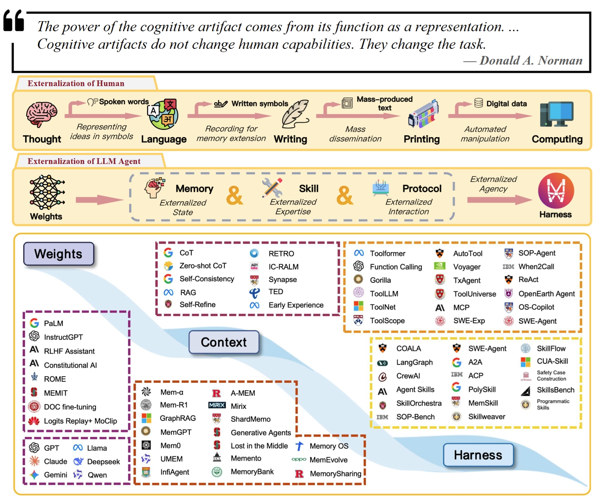
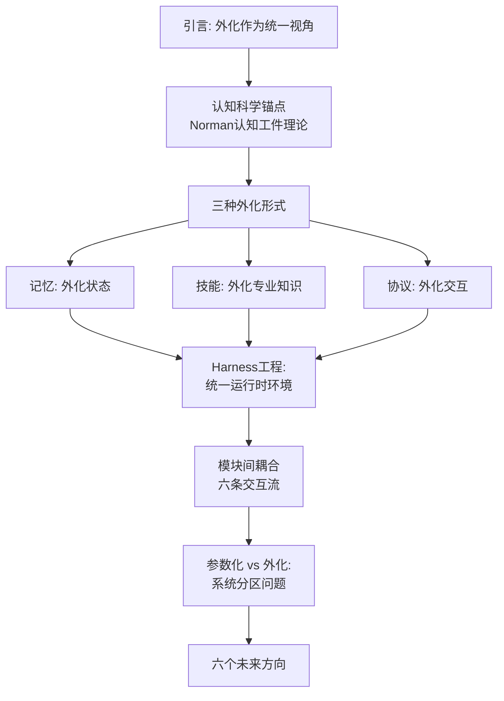
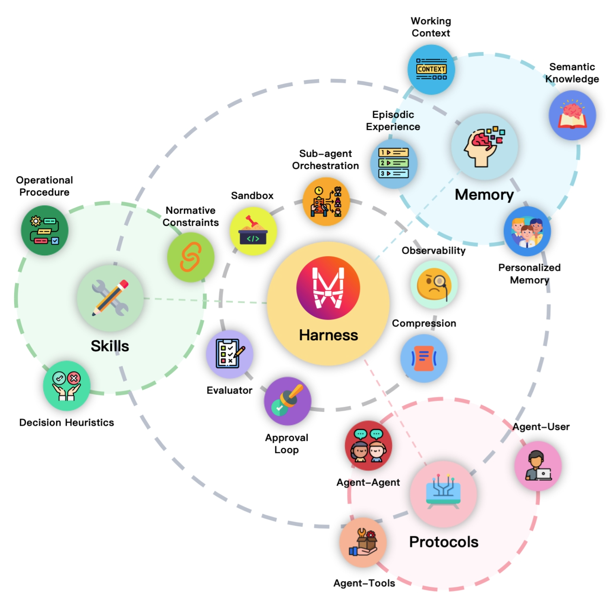
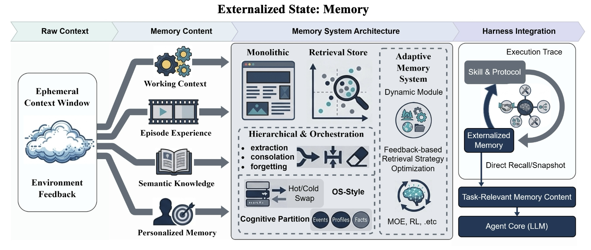
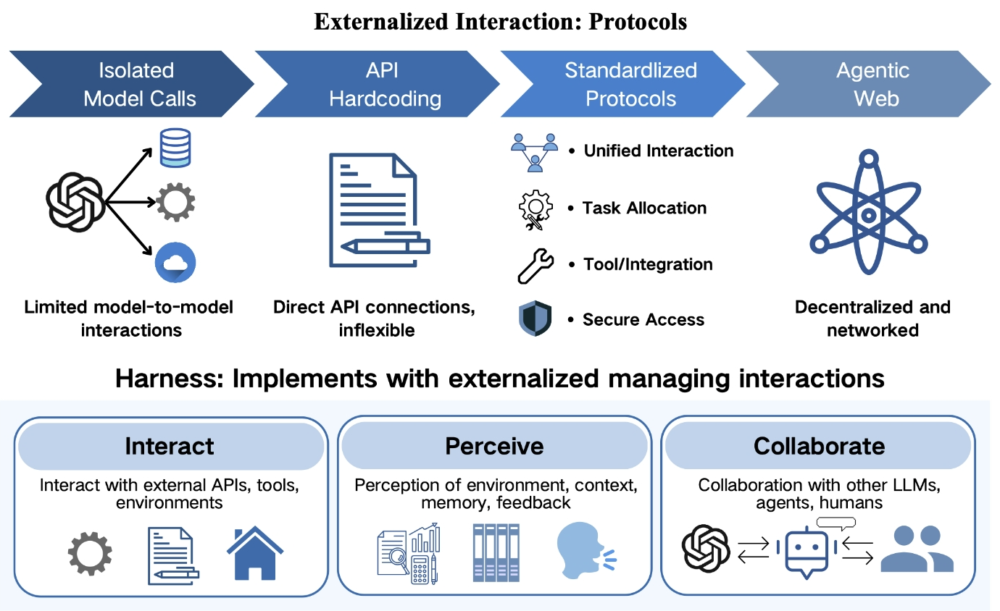
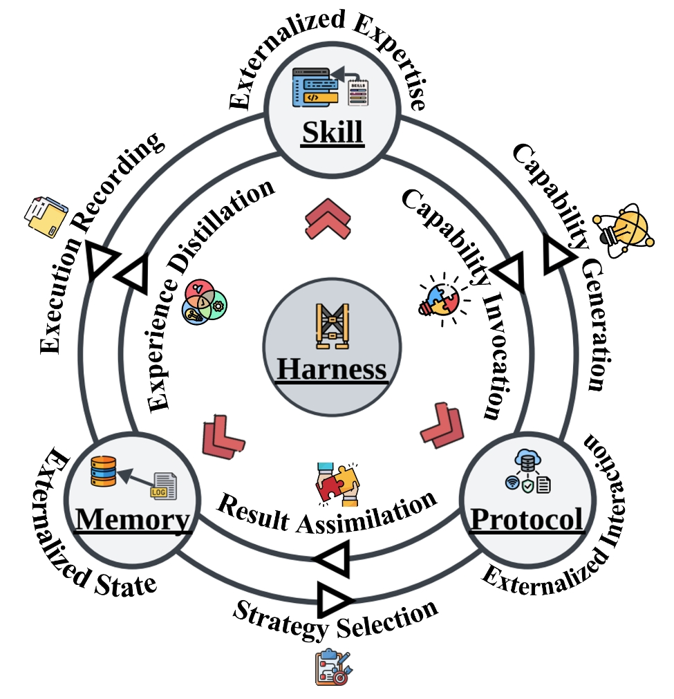
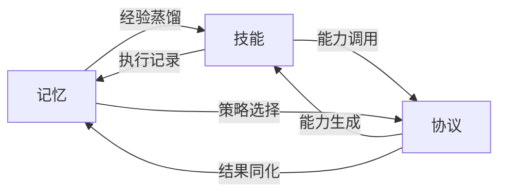
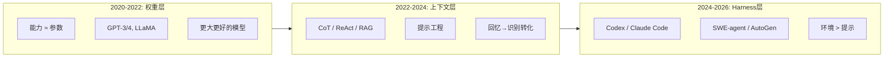

# 论文总结：LLM智能体中的外化——记忆、技能、协议与Harness工程的统一综述

**原文：** Externalization in LLM Agents: A Unified Review of Memory, Skills, Protocols and Harness Engineering  
**作者：** Chenyu Zhou 等21人 | 上海交通大学、中山大学、卡耐基梅隆大学、OPPO  
**来源：** arXiv:2604.08224v1 | 2026年4月  
**篇幅：** 54页 | 超300篇参考文献

---

## 一、核心主张

> **图1：外化作为LLM智能体设计的组织原则。** 上方：人类认知外化弧线（思想→语言→书写→印刷→数字计算）；中间：LLM智能体的对应弧线（权重→记忆/技能/协议→Harness）；下方：文献全景图，展示研究线程如何逐步向外迁移。

本文提出一个统一视角：**外化（Externalization）是理解当前LLM智能体最重要进展的转变逻辑。**

所谓外化，是指将认知负担从模型内部（权重/参数）逐步转移到模型外部的持久、可检查、可复用的结构中。论文的理论锚点来自认知科学家Donald Norman的**认知工件**理论——外部工件不是简单地"增强"内部能力，而是**改变了任务本身的表征结构**。正如购物清单将困难的"回忆"问题转化为简单的"识别"问题，智能体的外化基础设施将LLM难以可靠完成的认知任务转化为它更擅长的形式。

**关键推论**：更好的智能体越来越不取决于更强的模型本身，而取决于更好的**外部认知基础设施**。

---

## 二、问题诊断：裸LLM的三重不匹配

一个没有外化基础设施的LLM面临三个结构性缺陷：

| 问题 | 症状 | 对应的外化维度 |
|------|------|--------------|
| **连续性问题** | 上下文窗口有限，会话间失忆，长任务状态丢失 | 记忆（Memory） |
| **方差问题** | 多步骤程序每次重新推导，步骤遗漏，执行不一致 | 技能（Skills） |
| **协调问题** | 与工具/服务/协作者的交互脆弱，格式临时猜测 | 协议（Protocols） |

**例证**：一个软件工程智能体要在大型代码库中实现功能、运行测试并提交PR。没有外化时，模型必须在脆弱的提示中同时维持代码库结构、项目约定、工作流状态和工具交互。有了外化——持久记忆提供上下文，可复用技能编码约定，协议化接口规范工具调用，Harness编排全流程——基础模型可以完全不变，改变的是它面对的**任务表征**。

---

## 三、综述范围与方法

| 维度 | 说明 |
|------|------|
| **篇幅** | 54页，超300篇参考文献 |
| **时间跨度** | 从预训练时代（GPT-3, 2020）到最新工作（2026年） |
| **方法论** | 非系统性文献检索，而是**概念驱动的统一综述**——以认知工件理论（Norman, 1991）为锚点，用"外化"作为统一分析透镜 |
| **分类框架** | 三个外化维度（记忆/技能/协议）+ Harness工程整合层 |
| **与同类综述差异** | 不是传统的"模型能力"综述，明确强调"关键问题不再仅仅是如何构建更强的模型"，而是**能力的组织位置** |

---

## 四、历史演进：能力的重心向外迁移

> **图2：跨三个能力层的社区主题演变。** 堆叠的权重、上下文和Harness层展示了LLM智能体社区的重心如何随时间向外转移。

论文将LLM智能体的发展划分为三个叠加式阶段：

### 阶段一：权重中的能力
- **核心假设**：能力 ≈ 模型参数。更大更好的模型 = 更好的智能体
- **代表**：GPT-4、Gemini、DeepSeek-V3、Qwen2.5
- **优势**：快速推理、紧凑部署、强泛化
- **局限**：知识与程序过度耦合在静态工件中，难以选择性更新、组合和审计

### 阶段二：上下文中的能力
- **核心假设**：通过改变输入（提示/检索）来改变行为，无需修改权重
- **代表**：CoT、ReAct、Tree of Thoughts、RAG、Self-Refine
- **突破**：将"模型是否知道X"的回忆问题转化为"X已在上下文中，模型能否使用"的识别问题
- **局限**：上下文窗口有限且昂贵、"迷失在中间"现象、会话间状态丢失

### 阶段三：基础设施中的能力（Harness）
- **核心假设**：可靠性不仅靠提示，更靠模型运行的完整环境
- **代表**：Codex、Claude Code、SWE-agent、OpenHands、AutoGen、MetaGPT
- **范式转移**：从"我们应该告诉模型什么？"转向"模型应该在什么环境中运行？"

> 三个阶段是**分层叠加**而非替代关系——即使在最重基础设施的系统中，权重和上下文仍然重要。

> **图3：Harness化LLM智能体的外化架构。** Harness位于中心；记忆、技能、协议三个外化维度围绕其运行。沙箱、可观测性、压缩、评估、审批循环等操作元素介导Harness核心与外化模块之间的交互。

---

## 五、三种外化形式

### 5.1 记忆：外化跨时间的状态（§3）

> **图4：记忆作为外化状态。** 原始上下文被转化为四个持久记忆维度（工作上下文、情节经验、语义知识、个性化记忆），通过逐步更受管理的架构组织：单体上下文→检索存储→分层编排→自适应记忆系统。

**核心转换**：回忆 → 识别与检索

#### 四层记忆内容

| 记忆层 | 内容 | 功能 | 示例系统 |
|--------|------|------|---------|
| **工作上下文** | 当前任务的活动中间状态 | 支持即时恢复、中断后继续 | OpenHands, InfiAgent |
| **情节经验** | 过去执行的决策、失败、反思 | 提供先例、避免重复错误 | Reflexion, AriGraph |
| **语义知识** | 跨案例的领域事实、项目约定 | 支持抽象和知识迁移 | GraphRAG, RAG语料库 |
| **个性化记忆** | 用户偏好、习惯、交互历史 | 跨会话适应，隐私隔离 | IFRAgent, VARS |

#### 架构演进（四代）

1. **单体上下文**：所有历史塞入提示。适用于短任务，但容量差、随会话消失
2. **检索存储**：外部存储 + 按需检索。解决容量问题，但质量取决于检索。代表：GraphRAG、ENGRAM、SYNAPSE
3. **分层编排**：引入提取/整合/遗忘等操作的受管理生命周期。两种策略：
   - 时空解耦（MemGPT、MemoryOS：热/冷存储分离）
   - 语义解耦（MemoryBank：事件/档案/知识分离；MemOS：显式/隐式分离）
4. **自适应系统**：模块、路由、检索策略对经验做出动态响应。代表：MemEvolve、MemRL

> **核心转变**：从"存储"到"控制"。记忆的成功标准不是"保存了多少"，而是"是否使当前决策变得清晰可读"。

---

### 5.2 技能：外化程序性专业知识（§4）

> **图5：技能作为外化专业知识。** 追溯技能从调用、选择到程序的完整生命周期：获取（编写/蒸馏/发现/组合）→ 技能工件（操作程序+决策启发式+规范约束）→ 激活管道（发现→渐进式披露→执行绑定→组合）→ 运行时执行与边界条件。

**核心转换**：即兴生成 → 可复用程序的选择与组合

#### 技能的三个组件

| 组件 | 作用 | 解决的失败模式 |
|------|------|--------------|
| **操作程序** | 任务骨架：步骤、依赖、停止条件 | 跳步、乱序、提前终止 |
| **决策启发式** | 分支处的经验法则 | 模型在每个交叉点重新发现策略的高方差 |
| **规范约束** | 合规、安全和操作边界 | 技术可行但不合规/不安全的执行 |

#### 从工具到技能的三阶段演化

1. **原子执行原语**：模型学会调用单个工具（Toolformer）——单位是**动作**
2. **大规模原语选择**：从大型工具集合中检索和选择（Gorilla, ToolLLM）——单位是**工具**
3. **技能作为打包的专业知识**：将程序性知识编译为可复用能力包——单位是**程序**

#### 技能生命周期

#### 四条获取路径

- **编写**：人工撰写SKILL.md、AGENTS.md、SOP模板（最稳定）
- **蒸馏**：从历史轨迹中归纳可复用结构（TED, UMEM）
- **发现**：通过环境交互自主发现（Voyager在Minecraft中）
- **组合**：反复验证的技能组合被打包为更高级别技能

#### 边界条件（技能不保证可靠性）

- 语义对齐风险：遵循字面措辞却偏离真正目标
- 可移植性/过时：API变化使有效技能失效
- 不安全组合：单独无害的技能组合后可能引发提示注入、数据泄露、权限升级
- 上下文退化：长交互中技能执行质量下降；过多指南干扰全局任务跟踪

---

### 5.3 协议：外化交互结构（§5）

> **图6：协议作为外化交互。** 上方：从孤立模型调用→硬编码API→标准化协议→去中心化智能体网络的演化轨迹。下方：Harness通过交互、感知和协作三个功能表面实现外化交互管理。

**核心转换**：临时猜测 → 结构化合约

#### 协议外化的四个维度

- **调用语法**：模式和类型接口替代格式猜测
- **生命周期语义**：显式状态机替代隐含的排序假设
- **权限和信任边界**：可检查规则替代隐含的访问假设
- **发现元数据**：注册表和能力卡替代硬编码的工具列表

#### 四类协议

| 类型 | 协议 | 外化的内容 | 关键特征 |
|------|------|----------|---------|
| **智能体-工具** | MCP | 工具发现、调用、模式 | JSON-RPC 2.0，统一工具访问 |
| **智能体-智能体** | A2A, ACP, ANP | 能力发现、任务委托、状态交换 | Agent Cards, REST/HTTP, 互联网级互操作 |
| **智能体-用户** | A2UI, AG-UI | UI结构声明、执行状态流 | 类型化事件流 |
| **垂直领域** | UCP, AP2 | 商务结账、支付授权 | 高风险工作流的专用合约 |

> 协议是最强形式的外化之一——它从关键路径上**移除了整个类别的推理**，将开放式的自然语言推理替换为有界的结构化任务。

---

## 六、Harness工程：统一的认知环境（§6）

> **图7：Harness作为认知环境。** 基础模型位于中心；六个维度形成协调环——三个外化模块（记忆、技能、协议）提供认知内容，三个操作表面（权限、控制、可观测性）治理运行时访问、约束和监控。

**Harness不是第四种外化，而是三种外化在其中运作和交互的运行时环境。**

### 定义

Harness = 将原始模型能力转化为可靠智能体行为的完整脚手架，包括编排逻辑、约束、可观测性和反馈循环。

> 一个实际的智能体最好被理解为**在Harness内运行的模型**，而非附加了外围能力的模型。

### 六个设计维度

| 维度 | 功能 | 关键机制 |
|------|------|---------|
| **1. 智能体循环和控制流** | 时间骨干 | 感知→检索→规划→行动→观察 + 最大步数/递归深度/成本上限/超时 |
| **2. 沙箱和执行隔离** | 认知边界 | 云沙箱（Codex）、分级权限模式（Claude Code）。不仅是安全围栏，更简化操作环境 |
| **3. 人类监督和审批门** | 干预点 | 执行前审批/执行后审查/升级触发 + Hook系统泛化 |
| **4. 可观测性和结构化反馈** | 调试与演化 | 每次调用的结构化日志 → 对外审计，对内关闭反馈循环 |
| **5. 配置、权限和策略编码** | 治理分层 | 用户级偏好 → 项目级工具/路径 → 组织级合规/成本上限 |
| **6. 上下文预算管理** | 资源分配 | 摘要、优先级驱逐、分阶段加载。记忆/技能/协议竞争同一token预算 |

### 关键发现

独立开发的系统（如OpenAI Codex和Anthropic Claude Code）**收敛于相同的Harness维度集**。这不是巧合，而是外化智能体的**结构性需求**——说明主要设计挑战不是从模型引出更好的补全，而是安排操作条件使补全成为有效的干预。

### Harness的本质

用Norman的框架理解：Harness不仅用更多工具增强模型，它**重组了模型面临的表征问题**。借鉴Kirsh的空间智能使用观点，Harness是一个**认知生态位**——信息、工具、权限和程序被精心安排，使期望行为更容易执行、不期望行为更难产生。

> Harness的更深层功能不是基础设施，而是**环境结构化**——设计认知展开的条件。

---

## 七、模块间交互：六条耦合流（§7）

> **图8：记忆、技能与协议之间的耦合。** 六条箭头总结了三个外化模块如何在Harness内部相互加强。

| 耦合流 | 方向 | 说明 |
|---------|------|------|
| 经验蒸馏 | 记忆 → 技能 | 重复轨迹被聚类、抽象、提升为技能工件 |
| 执行记录 | 技能 → 记忆 | 每次执行的痕迹、失败、改进被持久化 |
| 能力调用 | 技能 → 协议 | 技能通过协议接口跨越从抽象到受治理动作的边界 |
| 能力生成 | 协议 → 技能 | 标准化接口扩展可编写新技能的表面 |
| 策略选择 | 记忆 → 协议 | 历史成功率、用户偏好影响协议路径选择 |
| 结果同化 | 协议 → 记忆 | 每次协议交互产生的状态被规范化写入记忆 |

### 三个系统级动态

1. **自我加强的正反馈**：更好的记忆 → 更好的技能蒸馏 → 更丰富的执行痕迹 → 更好的记忆… 但也可能**放大错误**
2. **上下文预算竞争**：三个模块共享同一有限的token窗口，扩大一个必然压缩其他
3. **多时间尺度**：协议交互=同步/毫秒级；技能加载=任务边界；记忆蒸馏=会话级或更长

### LLM输入/输出视角

- **记忆 → 上下文输入**：塑造可用的历史和情境
- **技能 → 指令输入**：塑造程序指导
- **协议 → 动作模式**：约束输出空间的结构化合约

> 三方组合 = **结构化的上下文工程**。Harness将提示分为具有不同更新率、治理要求和失败模式的独立可修订层。

---

## 八、参数化 vs 外化：系统分区问题（§7.3）

这不是零和博弈，而是**每种认知负担应该放在哪里**的设计决策：

| 考量维度 | 倾向外化 | 倾向参数化 |
|---------|---------|-----------|
| **更新频率** | 快速变化的知识/程序 | 稳定的背景能力 |
| **复用模式** | 跨任务/跨智能体需要 | 一次性/高度特异 |
| **治理需求** | 需要检查/批准/回滚/审计 | 无治理要求 |
| **执行成本** | 可容忍检索/路由/解析延迟 | 超快/低方差/纯语义任务 |

---

## 九、研究趋势

论文揭示了LLM智能体社区的重心随时间**系统性向外迁移**的清晰轨迹：

| 趋势 | 内容 | 证据 |
|------|------|------|
| **环境优先于提示** | 可靠性问题通过改变运行环境而非仅通过提示解决 | 独立开发的系统（Codex、Claude Code）收敛于相同Harness维度 |
| **从存储到控制** | 记忆系统的成功标准从"保存量"转向"使决策清晰" | 四代架构演进：单体→检索→分层→自适应 |
| **从动作到程序** | 技能单位从原子工具调用→工具选择→打包的程序性知识 | Toolformer→Gorilla/ToolLLM→SKILL.md |
| **从猜测到合约** | 协议将开放式NL推理替换为有界结构化任务 | MCP/A2A/ACP的标准化 |

---

## 十、六个未来方向（§8）

### 10.1 扩展的外化前沿
- 规划作为一等Harness对象（持久、可检查、可修订、可共享）
- 评估标准和验证程序外化为运行时组件
- 编排逻辑本身成为智能体可以检查和修订的对象（最递归的外化形式）
- 多模态外化：多模态技能、记忆和推理蒸馏

### 10.2 从数字到具身外化
- 机器人学习正经历平行的外化过程
- LLM作为**大脑**（慢速审慎认知）+ VLA模型作为**小脑**（快速反应执行）
- 与数字智能体的Harness架构**同构**

### 10.3 自演化Harness
- 如果编排逻辑本身被外化，Harness就可以程序化地自适应
- 技术路径：RL优化运行时策略、程序合成视为代码修复、进化搜索Harness拓扑、模仿学习

### 10.4 成本、风险和治理
- **认知开销**：过度外化时模型花在发现/解析/协调模块上的努力超过解决任务本身
- **安全威胁**：记忆投毒（损坏的痕迹扭曲未来推理）、恶意技能注入（对抗性程序进入可复用库）、协议欺骗（伪造工具清单导致未授权动作）
- **设计原则**：追求**高效且实用正面的外化**，而非**最大化外化**
- 治理必须是Harness的共同设计层，而非事后想法

### 10.5 从私有脚手架到共享基础设施
- 共享记忆："我记得什么" → "我们知道什么"
- 共享技能：程序性专业知识变成跨智能体的公共能力单元
- 共享协议：通用语法使协调可互操作
- 一旦外化结构被共享，智能体系统可以**分化角色**而非到处复制完整堆栈
- 反复验证的模式开始功能上更像**制度**而非临时脚手架
- 新治理问题：基础设施漂移、低质量工件污染、标准化时机

### 10.6 衡量外化
当前基准系统性低估外化基础设施的贡献。更丰富的评估应涵盖：
- **可转移性**：同一Harness在底层模型替换后是否仍有效
- **可维护性**：模块更新时系统退化的优雅程度
- **恢复稳健性**：失败检测、部分回滚和检查点恢复能力
- **上下文效率**：Harness开销占用的token比例
- **治理质量**：透明性和可逆性是否满足要求

---

## 十一、结论

论文的结论可以凝练为三个层次：

**事实层**：从权重到上下文再到Harness的转移标志着**智能体能力组织位置的根本转变**——一些负担一旦在模型外部变得持久、可检查、可复用和可治理，就变得更加可靠。

**机制层**：统一三种外化形式的是**表征转换**——记忆将回忆转化为检索，技能将即兴生成转化为有引导的组合，协议将临时协调转化为结构化交换。效果不是在模型周围添加组件，而是**改变模型被要求解决的任务**。

**展望层**：关键问题不再仅仅是如何构建更强的模型，而是如何在模型和基础设施之间分配能力、如何评估外化贡献、如何治理智能体依赖的共享工件。

> **更好的智能体不仅仅是更好的推理器——它们是更好组织的认知系统。**  
> **智能体的进步将来自模型和外部基础设施的共同演化，而非任何一方孤立发展。**
