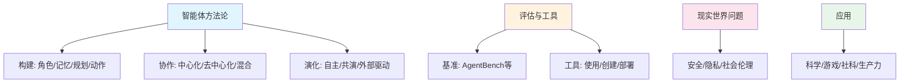
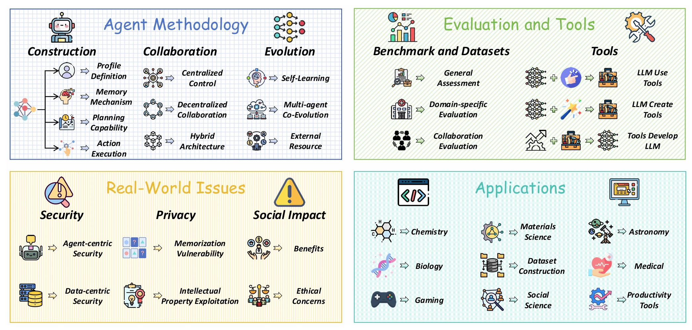
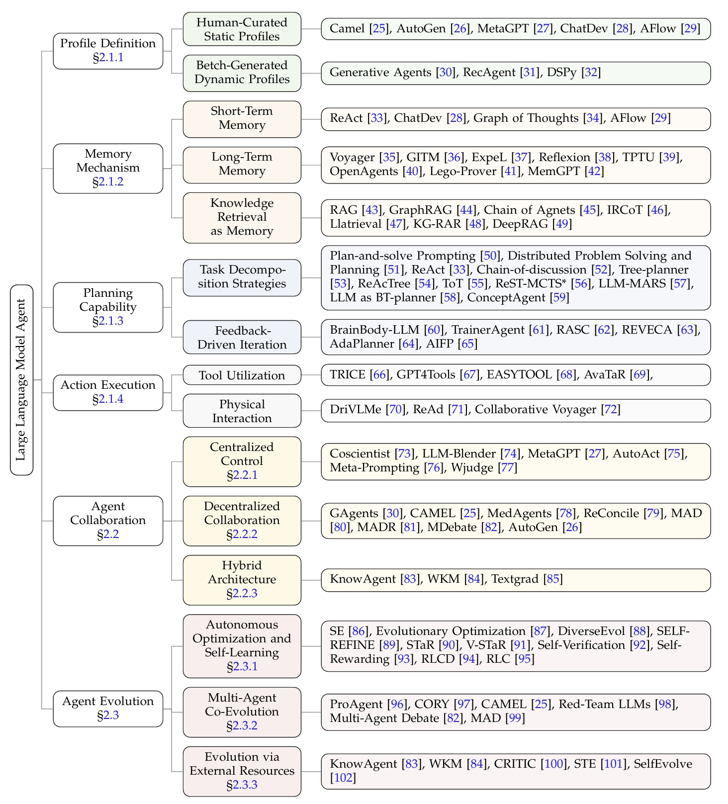
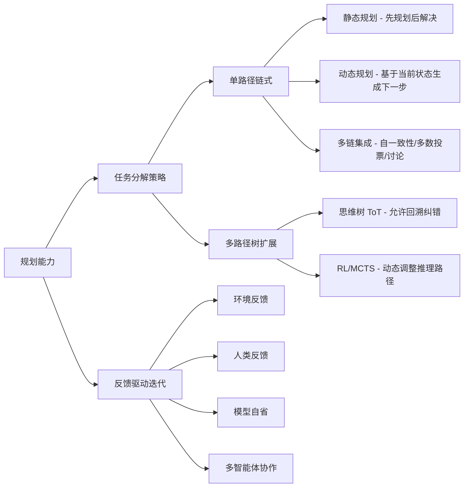
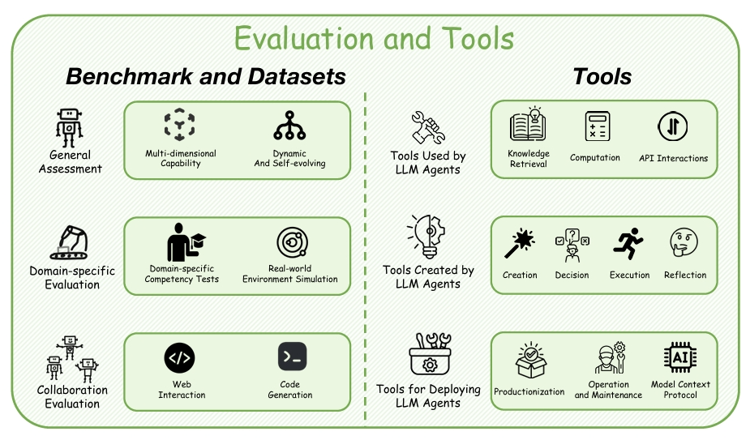
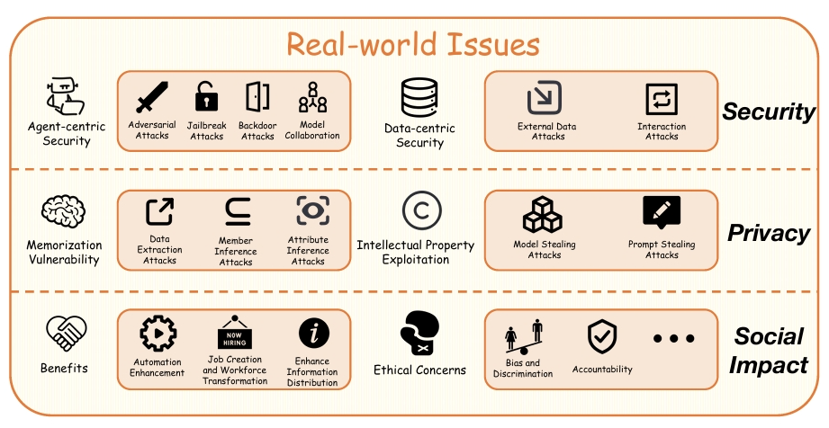
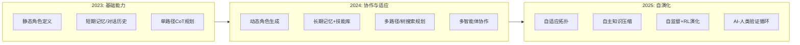

# LLM智能体综述：方法论、应用与挑战 — 论文总结

**原文：** Large Language Model Agent: A Survey on Methodology, Applications and Challenges  
**来源：** arXiv:2503.21460 [cs.CL]，2025年3月  
**作者：** Junyu Luo, Weizhi Zhang, Ye Yuan 等（北京大学、UIC、南洋理工等）

---

## 一、核心主张

**一句话概括：** 本综述提出"构建-协作-演化"三维分类体系，系统解构LLM智能体的方法论基础，将碎片化的智能体研究统一到一个架构视角下。

> 与以往综述侧重单一维度（游戏、安全、多模态）不同，本文的核心贡献在于揭示了**个体智能体设计原则与多智能体涌现行为之间的根本联系**——构建决定能力边界，协作扩展问题空间，演化实现持续改进。

---

## 二、问题诊断

传统AI系统仅被动响应用户输入，而LLM智能体能**主动感知环境、推理目标并执行动作**。现有综述存在三个缺口：

| 缺口 | 具体表现 | 本文解决方案 |
|------|---------|-------------|
| 缺乏方法论分类 | 已有综述多为应用导向的概述 | 提出以方法论为中心的系统分类体系 |
| 维度割裂 | 构建、协作、演化被分开研究 | "构建-协作-演化"统一框架 |
| 理论脱节 | 缺少对现实世界挑战的系统分析 | 全面覆盖安全、隐私、伦理等实际问题 |

---

## 三、综述范围与方法

| 维度 | 说明 |
|------|------|
| **发表时间** | 2025年3月（arXiv:2503.21460） |
| **论文资源** | 配套 GitHub 资源库 [Awesome-Agent-Papers](https://github.com/luo-junyu/Awesome-Agent-Papers) |
| **方法论** | **以方法论为中心的分类体系**——"构建-协作-演化"三维统一框架 |
| **覆盖范围** | 智能体方法论 + 评估与工具 + 现实世界问题（安全/隐私/伦理）+ 应用 |
| **与同类综述差异** | 此前综述主要关注特定应用（游戏）、部署环境、多模态或安全性，或提供缺乏详细方法论分类的概述；本文首次以方法论为核心轴线组织 |

---

## 四、整体框架

> **图1：LLM智能体生态系统概览。** 该图展示了LLM智能体生态系统的四个相互关联的维度：❶ **智能体方法论**，涵盖构建、协作和演化的基础方面；❷ **评估与工具**，呈现基准测试、评估框架和开发工具；❸ **现实世界问题**，关注安全、隐私和社会影响等关键议题；❹ **应用**，展示LLM智能体部署的多样化领域。

论文将LLM智能体生态系统组织为四大板块：

| 板块 | 内容 |
|------|------|
| **方法论** (§2) | 构建 → 协作 → 演化 |
| **评估与工具** (§3) | 基准/数据集 + 工具生态（使用/创建/部署） |
| **现实世界问题** (§4) | 安全 + 隐私 + 社会伦理 |
| **应用** (§5) | 科学/游戏/社科/生产力工具 |

---

## 五、智能体方法论（核心）

> **图2：LLM智能体方法论的综合框架。** 展示了构建、协作和演化三个核心维度及其子组件的关系。

### 5.1 智能体构建：四大支柱

构建是智能体系统的基础，包含四个相互依存的组件，形成**递归优化循环**——记忆→规划→执行→记忆更新→角色改进。

#### ① 角色定义

| 类型 | 方法 | 代表系统 | 适用场景 |
|------|------|---------|---------|
| 人工静态角色 | 领域专家手动指定 | CAMEL、AutoGen、MetaGPT、ChatDev | 需要高可解释性和合规性的场景 |
| 批量动态角色 | 参数化初始化+受控特质注入 | Generative Agents、RecAgent、DSPy | 社会行为模拟、群体智能研究 |

#### ② 记忆机制

| 类型 | 功能 | 局限 | 代表工作 |
|------|------|------|---------|
| **短期记忆** | 保留对话历史和环境反馈 | 上下文窗口受限，任务后消散 | ReAct、ChatDev、GoT、AFlow |
| **长期记忆** | 归档推理轨迹为可重用资产 | 需要有效的压缩和索引 | Voyager(技能库)、ExpeL(经验池)、MemGPT(分层架构) |
| **知识检索** | 整合外部知识库扩展信息边界 | 检索质量影响生成质量 | RAG、GraphRAG、IRCoT、DeepRAG |

> 长期记忆的三种范式特别值得关注：**技能库**（过程性知识）、**经验仓库**（成功/失败模式）、**工具合成**（组合适应能力）。这三者共同将短暂的认知努力转化为持久的操作资产。

#### ③ 规划能力

#### ④ 动作执行

- **工具利用**：工具使用决策（何时用）+ 工具选择（用哪个）
- **物理交互**：机器人硬件操控、社会知识理解、多智能体物理协作

### 5.2 智能体协作：三种架构

| 架构 | 核心思想 | 优势 | 代表系统 |
|------|---------|------|---------|
| **中心化控制** | 中央控制器分配任务+整合决策 | 严格协调，适合关键任务 | Coscientist、MetaGPT、AutoAct |
| **去中心化协作** | 节点间通过自组织协议直接交互 | 灵活，无单点瓶颈 | MedAgents(修订)、MAD/AutoGen(通信) |
| **混合架构** | 结合中心化与去中心化 | 平衡可控性与灵活性 | CAMEL、AFlow、DyLAN、MDAgents |

> 动态混合系统（如DyLAN、MDAgents）代表了最新趋势——**基于实时性能反馈自动重配协作拓扑**，而非预定义固定模式。

### 5.3 智能体演化：三条路径

| 路径 | 机制 | 代表方法 |
|------|------|---------|
| **自主优化** | 自监督学习、自反思纠正、自奖励RL | SELF-REFINE、STaR、V-STaR、RLC |
| **多智能体共演** | 合作学习（知识共享）+ 对抗演化（红队博弈） | ProAgent、CORY、CAMEL、Red-team LLMs、MAD |
| **外部资源驱动** | 知识增强 + 工具反馈 + 执行结果反馈 | KnowAgent、WKM、CRITIC、SelfEvolve |

---

## 六、评估与工具生态

> **图3：LLM智能体评估基准与工具概览。** 左侧为评估框架分类，右侧为工具生态分类。

### 评估基准

| 层次 | 基准 | 关注点 |
|------|------|--------|
| 通用评估 | AgentBench、Mind2Web、MMAU、CRAB | 多维能力（推理、规划、问题解决） |
| 领域特定 | MedAgentBench(医疗)、LaMPilot(自动驾驶)、TravelPlanner(规划)、AgentHarm(安全) | 垂直领域深度测试 |
| 真实环境 | OSWorld(跨OS)、EgoLife(日常活动) | 弥合仿真与现实 |
| 协作评估 | TheAgentCompany、MLE-Bench | 系统级协作能力 |

### 工具分类

| 维度 | 说明 | 代表 |
|------|------|------|
| 智能体**使用**的工具 | 知识检索/计算/API调用 | WebGPT、Toolformer、RestGPT |
| 智能体**创建**的工具 | 自主工具生成和组合 | CRAFT、CREATOR、LATM |
| **部署**智能体的工具 | 生产化/运维/协议 | AutoGen、LangChain、LlamaIndex、Dify、MCP |

---

## 七、现实世界问题

> **图4：LLM智能体系统的现实世界问题概览。** 涵盖安全挑战、隐私关切和社会影响三大领域。

### 安全威胁全景

| 攻击类型 | 攻击目标 | 攻击手段 | 防御策略 |
|---------|---------|---------|---------|
| **对抗攻击** | 损害智能体可靠性 | CheatAgent(推荐系统)、GIGA(传染性梯度) | LLAMOS(净化输入)、多智能体辩论 |
| **越狱攻击** | 突破安全防护 | RLTA(RL生成恶意提示)、RLbreaker(DRL搜索) | AutoDefense(多角色过滤)、ShieldLearner(自主学习防御) |
| **后门攻击** | 植入隐蔽触发器 | DemonAgent(动态加密)、DarkMind(推理链后门) | — |
| **协作攻击** | 利用多智能体交互 | CORBA(传染递归)、AiTM(消息拦截) | G-Safeguard(GNN检测)、PsySafe(心理学防御) |
| **数据攻击** | 污染输入数据 | 输入伪造、心理引导、外部源投毒 | 输入防火墙、医生/警察智能体、多智能体验证 |

### 隐私风险

- **记忆漏洞**：数据提取、成员推断、属性推断 → 防护：差分隐私、知识蒸馏、数据清洗
- **知识产权**：模型窃取、提示窃取 → 防护：模型水印、区块链认证、对抗样本

### 社会伦理

| 维度 | 益处 | 风险 |
|------|------|------|
| 劳动力 | 自动化增效、创造新岗位 | 替代现有工作 |
| 公平性 | — | 继承并放大训练数据偏见 |
| 内容 | 信息分发增强(教育等) | 虚假信息传播、版权侵犯 |
| 环境 | — | 大模型训练的碳足迹 |

---

## 八、应用领域

| 领域 | 代表系统 | 核心能力 |
|------|---------|---------|
| **科学发现** | SciAgents(假设生成)、ChemCrow(化学合成)、AgentHospital(虚拟医院) | 多智能体协作+领域工具整合 |
| **游戏** | Voyager(Minecraft终身学习)、ReAct(推理行动)、CALYPSO(叙事生成) | 终身学习+动态适应 |
| **社会科学** | Generative Agents(社会模拟)、Econagent(宏观经济)、TradingGPT(金融交易) | 类人行为模拟+社会动力学 |
| **生产力工具** | MetaGPT/ChatDev(软件开发)、Agent4Rec/AgentCF(推荐系统) | 角色协作+工作流自动化 |

---

## 九、研究趋势

论文虽未单独设节讨论研究演进，但从方法论分类和挑战分析中可提炼出以下清晰趋势：

| 趋势 | 从 | 到 | 代表 |
|------|----|-----|------|
| **角色定义** | 人工静态指定 | 参数化动态生成 | CAMEL → Generative Agents |
| **协作拓扑** | 固定架构（中心化/去中心化） | 基于实时反馈自动重配 | MetaGPT → DyLAN/MDAgents |
| **演化路径** | 外部监督训练 | 自主优化+对抗共演 | SFT → SELF-REFINE/STaR/V-STaR |
| **评估** | 静态基准 | 动态多轮多智能体评估 | MMLU → AgentBench/OSWorld |
| **安全** | 单模型防御 | 系统级拓扑+协议防御 | 输入过滤 → G-Safeguard/PsySafe |

> **总体方向**：从静态→动态、从单体→系统、从人工设计→自演化的一致趋势，"自适应和涌现"成为贯穿所有维度的关键词。

---

## 十、挑战与未来方向

| 挑战 | 核心问题 | 未来方向 |
|------|---------|---------|
| **可扩展性** | 高计算需求、协调效率低 | 层次化结构 + 去中心化规划 |
| **记忆约束** | 有限上下文窗口、知识纵向积累难 | 分层记忆架构（情景+语义）+ 自主知识压缩 |
| **可靠性** | 幻觉、输出对提示敏感、多智能体不确定性复合 | 知识图谱验证 + 检索交叉引用 + AI-人类验证循环 |
| **评估** | 静态基准无法捕捉多轮/多智能体动态行为 | 动态评估方法 + 自适应样本生成 |
| **监管** | 算法偏见、问责不清 | 标准化审计协议 + 可追溯机制 + 多学科保障 |
| **角色扮演** | 训练数据局限、缺乏认知深度 | 改进多智能体协调 + 真实世界推理框架 |

---

## 十一、关键洞察

> **1. LLM是"通用任务处理器"：** 通过生成架构在语义空间中统一感知、决策和行动，形成类人认知循环。这是LLM智能体区别于传统智能体的根本。

> **2. 三维框架的递归性：** 构建提供基础能力，协作扩展问题解决空间，演化实现能力迭代——三者不是线性阶段，而是递归优化循环。

> **3. 动态优于静态：** 从角色（静态→动态）、协作（固定拓扑→自适应拓扑）到评估（静态基准→动态生成），趋势一致指向自适应和涌现。

> **4. 安全是系统级问题：** 攻击不仅针对单个模型，更利用多智能体交互的传染性（CORBA、AgentSmith），防御也需从拓扑和协议层面着手。

---

*本总结基于arXiv:2503.21460论文（CC BY 4.0许可），仅用于学术参考。*
