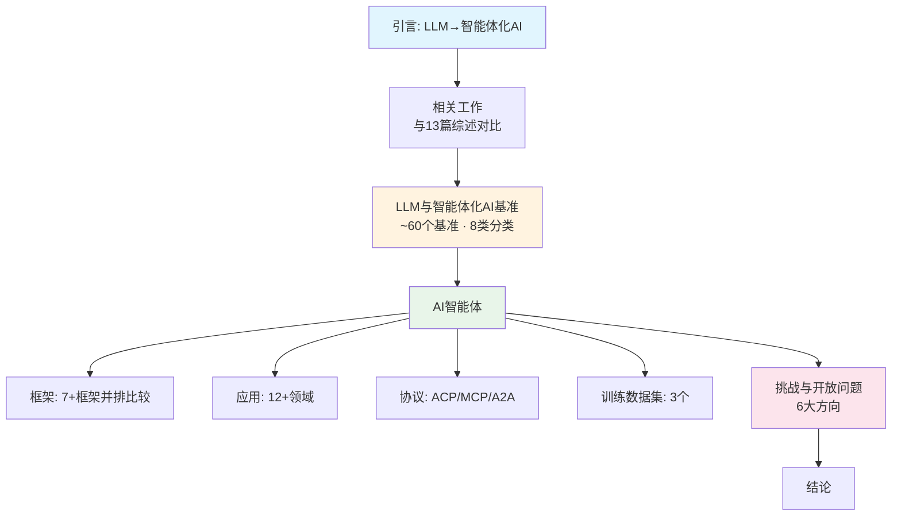
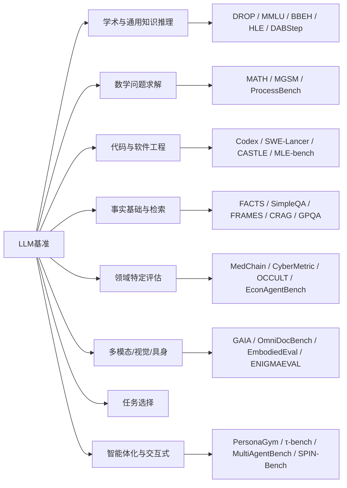
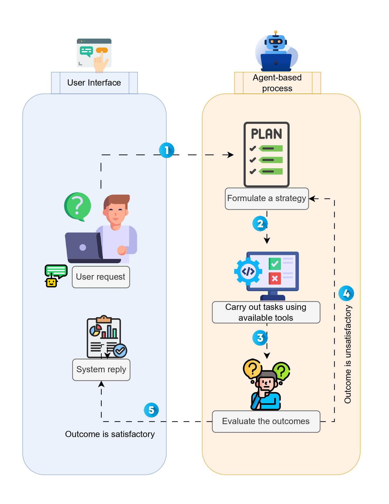
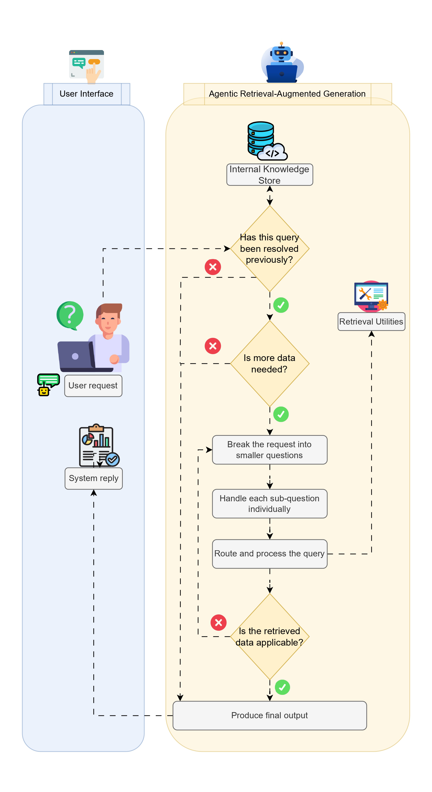
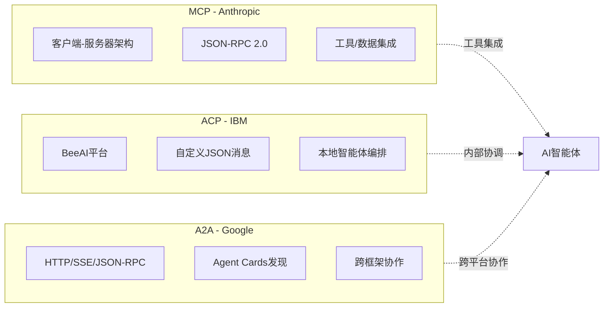
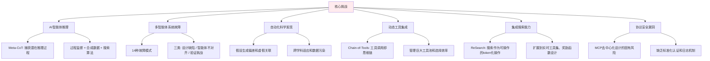

# 从LLM推理到自主AI智能体：全面综述 — 论文总结

**原文标题**：From LLM Reasoning to Autonomous AI Agents: A Comprehensive Review

**作者**：Mohamed Amine Ferrag, Norbert Tihanyi, Merouane Debbah

**原文链接**：https://arxiv.org/abs/2504.19678

---

## 1. 核心主张

> **一句话概括**：本文首次系统性地将LLM基准评估、AI智能体框架、实际应用、智能体间通信协议和未来挑战整合到一个端到端的统一综述中，提供了从LLM推理到自主AI智能体的完整技术路线图。

本文的核心价值在于填补了当前文献中的一个关键空白：虽然已有大量针对特定方面（如基准评估、多智能体系统、领域应用）的综述，但没有一篇将这些维度统一到一个框架中。本综述涵盖了约60个基准、主流智能体框架、12+应用领域、3种核心通信协议以及6个关键研究方向。

---

## 2. 问题诊断

| 维度 | 现状问题 | 本文应对 |
|------|---------|---------|
| 评估碎片化 | 基准分散在不同领域和年份，缺乏统一分类 | 提出8类约60个基准的系统分类体系 |
| 框架割裂 | 智能体框架各自独立，缺乏横向比较 | 并排比较LangChain、LlamaIndex、CrewAI等 |
| 协议不统一 | MCP、ACP、A2A各有侧重，开发者选择困难 | 首次对三大协议进行结构化对比 |
| 应用分散 | 各领域应用研究独立进行 | 跨12+领域整合应用案例 |
| 挑战不明确 | 缺乏系统性的问题清单和未来方向 | 识别6大核心挑战和开放问题 |

---

## 3. 综述范围与方法

| 维度 | 说明 |
|------|------|
| **发表时间** | 2025年4月（v1），2026年3月修订（v2） |
| **基准数量** | **约60个**基准的系统分类 |
| **基准时间跨度** | **2019–2025年** |
| **框架时间跨度** | **2023–2025年** |
| **应用覆盖** | 12+领域（医疗、材料科学、生物医学、软件工程、金融、化学、数学、GIS、多媒体等） |
| **分类方法** | 8类基准分类 + 框架并排比较 + 协议结构化对比 |
| **自我定位** | "第一个系统地将基准、框架设计、应用领域、通信协议和挑战结合在一起的综述"（表I对比了与13篇现有综述的覆盖差异） |

---

## 4. 主要贡献

### 4.1 基准分类体系（约60个基准）

**核心基准对比**：

| 基准 | 年份 | 评估重点 | 关键发现 |
|-----|------|---------|---------|
| MMLU | 2021 | 多任务知识理解 | 57个任务，LLM已达>90%准确率 |
| HLE | 2025 | 专家级学术推理 | 3000题跨100+学科，SOTA LLM <10% |
| ENIGMAEVAL | 2025 | 多模态谜题推理 | 1184谜题，SOTA仅~7% |
| GAIA | 2024 | 通用AI助手 | 人类92%，GPT-4+插件仅15% |
| SWE-Lancer | 2025 | 软件工程 | Claude 3.5 Sonnet仅26.2%通过率 |
| MultiAgentBench | 2025 | 多智能体协调 | 图协议在研究任务中最优 |
| τ-bench | 2024 | 对话智能体 | GPT-4o <50%成功率 |
| BBEH | 2025 | 挑战性推理 | 通用模型9.8%，推理模型44.8% |

> **关键洞察**：即使是最先进的LLM在真正挑战性的任务上仍然表现不佳——HLE上<10%、GAIA上仅15%、SWE-Lancer上26.2%——说明通向AGI的道路仍然漫长。

### 4.2 AI智能体框架

> **图1：智能体化工作流。** 用户请求→策略制定→工具执行→结果评估→满意/不满意的闭环决策流程。

| 框架 | 核心思想 | 关键优势 | 适用场景 |
|------|---------|---------|---------|
| **LangChain** | 集成LLM与多种工具构建自主智能体 | 可定制角色，简化原型开发 | 通用智能体开发 |
| **LlamaIndex** | 通过外部工具集成实现自主智能体创建 | 动态模块化管道 | 数据密集型应用 |
| **CrewAI** | 编排专业化AI智能体团队 | 模拟人类团队协作 | 复杂多角色任务 |
| **Swarm** | 轻量级无状态多智能体抽象 | 细粒度控制，多后端兼容 | 实验性多智能体 |
| **OctoTools** | 无需训练的工具集成推理 | 比GPT-4o平均高9.3% | 跨领域复杂推理 |
| **Agents SDK** | OpenAI模块化智能体框架 | 可扩展、可调试 | 生产级智能体应用 |

**LLM策略对比（RAG vs AI Agents vs Agentic RAG）**：

| 特性 | LLM预训练 | RAG | AI Agents | Agentic RAG |
|------|----------|-----|-----------|-------------|
| 自主性 | 基础 | 有限（用户驱动） | 中等自主 | 高度自主 |
| 学习 | 依赖预训练 | 静态知识 | 融入用户反馈 | 实时数据自适应 |
| 可靠性 | 依赖静态数据 | 已知查询一致 | 动态输入下可能波动 | 自适应方法增强可靠性 |
| 复杂度 | 基线 | 简单集成 | 更复杂 | 高度复杂 |

> **图2：智能体驱动的RAG框架。** 内部知识库→查询判断→子问题分解→检索工具→数据适用性评估→最终输出的完整流程。

### 4.3 AI智能体应用全景

```mermaid
graph TD
    Applications[AI智能体应用] --> Healthcare[医疗保健]
    Applications --> Materials[材料科学]
    Applications --> Biomedical[生物医学]
    Applications --> Research[研究应用]
    Applications --> SWE[软件工程]
    Applications --> Finance[金融]
    Applications --> Chemistry[化学推理]
    Applications --> Math[数学求解]
    Applications --> Geography[地理]
    Applications --> Multimedia[多媒体]
    Applications --> SynData[合成数据生成]
    
    Healthcare --> HC1[诊断: DiagnosisGPT/ZODIAC/PathFinder]
    Healthcare --> HC2[心理健康: PsyDraw/AutoCBT/CAMI]
    Healthcare --> HC3[药物: LIDDiA/DrugAgent/PatentAgent]
    
    SWE --> SE1[架构: Ann Arbor/Postline]
    SWE --> SE2[验证: AgentGym 51%通过率]
    SWE --> SE3[代码定位: LocAgent 92.7%]
    SWE --> SE4[多智能体: CodeSim SOTA]
    
    Finance --> F1[市场模拟: TwinMarket]
    Finance --> F2[投资决策: FinCon]
    Finance --> F3[股票分析: MarketSenseAI 125.9%回报]
    
    style Applications fill:#e8f5e9
    style Healthcare fill:#e3f2fd
    style SWE fill:#fff3e0
    style Finance fill:#fce4ec
```

**各领域关键成果汇总**：

| 领域 | 代表系统 | 核心成果 |
|------|---------|---------|
| 临床诊断 | DiagnosisGPT | 诊断9,604种疾病 |
| 心脏病学 | ZODIAC | 超越GPT-4o和专业医学LLM |
| 医学影像 | M3Builder | 94.29%成功率 |
| 病理学 | PathFinder | 超越病理学家平均水平9% |
| 鉴别诊断 | MEDDxAgent | 准确率提高>10% |
| 材料科学 | HoneyComb | 首个材料科学专用LLM智能体系统 |
| 研究协作 | AgentRxiv | MATH-500上11.4%相对改进 |
| 科学发现 | AI Co-Scientist | 假设质量+300 Elo分 |
| 软件工程 | AgentGym | SWE-Bench 51%通过率 |
| 数学推理 | MACM | GPT-4 Turbo MATH L5: 54.68%→76.73% |
| 定理证明 | MA-LoT | MiniF2F-Test 61.07%（GPT-4仅22.95%） |
| 金融分析 | MarketSenseAI | 累计回报125.9% vs 指数73.5% |
| 电影制作 | FilmAgent | 平均评分3.98/5 |

### 4.4 智能体通信协议

| 特性 | MCP (Anthropic) | ACP (IBM) | A2A (Google) |
|------|----------------|-----------|-------------|
| **主要目的** | LLM上下文和数据集成 | BeeAI内部智能体通信 | 跨框架智能体协作 |
| **架构** | 客户端-服务器 | BeeAI服务器编排 | Agent Cards + HTTP |
| **消息格式** | JSON-RPC 2.0 | 自定义JSON (role + parts) | JSON-RPC扩展 + SSE |
| **上下文共享** | 主机中介有状态会话 | session_id有状态 | Task ID + SSE流 |
| **错误恢复** | JSON-RPC错误 + 取消机制 | 结构化错误负载 | 标准错误码 + 重订阅 |
| **理想场景** | 将数据源集成到LLM工作流 | BeeAI内管理多智能体 | 连接不同平台的智能体 |

> **核心对比**：MCP关注数据集成、ACP关注本地编排、A2A关注跨平台互操作——三者互补而非竞争。

---

## 5. 权衡与取舍

| 设计决策 | 优势 | 劣势/风险 |
|---------|------|----------|
| 多智能体 vs 单智能体 | 专业化分工，协作能力 | 可能降低性能（Pan等人14种故障模式） |
| Agentic RAG vs 传统RAG | 动态自适应，减少幻觉 | 高度复杂，需额外资源 |
| 多步推理 | 提高准确性和可靠性 | 过度思考和冗长风险 |
| 动态工具集成 | 扩展能力边界 | 工具池管理、选择效率挑战 |
| 去中心化协议 | 灵活性和可扩展性 | 安全漏洞、认证不一致 |
| 强化学习训练 | 涌现推理行为 | 奖励黑客攻击、可解释性不足 |

---

## 5½. 研究趋势

论文通过2019–2025年基准的时间线分析，揭示了LLM评估和智能体化发展的清晰演进：

```mermaid
graph LR
    subgraph 早期 ["2019-2021: 核心能力"]
        E1[DROP: 离散推理]
        E2[MMLU: 多任务知识]
        E3[MATH: 数学推理]
        E4[Codex: 代码生成]
    end
    subgraph 中期 ["2022-2024: 复合评估"]
        M1[GAIA: 通用AI助手]
        M2[AgentBench: 智能体化]
        M3[多模态+RAG基准]
        M4[安全/领域特定基准]
    end
    subgraph 前沿 ["2025: 极限挑战"]
        F1[HLE: 专家级<10%]
        F2[BBEH: 通用模型9.8%]
        F3[MultiAgentBench: 多智能体]
        F4[SWE-Lancer: 真实工程]
    end
    早期 --> 中期 --> 前沿
```

| 趋势 | 早期（2019-2021） | 前沿（2025） | 变化 |
|------|------------------|-------------|------|
| **评估难度** | MMLU LLM已达>90% | HLE <10%、BBEH 9.8% | 从"可解决"到"远未解决" |
| **任务类型** | 单一能力（知识/推理/代码） | 多步+多模态+交互+智能体化 | 从原子到系统级 |
| **评估对象** | 模型本身 | 智能体系统（模型+工具+协作） | 从模型→系统 |
| **协议生态** | 无标准协议 | MCP/ACP/A2A三足鼎立 | 从碎片化到标准化 |
| **应用深度** | 通用能力展示 | 垂直领域深入（PathFinder超病理学家9%） | 从概念到落地 |

> **关键发现**：基准饱和驱动了评估的进化——MMLU上的>90%准确率催生了HLE、BBEH等"人类也觉得难"的新基准；单模型评估的局限催生了智能体化和多智能体基准。

---

## 6. 挑战与未来方向

**多智能体系统的14种故障模式**（Pan等人的研究）：

| 类别 | 故障模式 |
|------|---------|
| 设计和规范缺陷 | 忽略任务规范、忽略角色规范、不必要重复 |
| 智能体间不对齐 | 通信失败、角色混淆、信息丢失 |
| 任务验证和终止 | 记忆遗漏、有缺陷的验证过程、过早终止 |

---

## 7. 训练数据集

| 数据集 | 来源 | 规模 | 特点 |
|-------|------|------|------|
| NaturalReasoning | 多领域 | 280万问题 | STEM/经济/社科，知识蒸馏 |
| FineWeb2 | CommonCrawl | 8TB, 3万亿词 | 1893种语言，486种覆盖>1MB |
| MagPie-Ultra | Llama 3.1 405B | 5万指令对 | 首个开放合成指令数据集 |

---

## 8. 结论

> **总结性评价**：本综述是目前最全面的LLM推理到自主AI智能体的端到端调研，首次系统性地将基准评估（~60个）、框架设计（7+）、应用领域（12+）、通信协议（3种）和未来挑战（6大方向）整合到统一框架中。

**核心发现**：

1. **多步中间推理**是提升LLM在复杂任务上准确性和可靠性的关键——DeepSeek-R1、OpenAI o1/o3、GPT-4o展示了显著改进
2. **混合训练策略**（监督微调 + 强化学习 + 蒸馏）在Qwen-32B和Llama架构上激发了涌现推理行为
3. **智能体化RAG**结合了RAG的事实基础和AI智能体的动态适应性，代表了当前最佳实践方向
4. **多智能体系统**尽管理论上有协作优势，但在实践中面临14种故障模式的挑战
5. **通信协议标准化**（MCP/ACP/A2A）为异构智能体生态系统的互操作性奠定了基础
6. **安全性和可靠性**仍然是阻碍大规模部署的核心瓶颈，特别是在医疗、金融等关键领域

**未来展望**：领域和应用特定的优化将成为主流方向，DeepSeek-R1-Distill、Sky-T1和TinyZero等早期系统已展示了专业化推理系统如何在计算成本和准确性之间实现最优权衡。
